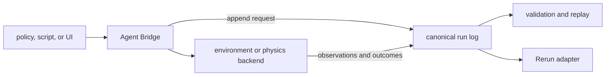

# Prisoma Architecture

This document describes the current system design and its explicit target boundaries.
[`grandplan.md`](grandplan.md) remains the canonical research and engineering specification.

Prisoma is a thin experiment-semantics layer. It composes with policies, environments,
estimators, and viewers. It does not replace them.

## 1. Design goals

The architecture optimizes for five properties:

1. Reconstructable evidence.
2. One explicit mutation path.
3. Fail-closed scientific interpretation.
4. Low default overhead.
5. Replaceable external adapters.

The design rejects hidden control paths, inferred population semantics, and mandatory optional
integrations. It also rejects a monolithic simulator or UI as the project center.

## 2. Non-negotiable invariants

### 2.1 Canonical run log

Every captured sample and accepted control request must be reconstructable from canonical events.
Sidecars and viewers are derived views. They cannot override the run log.

Schema-2 streams require exactly one response for each bridge request. Replay validation detects
missing, duplicate, or inconsistent events before a result becomes evidence.

### 2.2 Agent Bridge control plane

Every mutating client submits work through the Agent Bridge. The bridge records the request before
dispatch. Observers, analysis code, Rerun, and future UI code remain read-only.

The bridge is a provenance boundary, not a remote-security product. Standard profiles provide no
authentication, authorization, TLS, or redaction.

### 2.3 Four independent scientific gates

A numerical result has a computation status and four interpretation verdicts:

- Population support.
- Measure validity.
- Estimator validity.
- Application validity.

No layer may collapse these verdicts into one `valid` flag. A produced value can remain blocked
for interpretation. An abstention carries no numeric placeholder.

## 3. System decomposition

### 3.1 Estimator layer: `pid-rs`

The `pid-rs` submodule owns `pid-core`, `pid-runlog`, and `pid-python`. Prisoma does not duplicate
these crates. Local crates use exact path dependencies into the pinned submodule.

This separation prevents estimator drift and keeps the application repository focused on
experiment semantics. Estimator changes belong upstream, followed by a reviewed gitlink update.

### 3.2 Contract layer: `pid-bridge`

`pid-bridge` owns:

- The canonical method catalog.
- JSON-RPC request and response contracts.
- Safe-mode eligibility.
- Request and response event conversion.
- Optional aggregate run-log limits.

It does not own network transports, the simulator, or file confinement.

### 3.3 Execution layer: `pid-sim`

`pid-sim` groups small local execution surfaces that share the run-log contract:

- Deterministic object-state fixtures.
- stdio, TCP, and WebSocket bridge transports.
- A Rapier-backed manipulation fixture.
- H1 and H2 protocol arithmetic references.
- The offline `(V,L,D,A)` harness.
- Exact-snapshot publication helpers.

This crate is not a claim that one simulator is the research environment. Its backends are
software fixtures and adapters.

### 3.4 Viewer layer: `pid-rerun`

`pid-rerun` validates one bounded run-log snapshot and maps it to Rerun data. It supports headless
RRD output and optional interactive viewing. It never controls the environment.

The current adapter is implemented. The complete multi-panel Phases 1–3 diagnostic application is
specified but not built. A Tauri/SparkJS shell is deferred and is not a thesis dependency.

### 3.5 Producer layer

The offline harness accepts a strict `(V,L,D,A)` artifact with labels and metadata. Producers must
declare each axis and its population support. Prisoma never infers support from observed values.

The reference critical-path producer is `experiments/safe_adapter`. It validates content-bound
SAFE input bundles. Current committed outputs are synthetic software proofs.

The optional `ncp-observer` is a read-only producer adapter for NCP wire 0.8. It is workspace-
excluded. NCP and Zenoh therefore stay outside the default dependency graph.

## 4. Runtime data paths

### 4.1 Online capture path

1. A client sends one bridge request.
2. The transport validates framing and resource limits.
3. The bridge validates the method and named parameters.
4. The bridge appends the request event.
5. The backend handles the request.
6. The bridge appends the response event.
7. Durable transports flush before they return the wire response.
8. The session appends a terminal event when possible.

Crashes and storage failures can still leave incomplete provenance. Prisoma does not claim a
cross-file transaction or power-loss atomicity.

### 4.2 Offline analysis path

The harness admits the complete invocation before analysis. Main and uncertainty projections share
one aggregate work cap. The train-only screen fits independent preprocessing.

`--pid-mode none` is the default. It removes MI and PID requests while retaining factual-outcome
baselines. The explicit `analysis` feature still links `pid-core` for shared geometry and logistic
code. Thus, this mode is an estimator-request firebreak, not a link-time dependency claim.

### 4.3 Replay and publication path

Inputs are read from one descriptor-bound, bounded snapshot on supported Unix hosts. Publication
uses staged files, file synchronization, and no-replace installation. A later output failure can
leave an earlier file. No multi-file transaction is claimed.

## 5. Lean overhead model

Low overhead is a design constraint, not a benchmark claim.

### 5.1 Dependency isolation

- `ncp-observer` is outside the default workspace.
- Plotting, report, UI, and analysis packages are optional Python groups.
- `pid-sim` makes protocol references, legacy sensitivity, analysis, WebSocket, Rapier, and Rerun
  export explicit features. Its default build excludes those modules and their optional graphs.
- The default `pid-sim` graph excludes `pid-core`, linear algebra, SHA-1, Rapier, Rerun, and Arrow.
- `pid-rerun` is outside the workspace default members. Full workspace gates still compile it.
- `pid-rerun` uses narrow SDK crates rather than the Rerun application.
- Its default converter excludes `pid-core` and the separate `ndarray` 0.17 VLA layer. Rerun's
  own SDK types still use `ndarray` 0.16. The synthetic VLA demo requires `vla-demo`.
- The bridge transport binaries use direct argument parsing.
- The offline harness can disable PID requests without removing factual-outcome baselines. The
  complete analysis feature still links its shared `pid-core` implementation.

### 5.2 Bounded work

The offline harness caps raw bytes, samples, decoded scalars, metadata, JSON depth, pairwise work,
distance-coordinate work, dense-solver work, and outputs. Custom limits require an explicit strict
JSON file.

Bridge transports cap messages, timeouts, and selected session totals. The Engram-host profile adds
finite request, input, event, run-log, and pairing-attempt limits.

### 5.3 Allocation and reuse

The analysis path reuses quantization, PID marginals, nearest-neighbor distances, and standardized
held-out features. It stores those features in one contiguous buffer. Tie diagnostics borrow
matrix rows instead of copying them. It releases all-sample matrices before train-only fitting.
Report serialization uses bounded writers.

These choices reduce peak memory and duplicate computation. They do not change scientific
eligibility.

## 6. Security and trust boundaries

### 6.1 Local bridge profiles

TCP and WebSocket listeners reject non-loopback binds. This does not prevent a proxy from exposing
a loopback service. Standard profiles have no authentication or TLS.

The Engram-host profile is read-only and admits exactly three methods. Mutual HMAC proofs bind one
startup secret, request identifier, profile, connection, and fresh nonces. Pairing proves secret
possession only. It does not prove process or build identity.

### 6.2 Filesystem operations

Input readers reject observed symlinks and non-regular files. Unix descriptor readers request
`O_NOFOLLOW`, `O_NONBLOCK`, and `O_CLOEXEC`, then verify descriptor and lexical identities.

Bridge file RPC confinement is local best effort. It does not defend against every hardlink,
alias, or concurrent filesystem attack. Do not treat it as a security sandbox.

### 6.3 Untrusted artifacts

The SAFE adapter rejects downloaded pickle by default. The attribution probe and UI image path use
bounded decoders. All public file readers must validate size before expensive parsing.

See [SECURITY.md](SECURITY.md) and [LIMITATIONS.md](LIMITATIONS.md) for the release boundary.

## 7. Evidence architecture

Machine-readable ledgers in `protocols/` separate four kinds of truth:

| Ledger | Question answered |
|---|---|
| Claim registry | What can the current software and evidence support? |
| Governance drafts | What must be frozen before confirmatory capture? |
| Capability catalog | What exists, at which evidence level, and under which pin? |
| Ecosystem overlay | What external revisions were reviewed and when? |

Generated matrices bind evidence inputs to exact hashes. Static generation proves integrity, not
that a command exercises every claim. Review and CI provide the separate execution evidence.

Release candidate records form another truth surface. They remain non-promotable until a successor
schema and authenticated exact-commit evidence exist.

## 8. Optional and deferred surfaces

### 8.1 Reconstruction-quality study

`GAUSS_MI_INTEGRATION.md` specifies an optional reconstruction-quality covariate and active-view
study. No measurement contract or implementation exists. It cannot weight KSG or PID under the
rejected heuristic sketch.

### 8.2 External world-model comparator

`WORLD_WARP_INTEGRATION.md` specifies a possible external comparator. No pinned adapter, rights-
approved bundle, or matched-support result exists. Generated scenes are not causal ground truth.

### 8.3 Rendering and product UI

Gaussian splats, SparkJS, and Tauri are not current runtime requirements. If adopted, they must
consume canonical evidence and route mutations through the Agent Bridge.

## 9. Change rules

An architectural change is acceptable only if it preserves these conditions:

1. The run log remains authoritative.
2. No control path bypasses the Agent Bridge.
3. Optional systems stay outside the critical path.
4. Resource costs remain admitted before expensive work.
5. Scientific gates remain separate from computation status.
6. Docs and machine-readable ledgers change in the same commit.

Use [EXPERIMENTS.md](EXPERIMENTS.md) for proof commands. Use
[DIAGRAMS.md](DIAGRAMS.md) for compact system views. The legacy filename
[pidsplatspecs.md](pidsplatspecs.md) contains the stable adapter contract.
