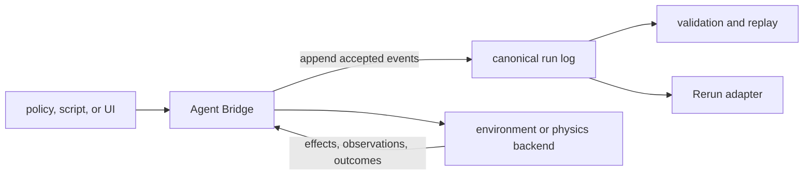
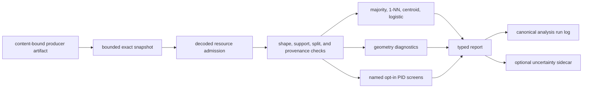

# Prisoma Architecture

This document describes the current system design and its explicit target boundaries.
[`grandplan.md`](grandplan.md) remains the canonical research and engineering specification.

Prisoma is a thin experiment-semantics layer. It composes with policies, environments,
estimators, and viewers. It does not replace them.

## 1. Design goals

The architecture optimizes for five properties:

1. Reconstructable evidence.
2. One explicit mutation path.
3. Fail-closed scientific interpretation.
4. Low default overhead.
5. Replaceable external adapters.

The design rejects hidden control paths, inferred population semantics, and mandatory optional
integrations. It also rejects a monolithic simulator or UI as the project center.

## 2. Non-negotiable invariants

### 2.1 Canonical run log

Every sample admitted to an artifact and every accepted control request must be reconstructable
from canonical events. Sidecars and viewers are derived views. They cannot override the run log.
The run log governs accepted recorded events. It cannot prove an upstream event that the capture
boundary never saw.

Schema-2 streams require exactly one response for each bridge request. Replay validation detects
missing, duplicate, or inconsistent events before a result becomes evidence.

### 2.2 Agent Bridge control plane

Every client that mutates a policy, controller, simulator, or environment submits work through the
Agent Bridge. The bridge records the request before dispatch. Observers, analysis code, Rerun, and
future UI code have no control authority.

The bridge is a provenance boundary, not a remote-security product. Standard profiles provide no
authentication, authorization, TLS, or redaction.

### 2.3 Four independent scientific gates

A numerical result has a computation status and four interpretation verdicts:

- Population support.
- Measure validity.
- Estimator validity.
- Application validity.

No layer may collapse these verdicts into one `valid` flag. A produced value can remain blocked
for interpretation. An abstention carries no numeric placeholder.

## 3. System decomposition

### 3.1 Estimator layer: `pid-rs`

The `pid-rs` submodule owns `pid-core`, `pid-runlog`, and `pid-python`. Prisoma does not duplicate
these crates. Local crates use exact path dependencies into the pinned submodule.

This separation prevents estimator drift and keeps the application repository focused on
experiment semantics. Estimator changes belong upstream, followed by a reviewed gitlink update.

### 3.2 Contract layer: `pid-bridge`

`pid-bridge` owns:

- The canonical method catalog.
- JSON-RPC request and response contracts.
- Safe-mode eligibility.
- Request and response event conversion.
- Optional aggregate run-log limits.

It does not own network transports, the simulator, or file confinement.

### 3.3 Execution layer: `pid-sim`

`pid-sim` groups small local execution surfaces that share the run-log contract:

- Deterministic object-state fixtures.
- stdio, TCP, and WebSocket bridge transports.
- A Rapier-backed manipulation fixture.
- A native exact-fork world-model decision reference.
- H1 and H2 protocol arithmetic references.
- The offline `(V,L,D,A)` harness.
- Exact-snapshot publication helpers.

This crate is not a claim that one simulator is the research environment. Its backends are
software fixtures and adapters.

### 3.4 Viewer layer: `pid-rerun`

`pid-rerun` validates one bounded run-log snapshot and maps it to Rerun data. It supports headless
RRD output and optional interactive viewing. It never controls the environment.

The current adapter is implemented, but it is narrow. It omits opaque `FrameObserved` events,
reduces flow vectors to magnitudes, and does not map world-model candidate metadata. Pinned Rerun
0.34.1 has mesh, camera, image, arrow, and point types. Its PLY path reduces Gaussian splats to
spherical points and ignores opacity. It lacks the newer unstable anisotropic splat archetype.
Therefore Rerun is a derived viewer, not the W1–W3 evidence model. The complete multi-panel
application is specified but not built. A Tauri/SparkJS shell remains deferred.

### 3.5 Producer layer

The offline harness accepts a strict `(V,L,D,A)` artifact with labels and metadata. Producers must
declare each axis and its population support. A continuous call also needs a declaration for its
complete source-target tuple. The tuple declaration asserts regular joint support and finite
information. Prisoma never infers either declaration from observed values.

`experiments/safe_adapter` is the reference adapter implementation for the preserved diagnostic
program. It validates content-bound SAFE input bundles. Current committed outputs are synthetic
software proofs. It is not the primary W1/W2 model path.

The optional `ncp-observer` is a read-only producer adapter for NCP wire 0.8. It is workspace-
excluded. NCP and Zenoh therefore stay outside the default dependency graph.

## 4. Runtime data paths

### 4.1 Online capture path

1. A client sends one bridge request.
2. The transport validates framing and resource limits.
3. The bridge validates the method and named parameters.
4. The bridge appends the request event.
5. The backend handles the request.
6. The bridge appends the response event.
7. Durable transports flush before they return the wire response.
8. The session appends a terminal event when possible.

Crashes and storage failures can still leave incomplete provenance. Prisoma does not claim a
cross-file transaction or power-loss atomicity.

### 4.2 Offline analysis path

The harness admits the complete invocation before analysis. Main and uncertainty projections share
one aggregate work cap. Unsupported episode topology produces a zero-work typed uncertainty skip.
Multi-row block subsampling and circular shifts require one episode with a strictly increasing
canonical decimal `metadata.sequence_index`. An `episode_id` does not establish order. Unit-block
subsampling and full shuffle also support identified singleton episodes or rows without episode
identifiers under the declared row-exchangeability null. The resamplers do not cross multiple
non-singleton episode boundaries. A combined bootstrap and permutation request must declare one
row-dependence class. Circular-shift tail fractions are approximate surrogate scores.
Temporal output is a within-unit-step-run Pearson lag-1 screen. Axis means exclude columns that
are undefined after centering and record their coverage. Rows without episode identities produce
no lag pairs. Every non-singleton segment also needs a strict canonical `sequence_index` receipt.
Only adjacent rows whose index advances by one contribute. The report counts excluded gaps. It
centers both lagged vectors inside each contiguous run before pooling residual products. A run
needs at least three lag pairs because two pairs force Pearson correlation to positive or negative
one. It reports admitted and correlation-eligible pair counts. It emits no inferential sample-size
or block-length suggestion.
The train-only screen fits independent preprocessing.

`--pid-mode none` is the default. It removes MI and PID requests while retaining factual-outcome
baselines. The explicit `analysis` feature still links `pid-core` for shared geometry and logistic
code. Thus, this mode is an estimator-request firebreak, not a link-time dependency claim.

The fitted categorical routes are `categorical-sx` and `categorical-sx-pls`. Each screen fits its
own preprocessing on the rows admitted to that screen. The all-sample screen fits all admitted
rows. An optional split screen fits and estimates only its training rows. Neither route scores
held-out categorical rows. Because `categorical-sx-pls` uses the same target rows for supervised
projection and analysis, every result carries a typed same-row warning and an estimator-blocked
gate. It is a selection-inflation diagnostic only. The routes construct categorical variables
with fitted equal-width quantizers. They use the pinned empirical-law MGW two-source
shared-exclusions backend. Reports bind
the fitted edges and all transform hashes.
They also retain empirical-PMF occupancy and coverage diagnostics from the estimator. Those
diagnostics do not establish population support.
These routes are not Williams–Beer `I_min`, BROJA, continuous Ehrlich shared exclusions, or an
infomorphic objective. They never replace a failed continuous result.

The architecture treats the PID scientific object and the software route as separate nodes. The
normative identity and promotion rules are in
[`PID_METHOD_SELECTION_AND_PUBLICATION_CONTRACT.md`](PID_METHOD_SELECTION_AND_PUBLICATION_CONTRACT.md).
A report binds one functional, one cumulative or Möbius-inverted quantity, one exact lattice
coordinate and component, and one tagged evaluator-or-estimator route. Transforms, exact
certifiers, validation fixtures, and objective compositions remain separate records. Higher-source
or novel PID work can remain available behind a research status without entering the active H3
path or changing the meaning of an existing route.

### 4.3 World-model decision path

The native reference starts from one exact simulator fork. It commits an ordered pool with at
least two distinct actions and all forecasts before any reference label becomes accessible. It
then executes only the selected action through the Agent Bridge and commits its execution receipt.
After that receipt exists, it labels every candidate on an independent branch restored from the
saved fork. A verifier reconstructs the commitments, selection, execution, branch outcomes, and
run-log replay.

The reference learns a small affine transition from a declared deterministic law. It proves the
decision-contract software semantics only. It does not prove learned-model quality, physical
truth, W1, W2, or planning benefit.

Run-log schema 2 lacks a neutral inline decision-record event. The current reference uses strictly
named `label_observed` envelopes for forecast commitments and execution receipts. These records are
not outcome labels. The project has requested a versioned `pid-runlog` event for a future adapter.
The request is not part of the pinned submodule until a later pin is reviewed and adopted.

### 4.4 Replay and publication path

Inputs are read from one descriptor-bound, bounded snapshot on supported Unix hosts. Publication
uses staged files, file synchronization, and no-replace installation. A later output failure can
leave an earlier file. No multi-file transaction is claimed.

The analysis call seals every serialized report field with a private process-local digest.
Summary and run-log publication verify that seal. Deserialization removes publication authority,
so a saved summary is read-only evidence. This detects in-process report changes. It is not an
external signature or a substitute for rerunning the analysis.

## 5. Low-overhead model

Low overhead is a design constraint, not a benchmark claim.

### 5.1 Dependency isolation

- `ncp-observer` is outside the default workspace.
- Plotting, report, UI, and analysis packages are optional Python groups.
- `pid-sim` makes protocol references, legacy sensitivity, analysis, WebSocket, Rapier, and Rerun
  export explicit features. Its default build excludes those modules and their optional graphs.
- The default `pid-sim` graph excludes `pid-core`, linear algebra, SHA-1, Rapier, Rerun, and Arrow.
- `pid-rerun` is outside the workspace default members. Full workspace gates still compile it.
- `pid-rerun` uses narrow SDK crates rather than the Rerun application.
- Its default converter excludes `pid-core` and the separate `ndarray` 0.17 VLA layer. Rerun's
  own SDK types still use `ndarray` 0.16. The synthetic VLA demo requires `vla-demo`.
- The bridge transport binaries use direct argument parsing.
- The offline harness can disable PID requests without removing factual-outcome baselines. The
  complete analysis feature still links its shared `pid-core` implementation.

### 5.2 Bounded work

The offline harness caps raw bytes, samples, decoded scalars, metadata, JSON depth, pairwise work,
distance-coordinate work, dense-solver work, fitted-categorical PID work, and outputs. Custom
limits require an explicit strict JSON file.

Bridge transports cap messages, timeouts, and selected session totals. The Engram-host profile adds
finite request, input, event, run-log, and pairing-attempt limits.

### 5.3 Allocation and reuse

The analysis path reuses quantization, PID marginals, nearest-neighbor distances, and standardized
held-out features. It stores those features in one contiguous buffer. Tie diagnostics borrow
matrix rows instead of copying them. It releases all-sample matrices before train-only fitting.
Report serialization uses bounded writers.

These choices reduce peak memory and duplicate computation. They do not change scientific
eligibility.

### 5.4 Model-side capture

Model hooks are optional and disabled by default. Capture only declared tensor sites. Use bounded
queues and explicit drop counters. Move projection, MI, PID, geometry, and attribution work
outside the action loop.

For predictive policies, record the deployed graph and whether the future branch runs. Record
policy proposals, controller output, executed actions, solver state, masks, and chunk timing.
Bind observation capture, inference start and finish, committed-prefix indices, dispatch, and
acknowledgement. An inference latency number alone cannot establish correct asynchronous execution.
Predictive-training state, intended-future state, coupled joint-sampler state, and
action-conditioned query state are different contracts. A joint density does not create an
operational conditional query.

Before H3 admission, freeze a target-specific prediction landmark before target realization or
availability. Bind the maximum observation time for each captured tensor. Reject a source that
reads a post-landmark observation or contains its PID target. A state
conditioned on a candidate action cannot be a source for PID whose target is that exact proposal.
A downstream command, later declared reference-state outcome, or separately measured physical
outcome remains eligible only when the matched baseline receives the same proposal. Command or
simulator-state prediction is not physical forecast validity. The current
shared artifact schema does not yet enforce this receipt.

The native exact-fork reference is the first M4 rung. It implements a fixed-pool contract. The
first external target is the compact LeWorldModel PushT planner at the frozen revisions in
`grandplan.md`. It uses adaptive CEM. The published PushT path runs 30 rounds with 300 samples, 30
elites, horizon five, and five-action blocks. The adapter must retain every round and separately
score its final recommendation before execution. The upstream evaluator hard-codes CUDA.
One exact-package synthetic probe ran its tensor and full-budget CEM paths on MPS. It did not run
the environment or closed loop. Therefore it remains an MPS port candidate, not MPS support. The
one-seed independent TwoRoom reproduction does not test PushT or M4. It does show that pipeline and
evaluation conventions can determine the reported result. The adapter must bind a
paper/configuration/code concordance ledger, train-only scaling, and raw-action support after inverse
transformation. Freeze each unresolved feasible protocol reading before outcomes.
JEPA-WM is the second planning benchmark.
SmolVLA is the direct-policy MPS baseline. VLA-JEPA is a predictive-training comparator whose
inference graph drops its predictor. No external model is a current runtime dependency.

## 6. Security and trust boundaries

### 6.1 Local bridge profiles

TCP and WebSocket listeners reject non-loopback binds. This does not prevent a proxy from exposing
a loopback service. Standard profiles have no authentication or TLS.

The Engram-host profile is read-only and admits exactly three methods. Mutual HMAC proofs bind one
startup secret, request identifier, profile, connection, and fresh nonces. Pairing proves secret
possession only. It does not prove process or build identity.

### 6.1.1 Managed receipt observer

The workspace-excluded managed observer is separate from the TCP profile.
It uses inherited private pipes and Engram Host API 2 framing.

The child verifies complete closed-loop source receipts in `prepare`, `observe`, and `finish` order.
It records one to 64 host-declared channels and a matching subject roster.
It can record three CREBAIN drone names without controlling them.
Current source receipts do not authenticate that roster.

All operations use observation class, effect `none`, and compute grant `none`.
The child has no Agent Bridge, NCP, PID, artifact, filesystem operation, network operation, or actuation path.
The reviewed sandbox does not enforce filesystem isolation.
Engram retains lifecycle, readiness, deadline, cancellation, and termination authority.

The runtime clears retained state after terminal success, clean EOF, and `Drop`.
Its receipts describe verified bytes.
They do not establish upstream completeness, safety, attestation, or scientific evidence.
The child mirrors Engram's durable-evidence profile but always reports bundle verification as false.
Full NEST bundle rejoin stays in an external bounded validator.
The checked success vector exercises that non-conflation with the NEST bundle-v2 profile.

Release staging requires an adjacent clean-source build receipt.
The receipt binds exact Git sources, toolchain bytes, build arguments, and arm64 Mach-O bytes.
Its source roster includes the build generator and validation code.
It records one local build observation and does not attest reproducibility.
Changing permissions on arbitrary target bytes cannot satisfy this join.

Package staging writes a separate owner-private receipt.
That receipt binds the exact build receipt and committed stage sources.
It also binds the staged executable and eight contract files.
It grants no installation, execution, Agent Bridge, NCP, MUSIC, physical, plant, or scientific authority.

The external matrix validator requires clean pushed revisions for three repositories.
It binds each origin, commit, tree, object format, and `origin/main` commit.
It accepts CREBAIN evidence-index v2 and installed proof v3 only.
It reads v2 operational evidence while retaining the v1 operational input suite.
It treats CREBAIN's source commit, C0, and publication commit, C1, separately.
C1 must have only C0 as its parent.
C1 may add only the index and three capture blobs.
The validator reopens build and tool sources from C0.
It reads published evidence bytes from C1.
It independently validates tool, build, stage, pack, package, and imported-source lineage.
The pack receipt binds committed `scripts/engram_extension.py` bytes and Git identity.
The imported-source closure must contain the same tool row and loaded host module.
This closure does not attest Python bytecode, interpreter state, or dependency bytes.
Each run keeps its distinct path-sensitive source closure.
All runs share one stable source-roster digest over committed source rows.
Receipt-store joins require exact V5 content-addressed artifact paths.
Stored receipt and evidence JSON omit their self-digest fields and final newlines.
Each complete store roster includes `store.json` and `writer.lock`.

A historical v1 audit records one packed child in Engram's reviewed-development store.
Its source state was a working-tree candidate, so it grants no current runtime claim.
The current v2 operational gate is `NOT RUN`.
The v2 contract requires immutable staging and guardian process-group closure.
It also requires exact imported-source closure without numeric process identities.
Neither version grants production, publisher, NCP, physical, or scientific authority.

### 6.2 Filesystem operations

Input readers reject observed symlinks and non-regular files. Unix descriptor readers request
`O_NOFOLLOW`, `O_NONBLOCK`, and `O_CLOEXEC`, then verify descriptor and lexical identities.

Bridge file RPC confinement is local best effort. It does not defend against every hardlink,
alias, or concurrent filesystem attack. Do not treat it as a security sandbox.

### 6.3 Untrusted artifacts

The SAFE adapter rejects downloaded pickle by default. The attribution probe and UI image path use
bounded decoders. All public file readers must validate size before expensive parsing.

See [SECURITY.md](SECURITY.md) and [LIMITATIONS.md](LIMITATIONS.md) for the release boundary.

## 7. Evidence architecture

Machine-readable ledgers in `protocols/` separate four kinds of truth:

| Ledger | Question answered |
|---|---|
| W1-W3 claim registry | What can the primary world-model program currently support? |
| EC1/H1-H4 claim registry | What can the preserved diagnostic program currently support? |
| Governance drafts | What must be frozen before confirmatory capture? |
| Capability catalog | What exists, at which evidence level, and under which pin? |
| Ecosystem overlay | What external revisions were reviewed and when? |

Generated matrices bind evidence inputs to exact hashes. Static generation proves integrity, not
that a command exercises every claim. Review and CI provide the separate execution evidence.

Release candidate records form another truth surface. They remain non-promotable until a successor
schema and authenticated exact-commit evidence exist.

## 8. Primary roadmap and deferred surfaces

### 8.1 Reconstruction-quality study

`GAUSS_MI_INTEGRATION.md` specifies an optional reconstruction-quality covariate and active-view
study. No frozen, implemented measurement contract exists. It cannot weight KSG or PID under the
rejected heuristic sketch.

### 8.2 World-model and linked-fidelity roadmap

The native world-model reference is implemented. W1 and W2 require a frozen learned-model study
with supported randomized actions, proper forecast scoring, fixed-pool or adaptive-search traces,
calibrated abstention, randomized complete policies, and measured M4 resource receipts. The
compact LeWorldModel PushT CEM path is the first port candidate. JEPA-WM is the second planning
benchmark. No external adapter or learned-model result exists yet.

W3 links the same authoritative state trajectory and camera across mesh and 3DGS renderers. A
body/link manifest separates collision geometry from both render paths. It binds camera,
exposure, color, shutter, frame timing, asset lineage, policy memory, KV cache, history, and random
state. W3 also links the same fork and action set across learned and reference dynamics. Immediate
frozen-policy response and downstream complete-policy effects use separate designs. This is a
narrow integration protocol, not a priority claim. `WORLD_WARP_INTEGRATION.md` remains an optional
legacy comparator specification.

The dated [WAM frontier review](docs/audits/2026-08-12-first-principles/WORLD_ACTION_MODEL_FRONTIER.md)
defines six deployed-graph families, including coupled joint generation. It splits planning into
fixed-pool and adaptive-search contracts. Action-conditioned prediction remains observational until
randomized executed-action validation passes.

### 8.3 Rendering and product UI

Gaussian splats, SparkJS, and Tauri are not current runtime requirements. If adopted, they must
consume canonical evidence and route mutations through the Agent Bridge.

## 9. Change rules

An architectural change is acceptable only if it preserves these conditions:

1. The run log remains authoritative for accepted recorded events.
2. No control path bypasses the Agent Bridge.
3. Optional systems stay outside the critical path.
4. Resource costs remain admitted before expensive work.
5. Scientific gates remain separate from computation status.
6. Docs and machine-readable ledgers change in the same commit.

Use [EXPERIMENTS.md](EXPERIMENTS.md) for proof commands. Use
[DIAGRAMS.md](DIAGRAMS.md) for compact system views. The legacy filename
[pidsplatspecs.md](pidsplatspecs.md) contains the stable adapter contract.
