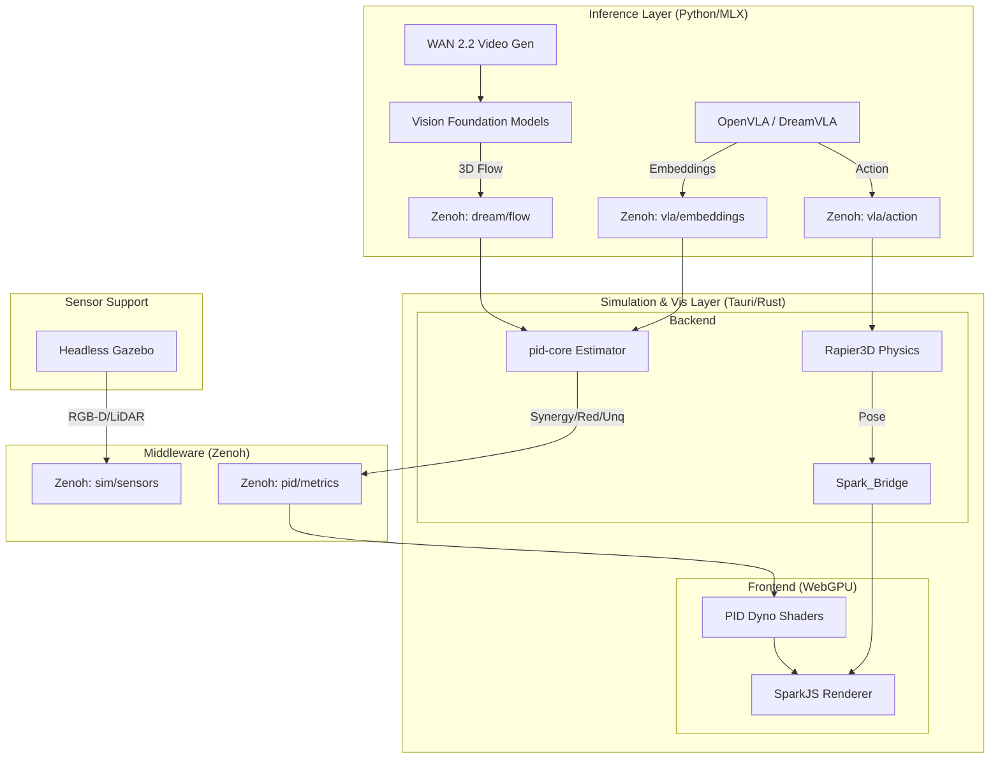
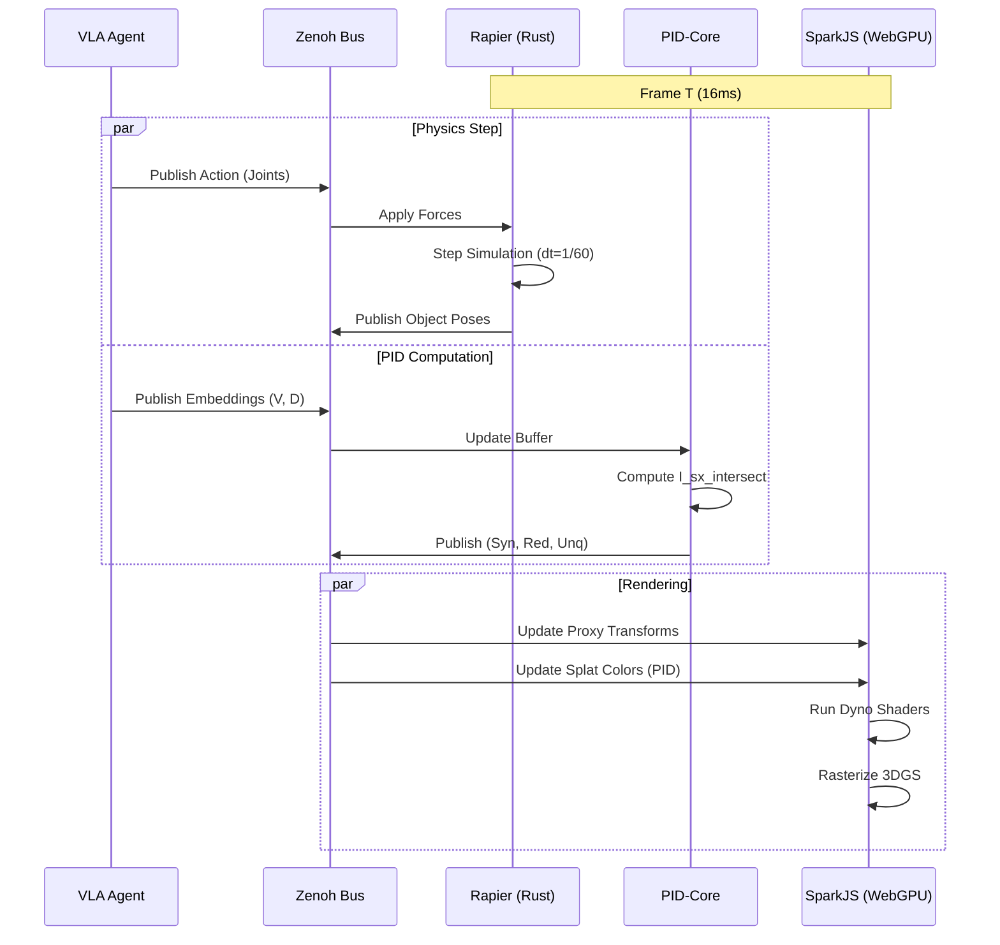
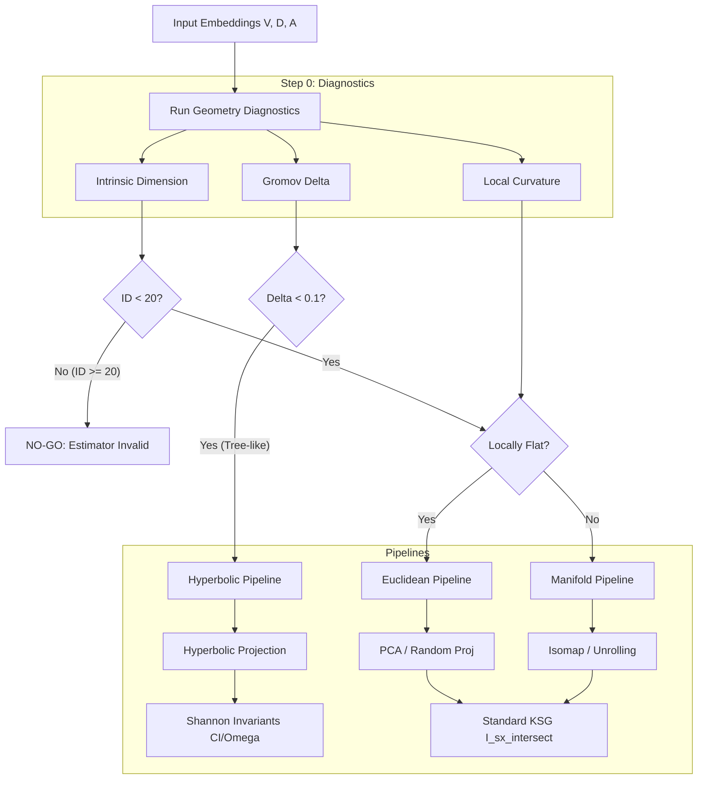
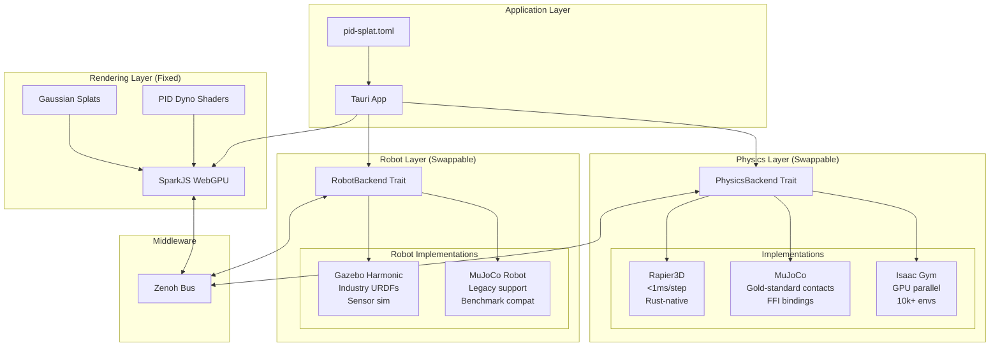
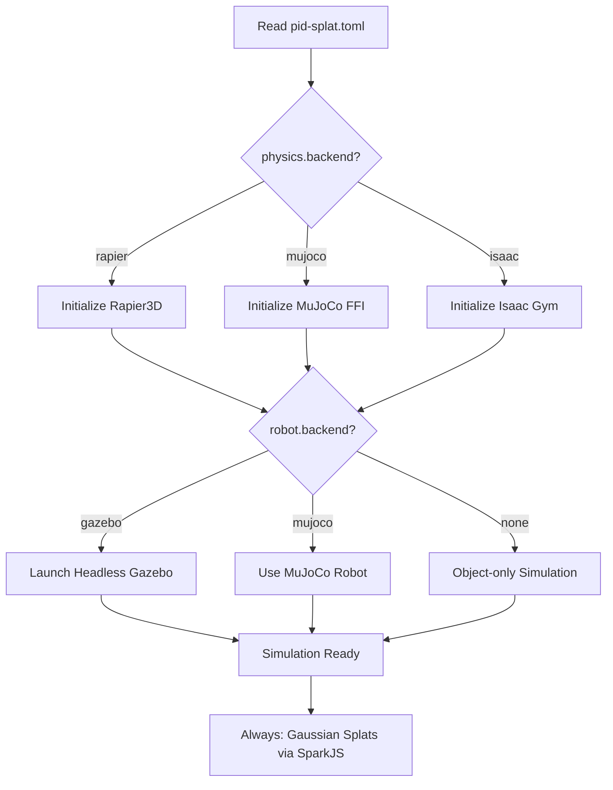
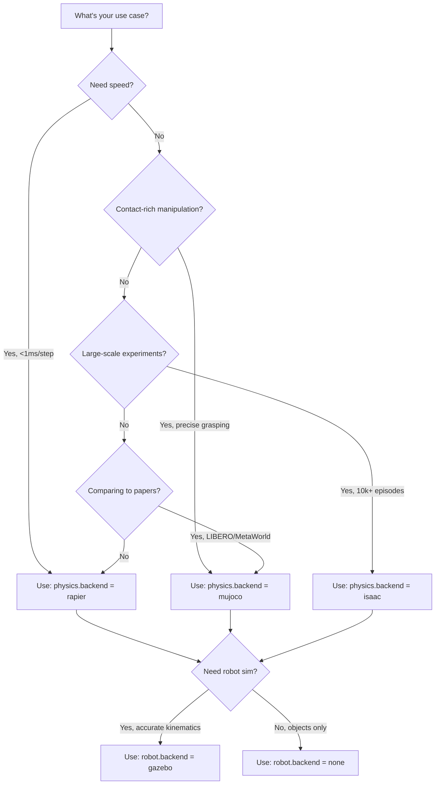
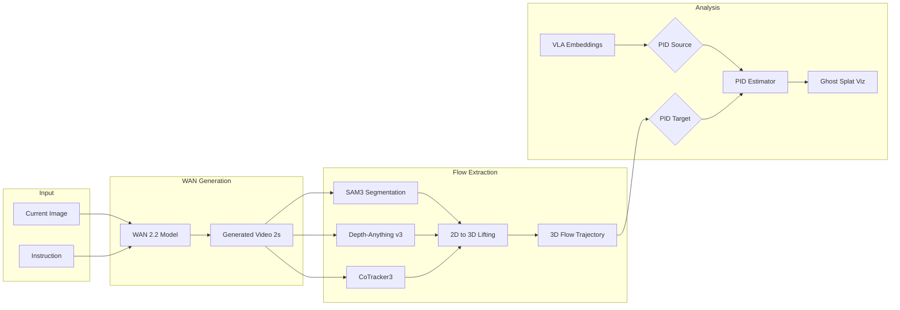

# System Architecture Diagrams

> **Documentation Cross-Reference**:
> - `grandplan.md` — Master plan and theoretical foundations
> - `pidsplatspecs.md` — Detailed simulation environment and PID specifications
> - `ARCHITECTURE.md` — Component breakdown and advantages over VLM-based robotics
> - `EXPERIMENTS.md` — Experimental protocols for SparkJS, Gazebo, Rapier setup and hypothesis testing
> - `README.md` — Quick start guide

This document contains visual representations of the PID-VLA system, the PID-Splat simulation environment, and the data processing pipelines.

## 1. High-Level System Overview

This diagram illustrates how the core components interact via the Zenoh middleware, separating the inference (VLA), simulation (PID-Splat), and analysis (PID-Core) layers.

---

## 2. PID-Splat Simulation Loop

This diagram details the "Splat-First" update loop, showing how physics (Rapier) and rendering (SparkJS) are synchronized and how PID metrics modulate the visual output.

---

## 3. Geometry-First Analysis Protocol

This flowchart implements the decision logic from `grandplan.md` §16.11, determining whether to use Euclidean, Manifold, or Hierarchical analysis methods.

---

## 4. Modular Physics Backend Architecture

This diagram shows the composable backend system where rendering (Gaussian Splats) is decoupled from physics (swappable between Rapier, MuJoCo, Isaac Gym) and robot simulation (Gazebo or MuJoCo).

### Backend Selection Logic

### Use Case Decision Tree

---

## 5. Dream2Flow Data Pipeline

Visualizing the specific integration of WAN video generation and 3D flow extraction (`pidsplatspecs.md` §4).

