# System Architecture Diagrams

> **Documentation Cross-Reference**:
> - `grandplan.md` — Master plan and theoretical foundations
> - `pidsplatspecs.md` — Detailed simulation environment and PID specifications
> - `ARCHITECTURE.md` — Component breakdown and advantages over VLM-based robotics
> - `EXPERIMENTS.md` — Experimental protocols for Rerun-first diagnostics, modular physics, and hypothesis testing
> - `README.md` — Quick start guide
> - `GAUSS_MI_INTEGRATION.md` — Optional 3DGS uncertainty + view selection (spec)
> - `WORLD_WARP_INTEGRATION.md` — Optional external world‑model baseline (spec)

This document contains visual representations of the prisoma system, the PID-Splat simulation environment, and the data processing pipelines.

**Docset alignment:** These diagrams are aligned to `grandplan.md` docset v12.5 (seventh adversarial revision; scientific cut 2026-07-12). Several components shown below (e.g., Tauri/SparkJS/Gazebo, optional Zenoh live transport, and external video predictors) are part of the *target architecture* and may be external or not yet implemented in this repository; check `grandplan.md` current-versus-target implementation (§8.10), the research milestones M0–M7 (`grandplan.md` §12), and the decision log (`grandplan.md` §16) for what exists today and what to build next.

**v10.7 → v12.5 migration note:** the old H1–H9 / Exp0–Exp10 scheme is retired. The confirmatory registry is now **EC1** (provenance-complete replay) plus **H1–H4** (`grandplan.md` §4); the estimator/experiment ordering is the **S0–S7 gate sequence** (§5.1); build order is **milestones M0–M7** (§12). Legacy "Exp0" estimator validation is now the **S1 gate / §7**. These diagrams are retargeted accordingly.

**Docset-wide final solution:** the diagrams should be read through `grandplan.md` §16 (decision log; see also §8.2, §8.11, §8.13, §15.4): run log as source of truth, Agent Bridge as the only control plane, Rerun as the read-only Phases 1–3 diagnostic viewer, and Tauri/SparkJS as the deferred Phase 4 shell. VLA actions, interventions, pause/resume/step transitions, and correction forces always traverse **client → Agent Bridge → canonical command event → backend**. PID, observers, Zenoh, and Rerun never actuate the system.

## 0. Docset v12.5 Status Dashboard (Pipeline State)

This chart is the honest, gate-driven snapshot. Estimator/measure validation (the **S1 gate**, `grandplan.md` §7) is judged against four separate PID gates — population, measure, estimator, and application (§7.1). The high-dimensional **MI/coherence path is NO-GO** (nuisance-dimension controls); continuous shared-exclusions atoms on **real VLA embeddings are BLOCKED / not application-validated**; the `pid-rs` pin does carry real low-dimensional additive-Gaussian oracle and discrete SxPID reference evidence. The first real-VLA capture, the capture-sizing/power gate (§6.8), the intervention pilot (S3), and the episode-local H1 feature path remain open; the confirmatory EC1/H1–H4 claims therefore remain blocked.

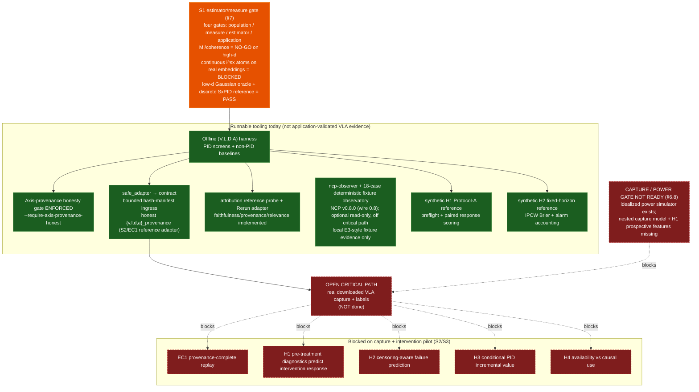

*Caption: v12.5 pipeline state — orange = the S1 estimator/measure gate (four-gate status); green = runnable tooling, not application-validated atom evidence; red dashed = unresolved capture/power gates (§6.8) and the EC1/H1–H4 confirmatory claims they block.*

---

## 0.1 Confirmatory Claim Status (EC1, H1–H4)

Claims grouped by their `grandplan.md` §4 confirmatory-registry role (kill rules in §3.8; falsifiability in §13 Lens 20). All confirmatory tests remain blocked on the real-VLA capture and the intervention pilot. Estimator validation, attribution probes, and the explicitly non-evidentiary synthetic H1 Protocol-A and H2 fixed-horizon/IPCW/alarm software references run today on fixtures.

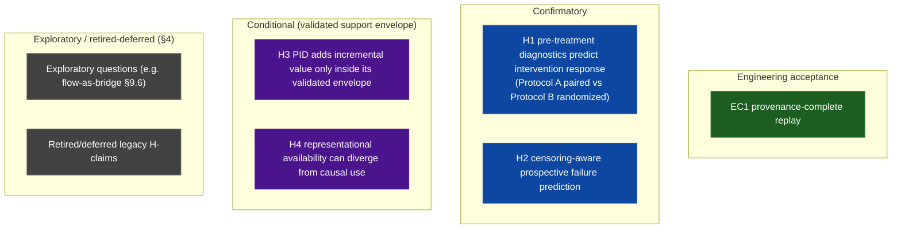

*Caption: EC1 + H1–H4 by role (engineering / confirmatory / conditional / exploratory-deferred) per `grandplan.md` §4. All confirmatory verdicts remain pending the open real-VLA capture and intervention pilot.*

---

## 0.2 Research Milestone / Critical-Path Roadmap (M0–M7)

Build order from `grandplan.md` §12 (research milestones M0–M7; gate sequence §5.1). The old repo used M1–M5 for *infrastructure* (run logs, Agent Bridge, sim, Rerun); those are now the event-model + control-plane parts of §8 and feed the research milestones as groundwork. "Implemented" reflects verified in-repo crates/harnesses; the real capture + intervention pilot (M3) is the open critical path; M4–M7 are downstream/specified. This is engineering state, not a research result.

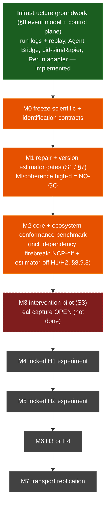

*Caption: research milestones M0–M7 (`grandplan.md` §12) — green = implemented infrastructure groundwork (§8), orange = partially met research contracts, red dashed = M3 intervention pilot blocked on the open real capture, grey = specified/downstream. Engineering state only, not a research result.*

---

## 1. High-Level System Overview

This diagram illustrates the target interaction pattern. The canonical Phases 1–3 data spine is **run log → replay → Rerun**; Zenoh/live middleware is optional Phase 6 transport and must still emit the same run-log events.

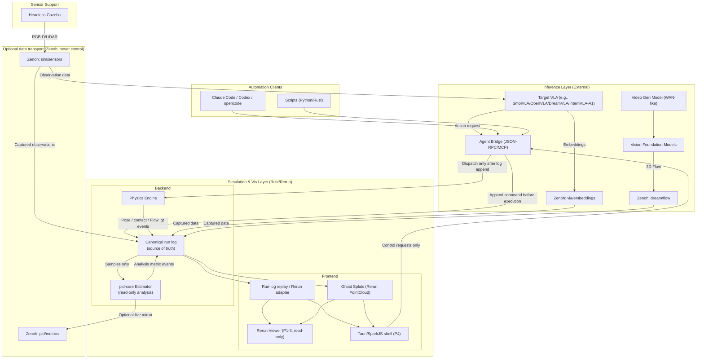

---

## 2. PID-Splat Simulation Loop

This diagram details the target "Splat-First" update loop, showing how a physics backend (Rapier shown as an example), canonical run-log events, and rendering are synchronized: Rerun consumes the replay stream in Phases 1–3, while SparkJS can consume the same events in Phase 4.

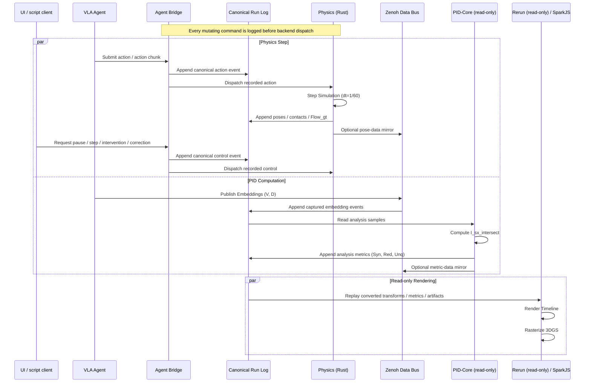

---

## 3. Geometry-First Analysis Protocol

This flowchart implements the geometry/dependence decision logic from `grandplan.md` §7.9 (geometry diagnostics are diagnostics, not proofs; see also §7.10 on metric substitution). Every variable and every concatenation actually passed to an estimator is diagnosed. Sampled mean `δ_rel` is reported as a descriptive tree-likeness statistic only: it is **not** a Euclidean-validity pass/fail gate (a Euclidean line is the immediate counterexample).

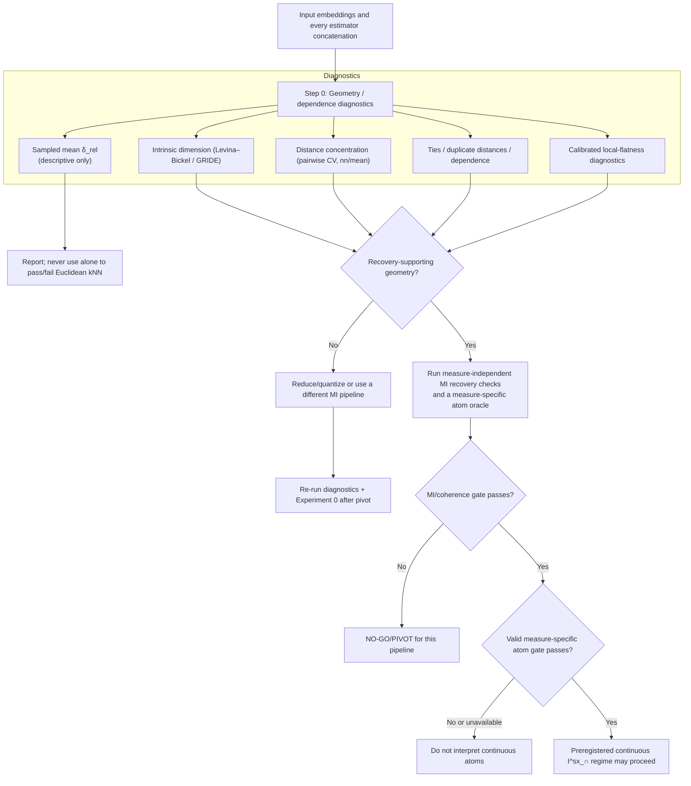

---

## 4. Modular Physics Backend Architecture

This diagram shows the composable backend system where rendering (Gaussian Splats) is decoupled from physics (swappable between Rapier, MuJoCo, Isaac Gym) and robot simulation (Gazebo or MuJoCo).

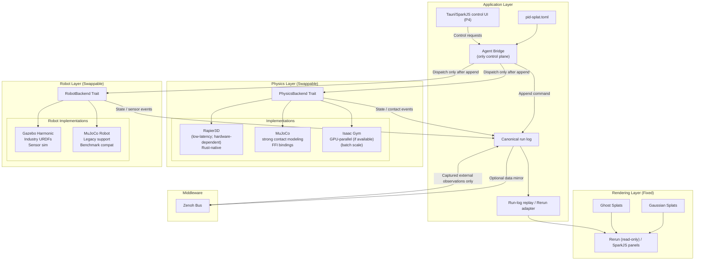

### Backend Selection Logic

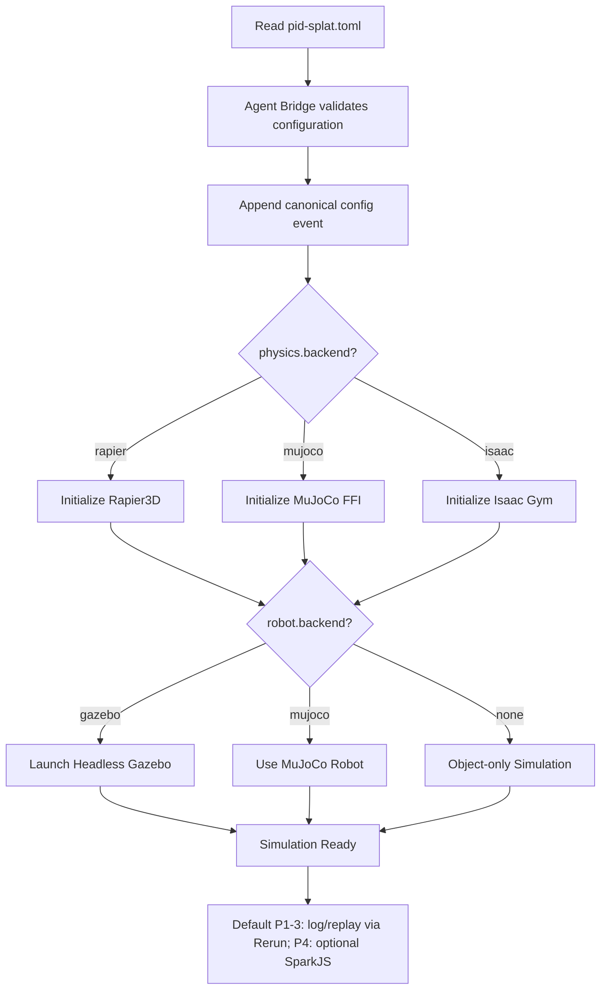

### Use Case Decision Tree

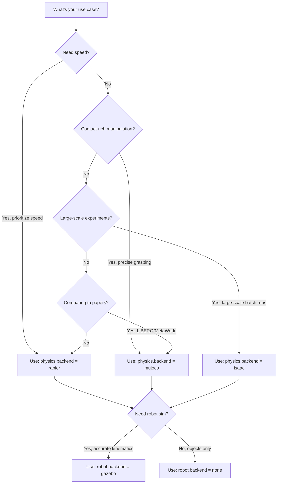

---

## 5. Hybrid Rendering: Splats + Mesh + Physics Proxies

This diagram captures the intended hybrid approach: use 3DGS splats for photoreal appearance, and meshes/URDFs for articulated robots, collision proxies, and precise interactive edits. This aligns with `grandplan.md` §8.13 (visualization and rendering) and §7.9 (geometry/diagnostics are independent of the renderer, but the renderer must support inspectable overlays).

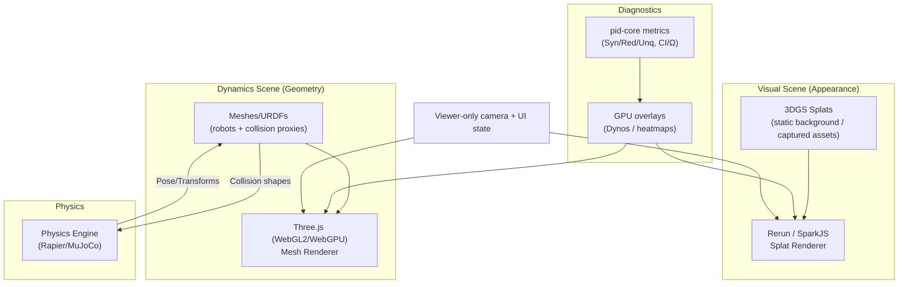

---

## 6. Dream2Flow Data Pipeline

Visualizing a model-agnostic Dream2Flow-style bridge: external video prediction → 3D flow extraction → PID targets (flow as a bridge; see `grandplan.md` §9.6). The video predictor is treated as an interchangeable, versioned service (no oracle framing).

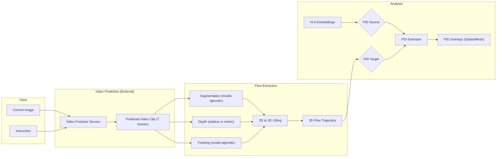

---

## 7. Estimator/Measure Validation (S1): The Four Gates and Atom Validation

This diagram summarizes the estimator/measure validation loop — the **S1 gate** — before applying PID to real VLA embeddings (`grandplan.md` §7; the four gates population/measure/estimator/application in §7.1; continuous shared-exclusions gate §7.5; discrete PID gate §7.6). The aggregate estimator-validation label must not be presented as continuous shared-exclusions atom validation.

```mermaid
flowchart TD
    Start["Choose representation (V/L/D/A/Flow)"] --> Geo[Run geometry diagnostics]
    Geo -->|OK| S1["Run S1 synthetic validation matrix (§7.3)"]
    Geo -->|Recovery / ID / concentration / ties / local-flatness warnings| PivotGeom[Pivot representation: reduce/quantize/Flow target]
    PivotGeom --> Geo

    S1 --> MIGate{Measure-independent MI/coherence passes? (§7.7)}
    MIGate -->|NO-GO on high-d| StopMI[Stop/pivot this MI pipeline]
    MIGate -->|Passes after a validated pivot| AtomGate{Application gate: real-embedding regime near a validated support envelope? (§7.14)}
    AtomGate -->|BLOCKED / not application-validated today| StopAtoms[Do not interpret continuous i^sx atoms]
    AtomGate -->|Future pass| Proceed[Proceed to preregistered real-embedding analyses]

    StopMI --> PivotEst[Pivot estimator/representation]
    PivotEst --> Geo
```

---

## 8. Confirmatory Claims → Experimental Programme Map

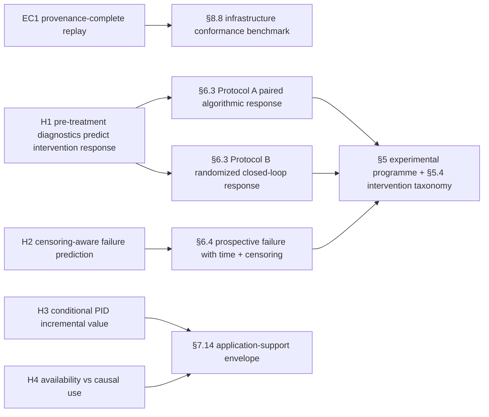

---

## 9. OpenUSD / USDZ Interop (Optional)

This diagram summarizes the LeIsaac/Isaac Sim interoperability pattern (interoperability, not reinvention; `grandplan.md` §8.6): convert splats to OpenUSD for composition/validation in USD tooling, then (optionally) bring the composed result back into the PID‑Splat workflow.

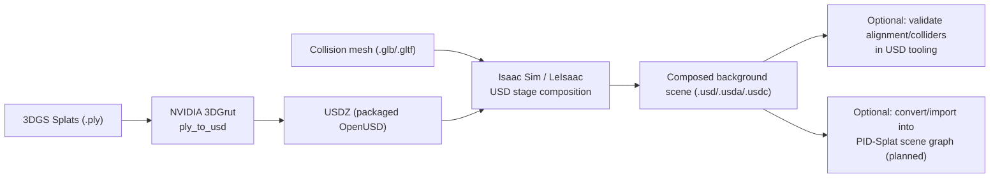

---

## 10. Agent Bridge Control Plane (LLM‑First)

The Agent Bridge is the **only** programmable control plane: it exposes the same operations to the GUI, VLA-policy adapter, scripts, and LLM coding tools (actions, scene editing, interventions, pause/resume/step, correction forces, replay, and exports). Each mutating request is appended to the canonical run log before backend dispatch.

**External backend note:** the Agent Bridge is also the *adapter surface* for third‑party simulators that expose an RL-style `reset/step` API (or their own WebSocket/pubsub interface). Their native interface sits behind the bridge; it is not a second prisoma control plane. The adapter records prisoma command events before dispatch so replay and analysis are identical across backends.

The deterministic in-repo bridge currently provides stdio/TCP/WebSocket JSON-RPC smokes for status, reset/step, scene edits, deterministic interventions, `log.replay`, `log.start`/`log.stop`, and `export.rerun`; safe mode permits status/replay and logs blocked mutation, run-ending, or file-writing export requests.

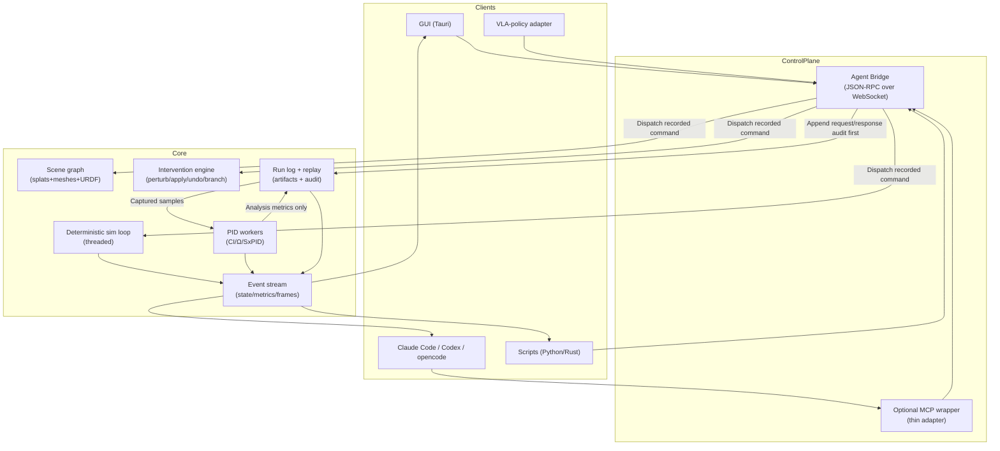

---

## 11. Cross-Backend Replay (Optional Robustness Control)

This diagram captures the cross-backend replay idea (`grandplan.md` §8.5 replay levels; robustness/falsification §6.10): replay the same run log under different physics backends (e.g., Rapier vs MuJoCo) and quantify divergence. This is a practical way to test whether PID findings (H1–H4) are sensitive to contact-model idiosyncrasies.

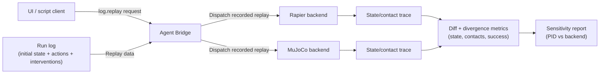

---

## 12. GauSS‑MI Uncertainty + Active View Selection (Optional)

This diagram summarizes the proposed GauSS‑MI integration (`GAUSS_MI_INTEGRATION.md`): treat 3DGS reconstruction uncertainty as a confound/diagnostic signal, optionally down‑weight unreliable visual features, and (if you are still capturing scenes) use uncertainty‑guided view selection to reduce uncertainty.

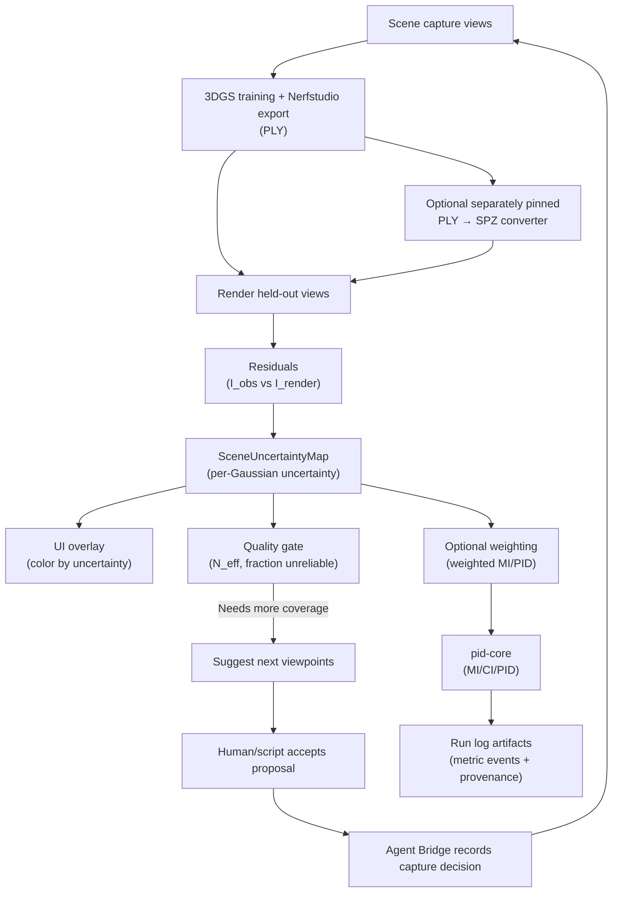

---

## 13. Attribution Probes as Companion Diagnostics

This diagram places LRP/Integrated Gradients/DeepLIFT/Grad-CAM/TCAV/saliency/SHAP-style methods beside PID. The two branches answer different questions and should be compared only through logged samples, common targets, and matched interventions.

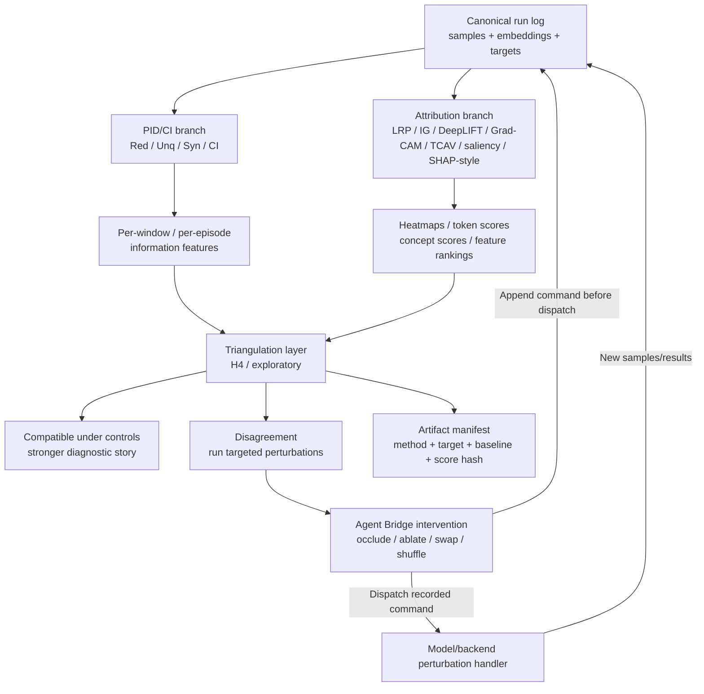
