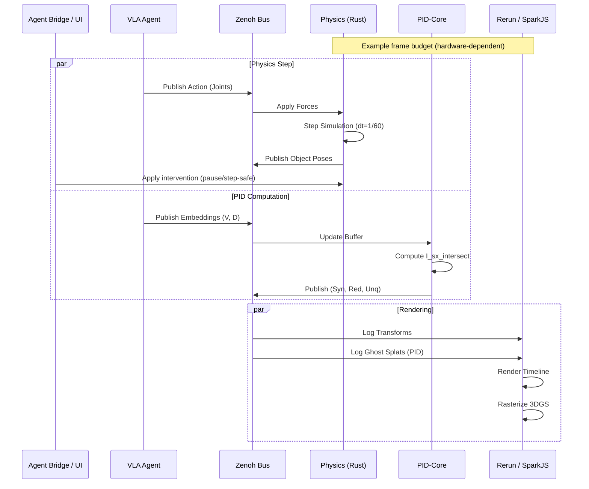
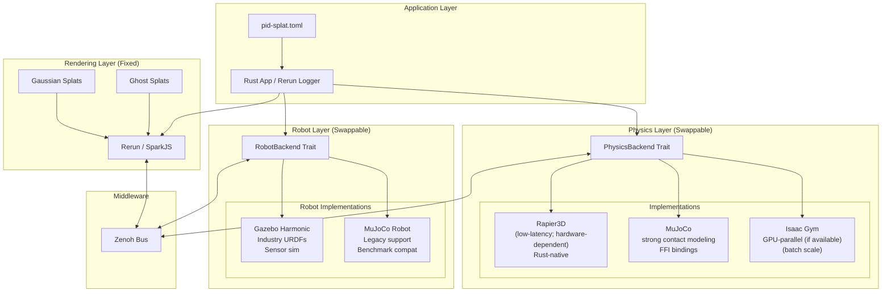
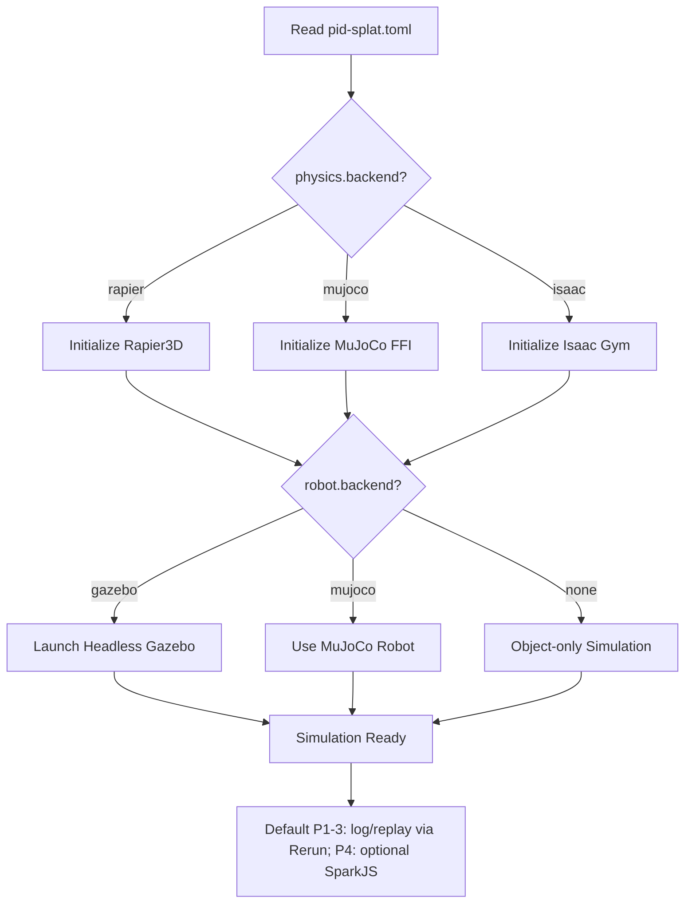
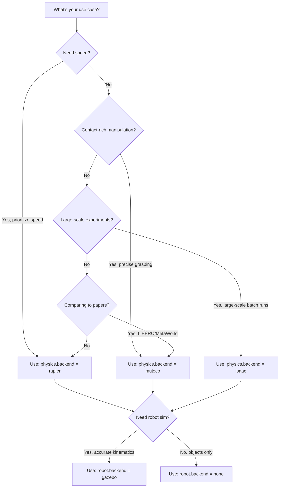
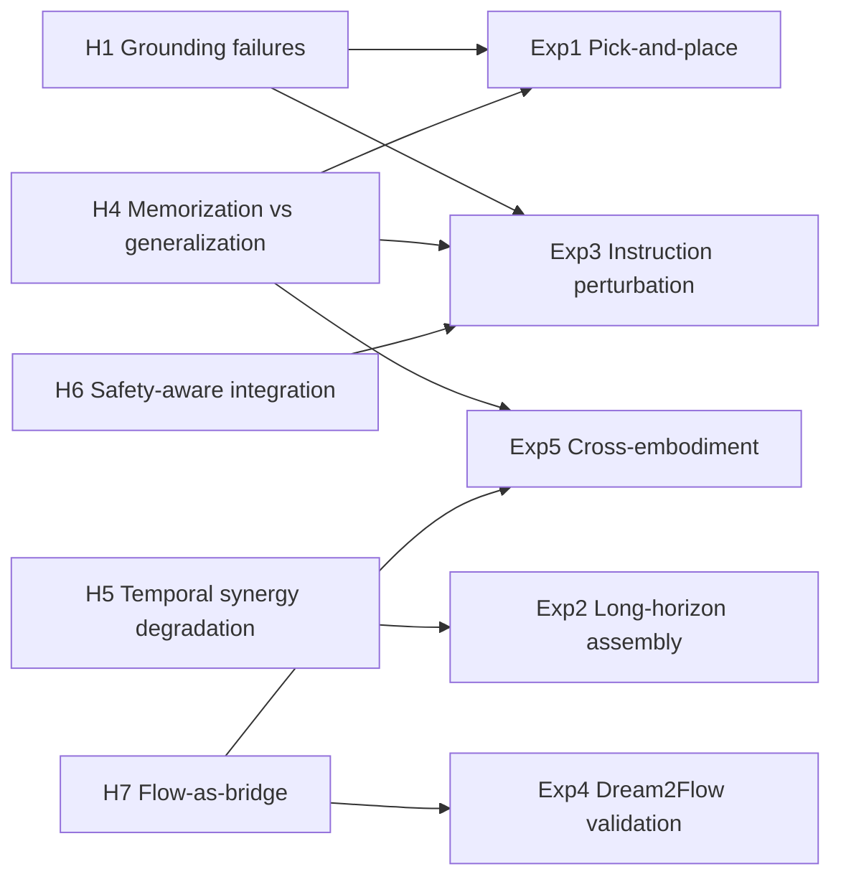

# System Architecture Diagrams

> **Documentation Cross-Reference**:
> - `grandplan.md` — Master plan and theoretical foundations
> - `pidsplatspecs.md` — Detailed simulation environment and PID specifications
> - `ARCHITECTURE.md` — Component breakdown and advantages over VLM-based robotics
> - `EXPERIMENTS.md` — Experimental protocols for SparkJS and Modular Physics setup and hypothesis testing
> - `README.md` — Quick start guide
> - `GAUSS_MI_INTEGRATION.md` — Optional 3DGS uncertainty + view selection (spec)
> - `WORLD_WARP_INTEGRATION.md` — Optional external world‑model baseline (spec)

This document contains visual representations of the PID-VLA system, the PID-Splat simulation environment, and the data processing pipelines.

**Docset alignment:** These diagrams are aligned to `grandplan.md` v10.1. Several components shown below (e.g., Tauri/SparkJS/Gazebo, optional Zenoh live transport, external video predictors, and the Agent Bridge control plane) are part of the *target architecture* and may be external or not yet implemented in this repository; check `grandplan.md` “Repo status” (§11.1), the v10.1 execution plan (`grandplan.md` §A.7), and the ten-scientist consensus decision record (`grandplan.md` §A.8) for what exists today and what to build next.

**Docset-wide final solution:** the diagrams should be read through `grandplan.md` §A.8: run log as source of truth, Agent Bridge as the only control plane, Rerun as the Phases 1–3 diagnostic viewer, and Tauri/SparkJS as the deferred Phase 4 shell.

## 1. High-Level System Overview

This diagram illustrates the target interaction pattern. The canonical Phases 1–3 data spine is **run log → replay → Rerun**; Zenoh/live middleware is optional Phase 6 transport and must still emit the same run-log events.

```mermaid
graph TD
    subgraph "Automation Clients"
        Claude[Claude Code / Codex / opencode]
        Scripts[Scripts (Python/Rust)]
    end

    subgraph "Inference Layer (External)"
        VLA[Target VLA (e.g., SmolVLA/OpenVLA/DreamVLA/InternVLA‑A1)]
        WAN[Video Gen Model (WAN-like)]
        Vis[Vision Foundation Models]
        
        VLA -->|Action| Z_ACT[Zenoh: vla/action]
        VLA -->|Embeddings| Z_EMB[Zenoh: vla/embeddings]
        WAN --> Vis
        Vis -->|3D Flow| Z_FLOW[Zenoh: dream/flow]
    end

    subgraph "Middleware (Zenoh)"
        Z_ACT
        Z_EMB
        Z_FLOW
        Z_SENS[Zenoh: sim/sensors]
        Z_PID[Zenoh: pid/metrics]
    end

    subgraph "Simulation & Vis Layer (Rust/Rerun)"
        subgraph "Backend"
            Phys[Physics Engine]
            PID_Core[pid-core Estimator]
            Agent[Agent Bridge (JSON-RPC/MCP)]
            
            Z_ACT --> Phys
            Phys -->|Pose| Spark_Bridge
            
            Z_EMB --> PID_Core
            Z_FLOW --> PID_Core
            PID_Core -->|Synergy/Red/Unq| Z_PID

            Claude --> Agent
            Scripts --> Agent
            Agent -->|Scene edits / interventions| Phys
            Agent -->|Compute requests| PID_Core
        end
        
        subgraph "Frontend (Rerun Viewer / SparkJS)"
            Vis[Rerun Viewer (P1-3) / SparkJS (P4)]
            Ghost[Ghost Splats (Rerun PointCloud)]
            
            Spark_Bridge --> Vis
            Z_PID --> Ghost
            Ghost --> Vis
        end
    end

    subgraph "Sensor Support"
        Gazebo[Headless Gazebo]
        Gazebo -->|RGB-D/LiDAR| Z_SENS
    end
```

---

## 2. PID-Splat Simulation Loop

This diagram details the "Splat-First" update loop, showing how physics (Rapier), canonical run-log events, and rendering are synchronized: Rerun consumes the replay stream in Phases 1–3, while SparkJS can consume the same events in Phase 4.



---

## 3. Geometry-First Analysis Protocol

This flowchart implements the decision logic from `grandplan.md` §16.11, determining whether to use Euclidean, Manifold, or Hierarchical analysis methods.
For δ-hyperbolicity thresholds, use a normalized `δ_rel` (e.g., `δ_rel = 2δ / diam(X)`) rather than raw δ; see `grandplan.md` §16.7.

```mermaid
flowchart TD
    Start[Input embeddings (V, D, A)] --> Diag[Step 0: Geometry diagnostics]

    subgraph "Diagnostics"
        Diag --> ID[Intrinsic dimension (Levina–Bickel / GRIDE)]
        Diag --> DC[Distance concentration (pairwise CV, nn/mean)]
        Diag --> Delta[δ-hyperbolicity (4-point sampling)]
        Diag --> Flat[Local flatness / curvature proxy (e.g., neighborhood PCA residual; ORC if available)]
    end

    DC --> ConcQ{Concentration?}
    ConcQ -- Yes --> Reduce[Reduce/quantize or MI-only]
    Reduce --> Note0[Re-run diagnostics + Experiment 0 after pivot]

    ConcQ -- No --> Tree{δ_rel very small?}
    Tree -- Yes --> Hier[Tree-like regime]
    Hier --> SI[Use Shannon invariants / MI-only screening]
    Hier --> Note1[Avoid interpreting continuous I^sx_∩ atoms (no non-Euclidean derivation)]

    Tree -- No --> FlatQ{Locally flat-ish?}
    Flat --> FlatQ

    FlatQ -- Yes --> Euclid[PCA + L∞ I^sx_∩ (after Experiment 0 gate)]
    Euclid --> Gate{Experiment 0 passes?}
    Gate -- No --> Pivot[Pivot: quantization (discrete PID) or MI-only]

    FlatQ -- No --> Curved[High curvature, non-hierarchical]
    Curved --> Quant[Quantization → discrete PID]
    Curved --> Unroll[Manifold unrolling → L∞ estimator (then re-validate)]
```

---

## 4. Modular Physics Backend Architecture

This diagram shows the composable backend system where rendering (Gaussian Splats) is decoupled from physics (swappable between Rapier, MuJoCo, Isaac Gym) and robot simulation (Gazebo or MuJoCo).



### Backend Selection Logic



### Use Case Decision Tree



---

## 5. Hybrid Rendering: Splats + Mesh + Physics Proxies

This diagram captures the intended hybrid approach: use 3DGS splats for photoreal appearance, and meshes/URDFs for articulated robots, collision proxies, and precise interactive edits. This aligns with `grandplan.md` §A and §16 (geometry/diagnostics are independent of the renderer, but the renderer must support inspectable overlays).

```mermaid
graph TB
    subgraph "Visual Scene (Appearance)"
        Splats[3DGS Splats\n(static background / captured assets)]
        Vis[Rerun / SparkJS\nSplat Renderer]
        Splats --> Vis
    end

    subgraph "Dynamics Scene (Geometry)"
        Mesh[Meshes/URDFs\n(robots + collision proxies)]
        Three[Three.js (WebGL2/WebGPU)\nMesh Renderer]
        Mesh --> Three
    end

    subgraph "Physics"
        Phys[Physics Engine\n(Rapier/MuJoCo)]
        Mesh -->|Collision shapes| Phys
        Phys -->|Pose/Transforms| Mesh
    end

    subgraph "Diagnostics"
        PID[pid-core metrics\n(Syn/Red/Unq, CI/Ω)]
        PID --> Overlay[GPU overlays\n(Dynos / heatmaps)]
        Overlay --> Vis
        Overlay --> Three
    end

    Cam[Shared camera + UI state] --> Vis
    Cam --> Three
```

---

## 6. Dream2Flow Data Pipeline

Visualizing a model-agnostic Dream2Flow-style bridge: external video prediction → 3D flow extraction → PID targets (see `grandplan.md` §9.7.7, §10.10). The video predictor is treated as an interchangeable, versioned service (no oracle framing).

```mermaid
graph LR
    subgraph "Input"
        IMG[Current Image]
        TXT[Instruction]
    end

    subgraph "Video Prediction (External)"
        IMG --> VP[Video Predictor Service]
        TXT --> VP
        VP --> VIDEO[Predicted Video Clip (T frames)]
    end

    subgraph "Flow Extraction"
        VIDEO --> SAM[Segmentation (model-agnostic)]
        VIDEO --> DEPTH[Depth (relative or metric)]
        VIDEO --> TRACK[Tracking (model-agnostic)]
        
        SAM --> LIFT[2D to 3D Lifting]
        DEPTH --> LIFT
        TRACK --> LIFT
        LIFT --> TRAJ[3D Flow Trajectory]
    end

    subgraph "Analysis"
        TRAJ --> TARGET{PID Target}
        VLA_EMB[VLA Embeddings] --> SOURCE{PID Source}
        
        SOURCE --> EST[PID Estimator]
        TARGET --> EST
        EST --> VIZ[PID Overlays (Splats/Mesh)]
    end
```

---

## 7. Experiment 0 Validation Gate (GO/PIVOT/NO-GO)

This diagram summarizes the required estimator/geometry validation loop before applying PID to real VLA embeddings (`grandplan.md` §9.1, §16; `EXPERIMENTS.md` §4).

```mermaid
flowchart TD
    Start[Choose representation (V/L/D/A/Flow)] --> Geo[Run geometry diagnostics]
    Geo -->|OK| Exp0[Run Experiment 0 (synthetic validation)]
    Geo -->|Flags non-Euclidean / concentration| PivotGeom[Pivot representation: reduce/quantize/Flow target]
    PivotGeom --> Geo

    Exp0 --> Gate{Meets coherence gates?}
    Gate -->|GO| Proceed[Proceed to real embeddings + preregistered analyses]
    Gate -->|PIVOT| PivotEst[Pivot estimator/representation; re-run Geo + Exp0]
    Gate -->|NO-GO| Stop[Stop: do not interpret PID atoms]

    PivotEst --> Geo
```

---

## 8. Hypotheses → Experiments Map



---

## 9. OpenUSD / USDZ Interop (Optional)

This diagram summarizes the LeIsaac/Isaac Sim interoperability pattern referenced in `grandplan.md` §C.1: convert splats to OpenUSD for composition/validation in USD tooling, then (optionally) bring the composed result back into the PID‑Splat workflow.

```mermaid
graph LR
    PLY[3DGS Splats (.ply)] --> GRUT[NVIDIA 3DGrut\nply_to_usd]
    GRUT --> USDZ[USDZ (packaged OpenUSD)]

    MESH[Collision mesh (.glb/.gltf)] --> ISAAC[Isaac Sim / LeIsaac\nUSD stage composition]
    USDZ --> ISAAC

    ISAAC --> USD[Composed background scene (.usd/.usda/.usdc)]

    USD --> NOTE[Optional: validate alignment/colliders\nin USD tooling]
    USD --> IMPORT[Optional: convert/import into\nPID‑Splat scene graph (planned)]
```

---

## 10. Agent Bridge Control Plane (LLM‑First)

The Agent Bridge is the “programmable face” of the simulator: a local control plane that exposes the same operations the GUI uses (scene editing, interventions, run control, replay, exports). It is designed to be called by scripts and LLM coding tools without introducing irreproducible “manual steps”.

**External backend note:** the Agent Bridge can also act as an *adapter surface* for third‑party simulators that already expose an RL-style `reset/step` API (or their own WebSocket/pubsub control plane). In that mode, the adapter must still write PID‑VLA run‑log events so replay and analysis are identical across backends.

The deterministic in-repo bridge currently provides stdio/TCP/WebSocket JSON-RPC smokes for status, reset/step, scene edits, deterministic interventions, `log.replay`, `log.start`/`log.stop`, and `export.rerun`; safe mode permits status/replay and logs blocked mutation, run-ending, or file-writing export requests.

```mermaid
graph TB
    subgraph Clients
        UI[GUI (Tauri)]
        LLM[Claude Code / Codex / opencode]
        Script[Scripts (Python/Rust)]
    end

    subgraph ControlPlane
        RPC[Agent Bridge\n(JSON-RPC over WebSocket)]
        MCP[Optional MCP wrapper\n(thin adapter)]
    end

    subgraph Core
        Sim[Deterministic sim loop\n(threaded)]
        Scene[Scene graph\n(splats+meshes+URDF)]
        Intervene[Intervention engine\n(perturb/apply/undo/branch)]
        Log[Run log + replay\n(artifacts + audit)]
        PID[PID workers\n(CI/Ω/SxPID)]
        Events[Event stream\n(state/metrics/frames)]
    end

    UI --> RPC
    Script --> RPC
    LLM --> MCP --> RPC

    RPC --> Sim
    RPC --> Scene
    RPC --> Intervene
    RPC --> Log
    RPC --> PID

    Sim --> Events
    PID --> Events
    Log --> Events

    Events --> UI
    Events --> Script
    Events --> LLM
```

---

## 11. Cross-Backend Replay (Optional Robustness Control)

This diagram captures the v10.0 “differential physics” idea (`grandplan.md` §E.1): replay the same run log under different physics backends (e.g., Rapier vs MuJoCo) and quantify divergence. This is a practical way to test whether PID findings (H1–H6) are sensitive to contact-model idiosyncrasies.

```mermaid
graph LR
    Log[Run log\n(initial state + actions + interventions)] -->|Replay| R[Rapier backend]
    Log -->|Replay| M[MuJoCo backend]

    R --> TR[State/contact trace]
    M --> TM[State/contact trace]

    TR --> D[Diff + divergence metrics\n(state, contacts, success)]
    TM --> D

    D --> Report[Sensitivity report\n(PID vs backend)]
```

---

## 12. GauSS‑MI Uncertainty + Active View Selection (Optional)

This diagram summarizes the proposed GauSS‑MI integration (`GAUSS_MI_INTEGRATION.md`): treat 3DGS reconstruction uncertainty as a confound/diagnostic signal, optionally down‑weight unreliable visual features, and (if you are still capturing scenes) use uncertainty‑guided view selection to reduce uncertainty.

```mermaid
graph TB
    Capture[Scene capture views] --> Train[3DGS training\n(PLY/SPZ)]
    Train --> Render[Render held-out views]
    Render --> Resid[Residuals\n(I_obs vs I_render)]
    Resid --> UMap[SceneUncertaintyMap\n(per-Gaussian uncertainty)]

    UMap --> UI[UI overlay\n(color by uncertainty)]
    UMap --> Gate[Quality gate\n(N_eff, fraction unreliable)]
    UMap --> Wt[Optional weighting\n(weighted MI/PID)]

    Gate -->|Needs more coverage| Suggest[Suggest next viewpoints]
    Suggest --> Capture

    Wt --> PID[pid-core\n(MI/CI/PID)]
    PID --> Log[Run log artifacts\n(metrics + provenance)]
```
