# System Architecture Diagrams

> **Documentation Cross-Reference**:
> - `grandplan.md` — Master plan and theoretical foundations
> - `pidsplatspecs.md` — Detailed simulation environment and PID specifications
> - `ARCHITECTURE.md` — Component breakdown and advantages over VLM-based robotics
> - `EXPERIMENTS.md` — Experimental protocols for Rerun-first diagnostics, modular physics, and hypothesis testing
> - `README.md` — Quick start guide
> - `GAUSS_MI_INTEGRATION.md` — Optional 3DGS uncertainty + view selection (spec)
> - `WORLD_WARP_INTEGRATION.md` — Optional external world‑model baseline (spec)

This document contains visual representations of the prisoma system, the PID-Splat simulation environment, and the data processing pipelines.

**Docset alignment:** These diagrams are aligned to the current 2026-07-10 corrective addendum in `grandplan.md` v10.7. Several components shown below (e.g., Tauri/SparkJS/Gazebo, optional Zenoh live transport, and external video predictors) are part of the *target architecture* and may be external or not yet implemented in this repository; check `grandplan.md` “Repo status” (§11.1), the execution plan (`grandplan.md` §A.7), and the decision record (`grandplan.md` §A.8) for what exists today and what to build next.

**Docset-wide final solution:** the diagrams should be read through `grandplan.md` §A.8: run log as source of truth, Agent Bridge as the only control plane, Rerun as the read-only Phases 1–3 diagnostic viewer, and Tauri/SparkJS as the deferred Phase 4 shell. VLA actions, interventions, pause/resume/step transitions, and correction forces always traverse **client → Agent Bridge → canonical command event → backend**. PID, observers, Zenoh, and Rerun never actuate the system.

## 0. Docset v10.7 Status Dashboard (Pipeline State)

This chart is the honest, gate-driven snapshot after the corrective audit. Exp0 has a **split status**: its default high-dimensional MI/coherence sweep is **NO-GO**, while continuous `I^sx_∩` atom validation has **no valid automated gate yet**. The offline tooling is runnable, but it is not a gate-passing atom-analysis spine. The first real-VLA capture, the nested capture-sizing gate, and the episode-local H1 feature path remain open; Exp1–Exp5 therefore remain blocked.

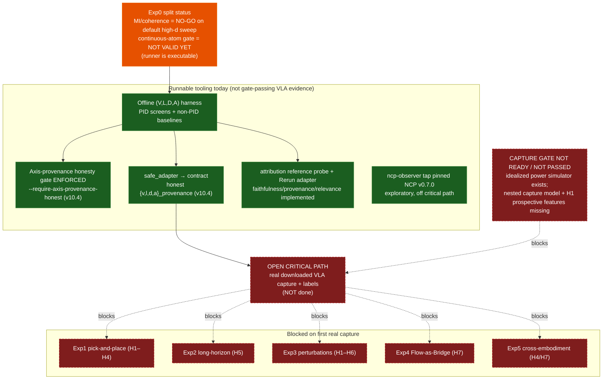

*Caption: corrected v10.7 pipeline state — orange = executable Exp0 with split scientific status; green = runnable tooling, not validated atom evidence; red dashed = unresolved capture design/data gates and the Exp1–Exp5 protocols they block.*

---

## 0.1 Hypothesis Status (H1–H9)

Hypotheses grouped by their `grandplan.md` §14.1 status. Status is unchanged at v10.7; all hypothesis tests remain blocked on the real-VLA capture (only H8 geometry diagnostics and the H9 probe machinery run today on fixtures/synthetic).

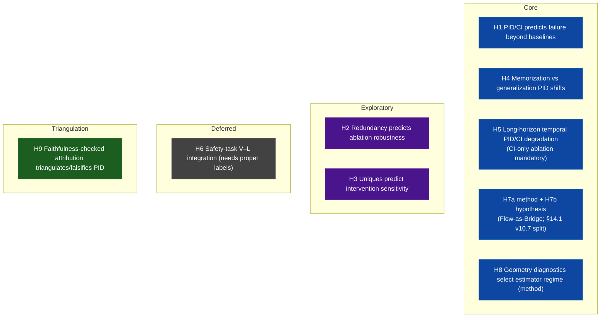

*Caption: H1–H9 by status (Core / Exploratory / Deferred / Triangulation). Status is unchanged at v10.7; all hypothesis verdicts remain pending the open real-VLA capture.*

---

## 0.2 Milestone / Critical-Path Roadmap (M0–M8)

Build order from `grandplan.md` §A.7. "Implemented" reflects verified in-repo crates/harnesses; M5 capture is the open critical path; M6–M8 are specified/optional. This is engineering state, not a research result.

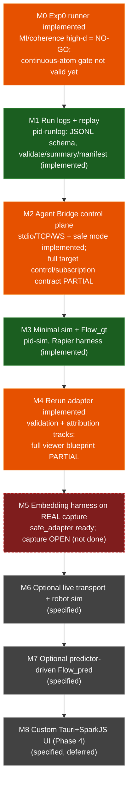

*Caption: M0–M8 roadmap — green = implemented acceptance slice, orange = implemented groundwork with an unmet scientific/milestone contract, red dashed = M5 open critical path, grey = specified/optional. Engineering state only.*

---

## 1. High-Level System Overview

This diagram illustrates the target interaction pattern. The canonical Phases 1–3 data spine is **run log → replay → Rerun**; Zenoh/live middleware is optional Phase 6 transport and must still emit the same run-log events.

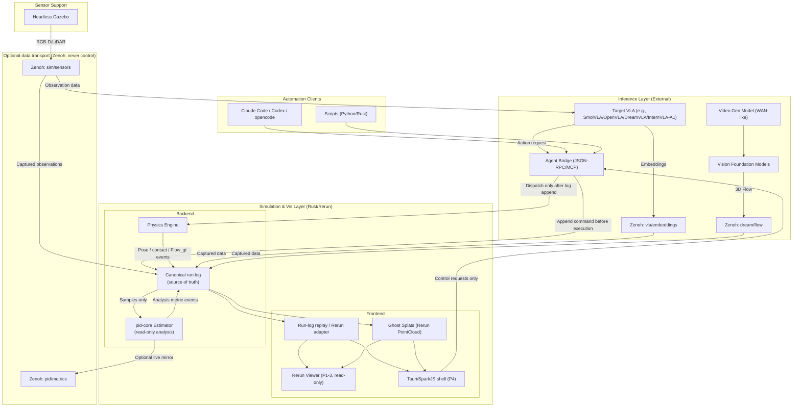

---

## 2. PID-Splat Simulation Loop

This diagram details the target "Splat-First" update loop, showing how a physics backend (Rapier shown as an example), canonical run-log events, and rendering are synchronized: Rerun consumes the replay stream in Phases 1–3, while SparkJS can consume the same events in Phase 4.

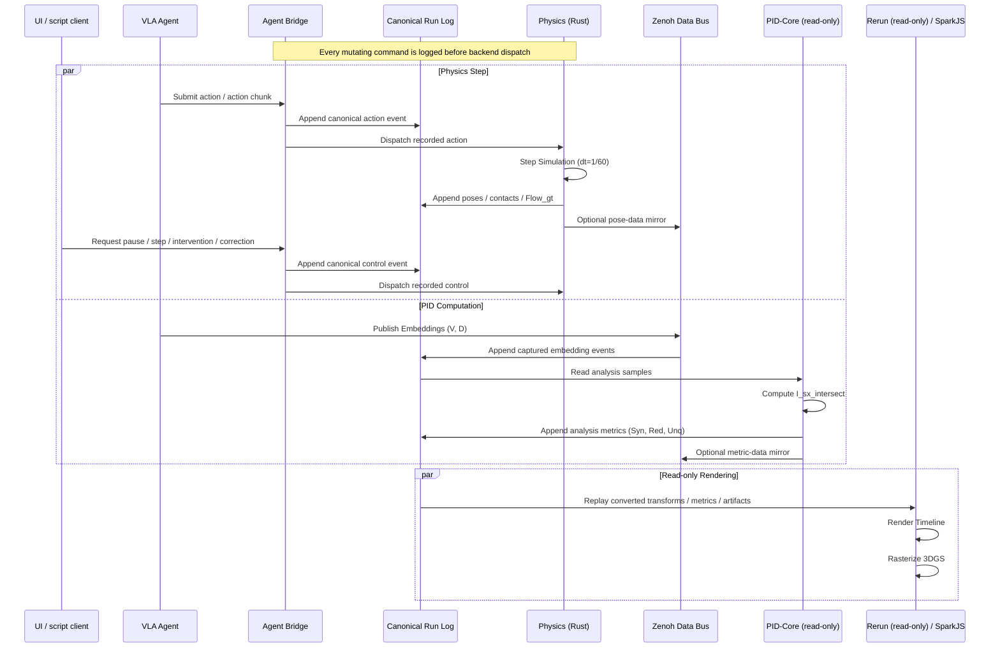

---

## 3. Geometry-First Analysis Protocol

This flowchart implements the corrected decision logic from `grandplan.md` §16.11. Every variable and every concatenation actually passed to an estimator is diagnosed. Sampled mean `δ_rel` is reported as a descriptive tree-likeness statistic only: it is **not** a Euclidean-validity pass/fail gate (a Euclidean line is the immediate counterexample).

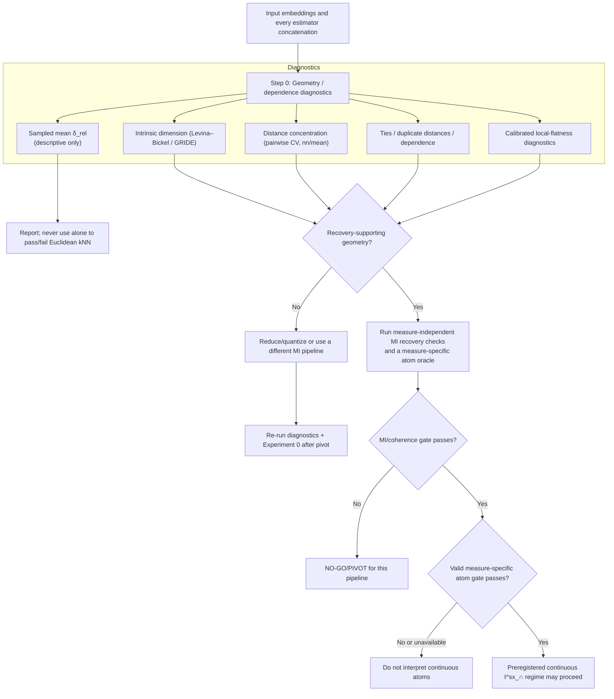

---

## 4. Modular Physics Backend Architecture

This diagram shows the composable backend system where rendering (Gaussian Splats) is decoupled from physics (swappable between Rapier, MuJoCo, Isaac Gym) and robot simulation (Gazebo or MuJoCo).

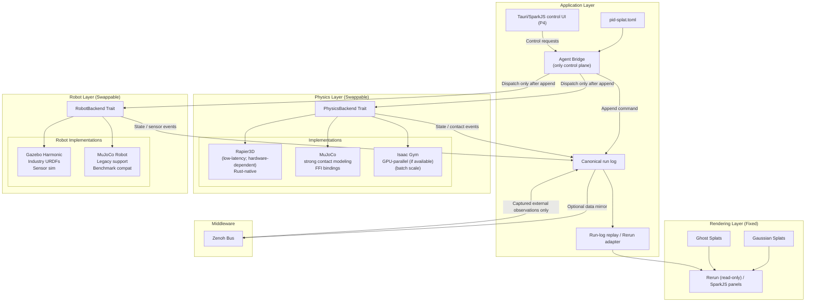

### Backend Selection Logic

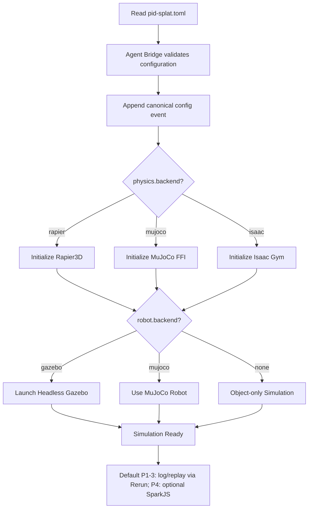

### Use Case Decision Tree

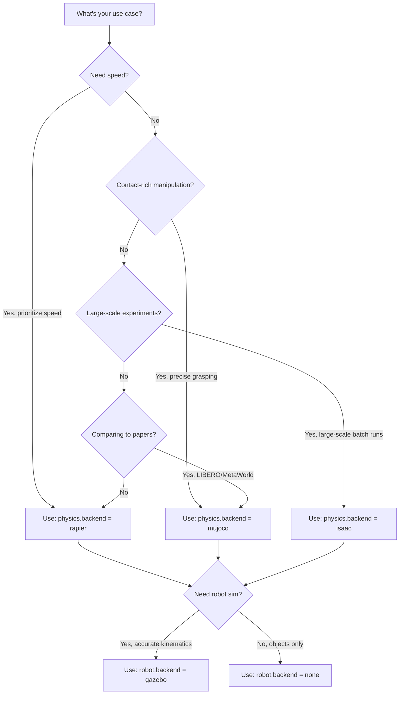

---

## 5. Hybrid Rendering: Splats + Mesh + Physics Proxies

This diagram captures the intended hybrid approach: use 3DGS splats for photoreal appearance, and meshes/URDFs for articulated robots, collision proxies, and precise interactive edits. This aligns with `grandplan.md` §A and §16 (geometry/diagnostics are independent of the renderer, but the renderer must support inspectable overlays).

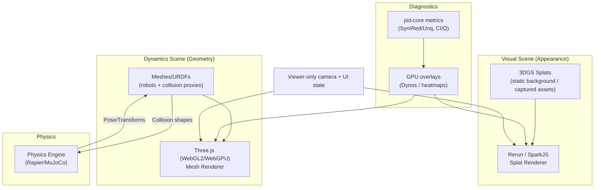

---

## 6. Dream2Flow Data Pipeline

Visualizing a model-agnostic Dream2Flow-style bridge: external video prediction → 3D flow extraction → PID targets (see `grandplan.md` §9.7.7, §10.10). The video predictor is treated as an interchangeable, versioned service (no oracle framing).

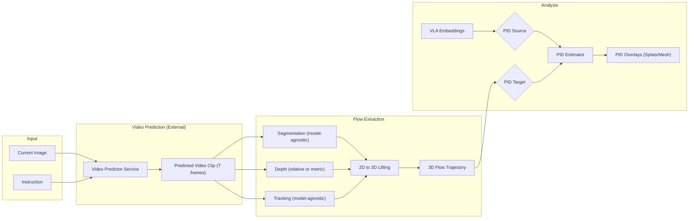

---

## 7. Experiment 0: Separate MI/Coherence and Atom-Validation Gates

This diagram summarizes the corrected validation loop before applying PID to real VLA embeddings (`grandplan.md` corrective addendum, §9.1, §16; `EXPERIMENTS.md` §4). The existing aggregate Exp0 label must not be presented as continuous-atom validation.

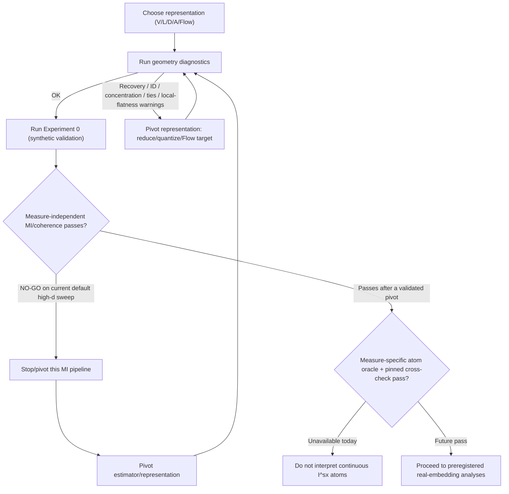

---

## 8. Hypotheses → Experiments Map

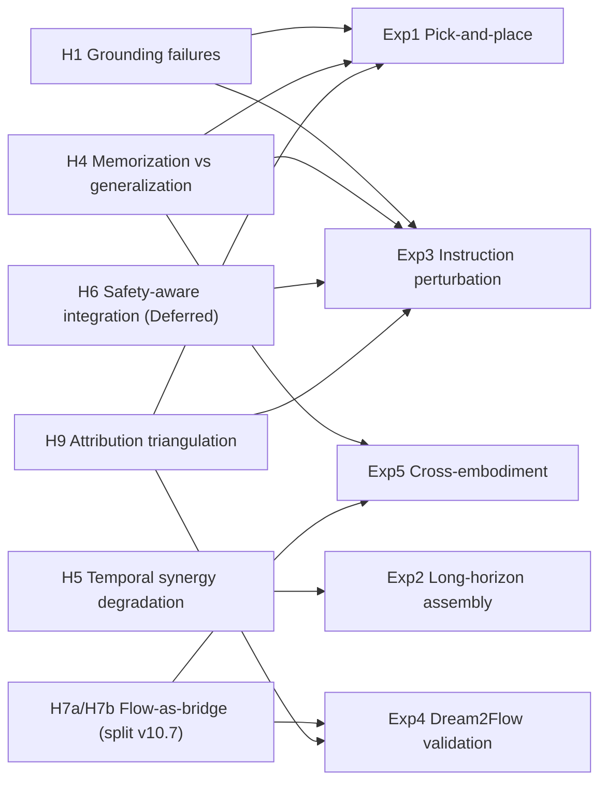

---

## 9. OpenUSD / USDZ Interop (Optional)

This diagram summarizes the LeIsaac/Isaac Sim interoperability pattern referenced in `grandplan.md` §C.1: convert splats to OpenUSD for composition/validation in USD tooling, then (optionally) bring the composed result back into the PID‑Splat workflow.

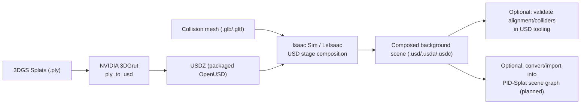

---

## 10. Agent Bridge Control Plane (LLM‑First)

The Agent Bridge is the **only** programmable control plane: it exposes the same operations to the GUI, VLA-policy adapter, scripts, and LLM coding tools (actions, scene editing, interventions, pause/resume/step, correction forces, replay, and exports). Each mutating request is appended to the canonical run log before backend dispatch.

**External backend note:** the Agent Bridge is also the *adapter surface* for third‑party simulators that expose an RL-style `reset/step` API (or their own WebSocket/pubsub interface). Their native interface sits behind the bridge; it is not a second prisoma control plane. The adapter records prisoma command events before dispatch so replay and analysis are identical across backends.

The deterministic in-repo bridge currently provides stdio/TCP/WebSocket JSON-RPC smokes for status, reset/step, scene edits, deterministic interventions, `log.replay`, `log.start`/`log.stop`, and `export.rerun`; safe mode permits status/replay and logs blocked mutation, run-ending, or file-writing export requests.

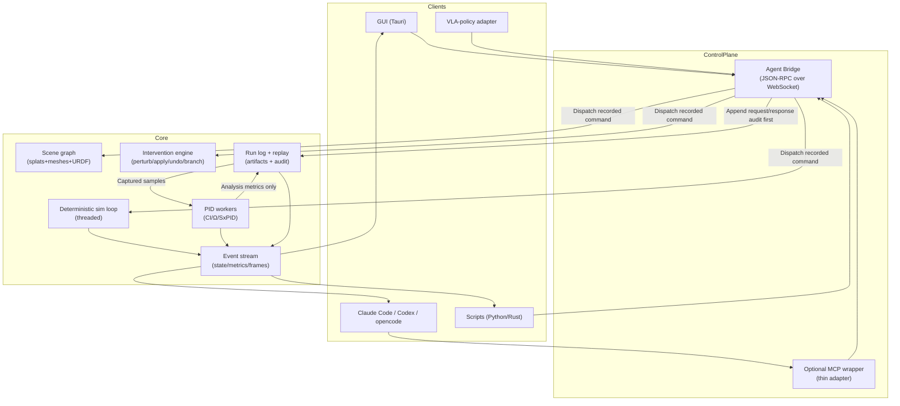

---

## 11. Cross-Backend Replay (Optional Robustness Control)

This diagram captures the v10.1 cross-backend replay idea (`grandplan.md` §E.1): replay the same run log under different physics backends (e.g., Rapier vs MuJoCo) and quantify divergence. This is a practical way to test whether PID findings (H1–H6) are sensitive to contact-model idiosyncrasies.

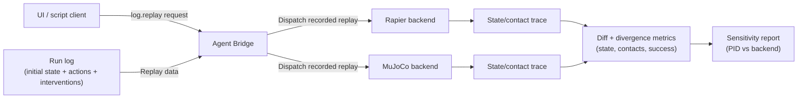

---

## 12. GauSS‑MI Uncertainty + Active View Selection (Optional)

This diagram summarizes the proposed GauSS‑MI integration (`GAUSS_MI_INTEGRATION.md`): treat 3DGS reconstruction uncertainty as a confound/diagnostic signal, optionally down‑weight unreliable visual features, and (if you are still capturing scenes) use uncertainty‑guided view selection to reduce uncertainty.

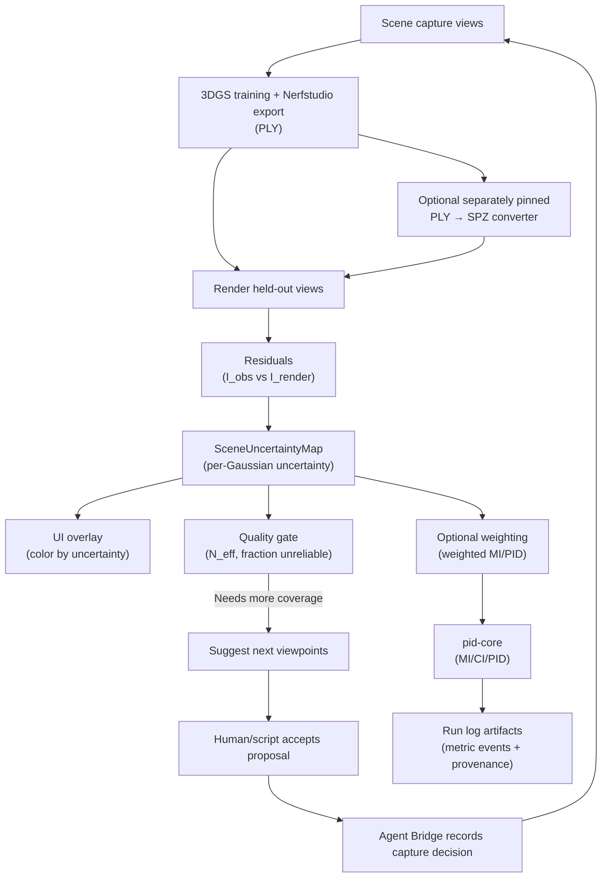

---

## 13. Attribution Probes as Companion Diagnostics

This diagram places LRP/Integrated Gradients/DeepLIFT/Grad-CAM/TCAV/saliency/SHAP-style methods beside PID. The two branches answer different questions and should be compared only through logged samples, common targets, and matched interventions.

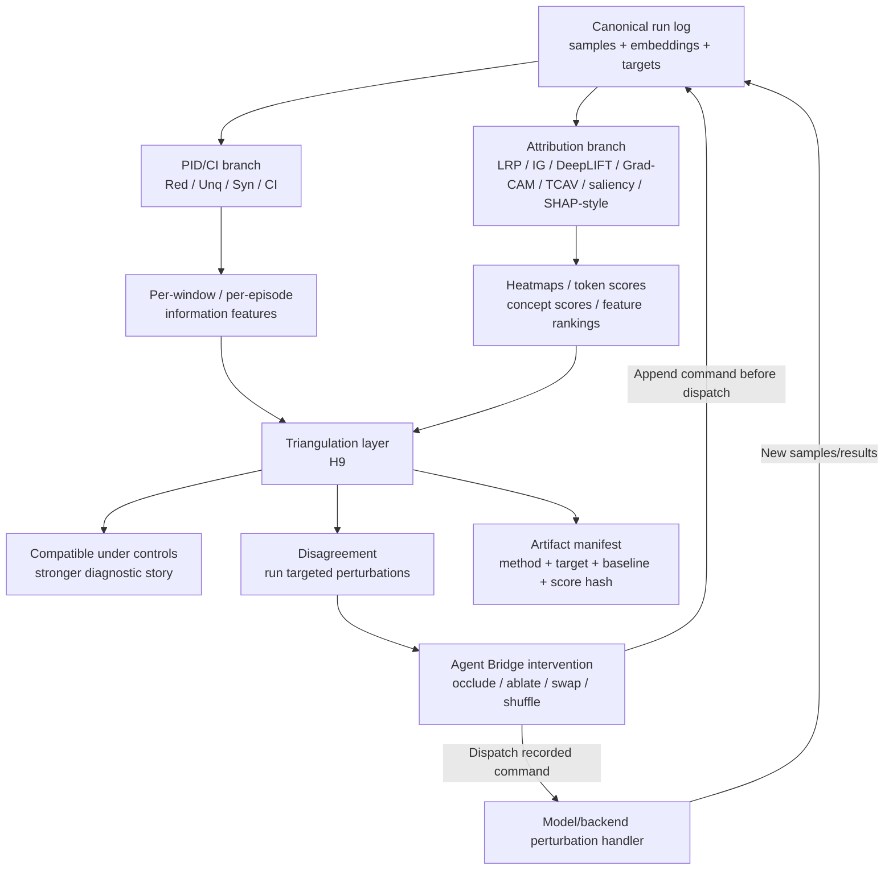
