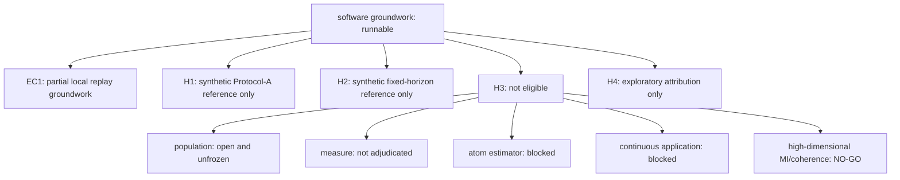
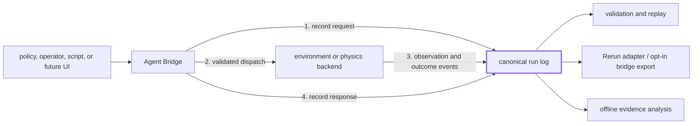
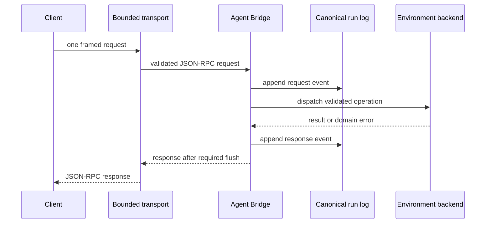
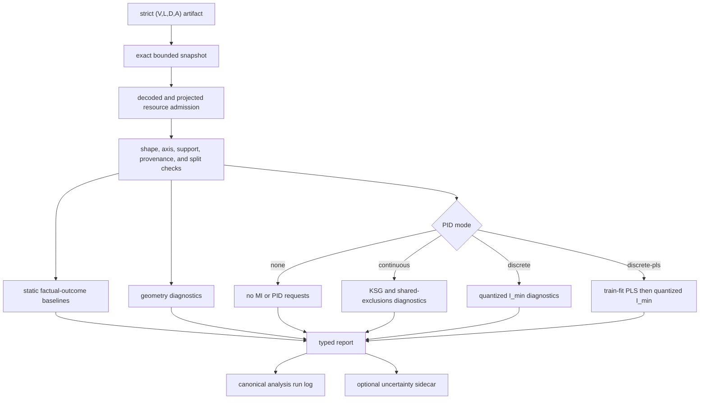
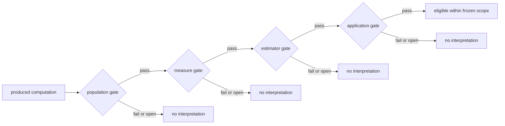
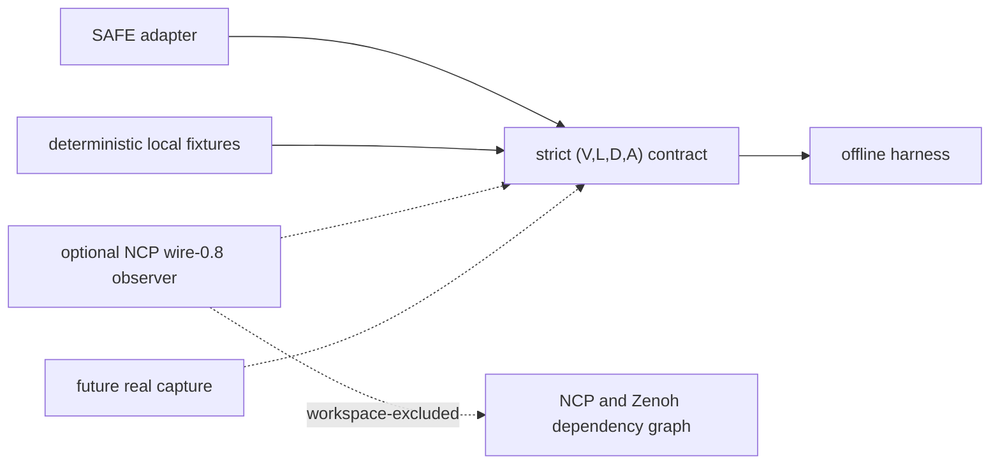
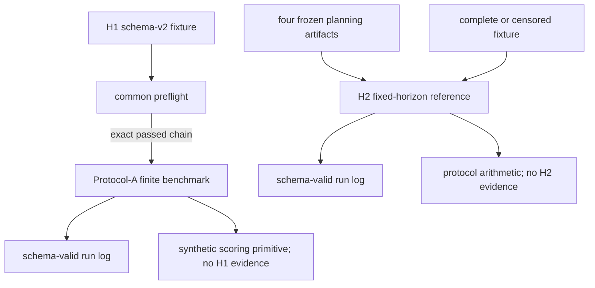
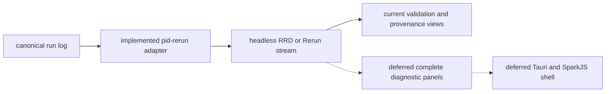
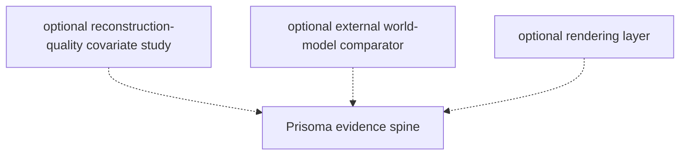
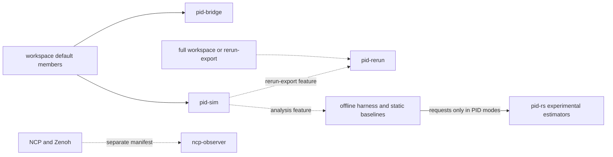

# Prisoma System Diagrams

These diagrams summarize the current Prisoma design. They do not add requirements beyond
[`grandplan.md`](grandplan.md) and [ARCHITECTURE.md](ARCHITECTURE.md).

Solid nodes exist in the repository. Dashed nodes are optional, external, or deferred.

## 1. Current status

```mermaid
flowchart TD
    Groundwork["software groundwork: runnable"]
    EC1["EC1: partial local replay groundwork"]
    H1["H1: synthetic Protocol-A reference only"]
    H2["H2: synthetic fixed-horizon reference only"]
    H3["H3: not eligible"]
    H4["H4: exploratory attribution only"]

    Groundwork --> EC1
    Groundwork --> H1
    Groundwork --> H2
    Groundwork --> H3
    Groundwork --> H4

    H3 --> Population["population: open and unfrozen"]
    H3 --> Measure["measure: not adjudicated"]
    H3 --> Estimator["atom estimator: blocked"]
    H3 --> Application["continuous application: blocked"]
    H3 --> HighDim["high-dimensional MI/coherence: NO-GO"]
```

No branch in this diagram is a confirmatory result.

## 2. Control and evidence spine

```mermaid
flowchart LR
    Client["policy, operator, script, or future UI"] --> Bridge["Agent Bridge"]
    Bridge -->|1. record request| Log["canonical run log"]
    Bridge -->|2. validated dispatch| Backend["environment or physics backend"]
    Backend -->|3. observation and outcome events| Log
    Bridge -->|4. record response| Log

    Log --> Replay["validation and replay"]
    Log --> Rerun["Rerun adapter / opt-in bridge export"]
    Log --> Analysis["offline evidence analysis"]

    style Log stroke-width:3px
```

Rerun and analysis are consumers. They have no control authority.

## 3. Bridge request lifecycle

```mermaid
sequenceDiagram
    participant C as Client
    participant T as Bounded transport
    participant B as Agent Bridge
    participant L as Canonical run log
    participant E as Environment backend

    C->>T: one framed request
    T->>B: validated JSON-RPC request
    B->>L: append request event
    B->>E: dispatch validated operation
    E-->>B: result or domain error
    B->>L: append response event
    B-->>T: response after required flush
    T-->>C: JSON-RPC response
```

A transport or storage failure can prevent a complete terminal record. The design makes no
cross-file or power-loss transaction claim.

## 4. Offline analysis

```mermaid
flowchart TD
    Artifact["strict (V,L,D,A) artifact"] --> Snapshot["exact bounded snapshot"]
    Snapshot --> Admission["decoded and projected resource admission"]
    Admission --> Contract["shape, axis, support, provenance, and split checks"]

    Contract --> Static["static factual-outcome baselines"]
    Contract --> Geometry["geometry diagnostics"]
    Contract --> PIDMode{"PID mode"}

    PIDMode -->|none| NoPid["no MI or PID requests"]
    PIDMode -->|continuous| Continuous["KSG and shared-exclusions diagnostics"]
    PIDMode -->|discrete| Discrete["quantized I_min diagnostics"]
    PIDMode -->|discrete-pls| Pls["train-fit PLS then quantized I_min"]

    Static --> Report["typed report"]
    Geometry --> Report
    NoPid --> Report
    Continuous --> Report
    Discrete --> Report
    Pls --> Report
    Report --> AnalysisLog["canonical analysis run log"]
    Report --> Sidecar["optional uncertainty sidecar"]
```

The branches identify different computation paths. They do not identify interchangeable
estimands. A failed continuous path never falls through to discrete `I_min`.

## 5. Scientific interpretation gates

```mermaid
flowchart LR
    Estimate["produced computation"] --> Population{"population gate"}
    Population -->|pass| Measure{"measure gate"}
    Population -->|fail or open| Stop1["no interpretation"]
    Measure -->|pass| Estimator{"estimator gate"}
    Measure -->|fail or open| Stop2["no interpretation"]
    Estimator -->|pass| Application{"application gate"}
    Estimator -->|fail or open| Stop3["no interpretation"]
    Application -->|pass| Interpret["eligible within frozen scope"]
    Application -->|fail or open| Stop4["no interpretation"]
```

Computation status and gate status remain separate in reports and ledgers.

## 6. Producer boundaries

```mermaid
flowchart LR
    Safe["SAFE adapter"] --> Contract["strict (V,L,D,A) contract"]
    Toy["deterministic local fixtures"] --> Contract
    NCP["optional NCP wire-0.8 observer"] -.-> Contract
    Real["future real capture"] -.-> Contract
    Contract --> Harness["offline harness"]

    NCP -.->|workspace-excluded| Optional["NCP and Zenoh dependency graph"]
```

The critical-path producer is the SAFE adapter. The NCP observer is optional and read-only.
Neither current path provides real confirmatory capture.

## 7. H1 and H2 software references

```mermaid
flowchart TD
    H1Input["H1 schema-v2 fixture"] --> H1Preflight["common preflight"]
    H1Preflight -->|exact passed chain| H1A["Protocol-A finite benchmark"]
    H1A --> H1Log["schema-valid run log"]
    H1A --> H1Boundary["synthetic scoring primitive; no H1 evidence"]

    H2Artifacts["four frozen planning artifacts"] --> H2Ref["H2 fixed-horizon reference"]
    H2Dataset["complete or censored fixture"] --> H2Ref
    H2Ref --> H2Log["schema-valid run log"]
    H2Ref --> H2Boundary["protocol arithmetic; no H2 evidence"]
```

Both paths make invalid readable inputs auditable. Neither substitutes for a frozen real study.

## 8. Viewer boundary

```mermaid
flowchart LR
    Log["canonical run log"] --> Converter["implemented pid-rerun adapter"]
    Converter --> RRD["headless RRD or Rerun stream"]
    RRD --> Current["current validation and provenance views"]
    RRD -.-> Full["deferred complete diagnostic panels"]
    Full -.-> Shell["deferred Tauri and SparkJS shell"]
```

The complete Phases 1–3 viewer is specified but not implemented. The Phase-4 shell is deferred.

## 9. Optional studies

```mermaid
flowchart TD
    Core["Prisoma evidence spine"]
    Gauss["optional reconstruction-quality covariate study"]
    World["optional external world-model comparator"]
    Render["optional rendering layer"]

    Gauss -.-> Core
    World -.-> Core
    Render -.-> Core
```

These proposals must consume canonical evidence and preserve the control invariant. They are not
runtime dependencies and are not on the thesis critical path.

## 10. Dependency firebreak

```mermaid
flowchart LR
    Core["workspace default members"] --> Bridge["pid-bridge"]
    Core --> Sim["pid-sim"]
    Full["full workspace or rerun-export"] -.-> Rerun["pid-rerun"]
    Sim -.->|rerun-export feature| Rerun
    Sim -.->|analysis feature| Harness["offline harness and static baselines"]

    Harness -->|requests only in PID modes| PID["pid-rs experimental estimators"]
    NCP["NCP and Zenoh"] -.->|separate manifest| Observer["ncp-observer"]
```

The default `pid-sim` feature set excludes the estimator/linear-algebra, Rerun/Arrow, Rapier, and
WebSocket graphs. The workspace default members also exclude `pid-rerun`, and `ncp-observer` has a
separate manifest. Full gates include every feature. The PID-disabled analysis mode emits baselines
without requesting MI or PID atoms.
