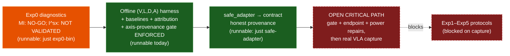

<p align="center">
  
</p>

# prisoma

> **Rust PID estimators + Python bindings live in [`pid-rs`](https://github.com/sepahead/pid-rs) — the single source of truth.**
> `pid-core`, `pid-runlog`, and the `pid-python` (`pid_core_rs`) bindings are **not** vendored here;
> they are pinned as the `pid-rs/` git submodule. After cloning: `git submodule update --init`.
> The local crates (`pid-sim`, `pid-rerun`, `pid-bridge`) path-depend into `pid-rs/crates/*`, and the
> estimator binaries run from the submodule, e.g.
> `cargo run --manifest-path pid-rs/crates/pid-core/Cargo.toml --bin exp0`.
> Build the Python module from the submodule: `maturin develop -m pid-rs/crates/pid-python/Cargo.toml`.

[](#license)

prisoma is a research toolkit for diagnosing **Vision‑Language‑Action (VLA)** policies with **Partial Information Decomposition (PID)** — specifically the shared‑exclusions measure `I^sx_∩` — plus Shannon‑invariant screening and non‑PID controls, with local attribution methods treated strictly as baselines/triangulation probes. The project is **gate‑driven**: PID atoms are never interpreted on real embeddings until the estimator and geometry gates pass, hypothesis claims are bound by preregistered falsification contracts (`grandplan.md` §14.1) and a preregistered statistical analysis plan (§14.8), and negative results are first‑class publishable outcomes.

## Documentation map

Read these in order of what you need. `grandplan.md` is canonical; the others are kept consistent with it.

| Document | What it is |
|---|---|
| `grandplan.md` | Canonical spec — definitions, gates, hypotheses, engineering plan |
| `EXPERIMENTS.md` | What to run + what to log (protocols; §0.2 runbook = executable-today vs blocked) |
| `ARCHITECTURE.md` | Target system design (PID‑Splat) |
| `DIAGRAMS.md` | Architecture + control-plane diagrams (status dashboards up top) |
| `pidsplatspecs.md` | Simulation/spec details (PID‑Splat) |
| `findings.md` | Current estimator-status evidence (Exp0 results + interpretation) |
| `REVIEW_AND_TODO.md` | Whole-repo review, prioritized to-do list, current critical path |
| `AGENTS.md` | Ground rules + a detailed "what actually exists" inventory for contributors |
| `NCP_DEV_PROMPT.md` | Optional: dev handoff for the Engram/NCP `(V,L,D,A)` bridge |
| `uidesigner/UI.md` | UI/UX spec (viewer-first; ordered by milestones) |
| `GAUSS_MI_INTEGRATION.md`, `WORLD_WARP_INTEGRATION.md` | Optional add-on specs (3DGS uncertainty; external world-model baseline) |
| `THIRD_PARTY_NOTICES.md` | Release-governance notices/checklist |

## Prerequisites

- **Rust** — a stable toolchain new enough for the current local dependency graph (Rerun
  0.28 declares Rust 1.88). The root workspace does not currently declare an enforced MSRV;
  the separate `pid-rs` workspace targets 1.80. Install via [rustup](https://rustup.rs/).
- **Git submodule** — `git submodule update --init` after cloning (fetches `pid-rs`, the estimator core). There are no nested submodules, so `--recursive` is not required. The submodule URL is SSH (`git@github.com:sepahead/pid-rs.git`); if you cloned over HTTPS without SSH keys, either configure SSH or add a `git config --global url."https://github.com/".insteadOf git@github.com:` rewrite first.
- **Python 3.11+** with [`uv`](https://docs.astral.sh/uv/) — only for the `experiments/` (SAFE adapter + attribution probe) and the doc-audit scripts. `numpy` is the sole hard runtime dep; `uv sync` installs the dev/analysis groups.
- **`just`** (optional) — a task runner; every `just` recipe below has a plain `cargo`/`python` equivalent. Install with `cargo install just`.
- **`maturin`** (optional) — only to build the Python bindings (`pid_core_rs`) from the submodule.

Verify the toolchain and see the estimator gate fire:

```bash
git submodule update --init
cargo test --workspace
cargo run --manifest-path pid-rs/crates/pid-core/Cargo.toml --bin exp0   # prints the GO/PIVOT/NO-GO verdict
```

## Current Status & What To Do, In Order (v10.7 corrective audit, 2026-07-10)

**Status at a glance:**

- **Implemented, with passing baseline tests:** the Rust estimator, run-log/replay,
  bridge/sim/Rerun groundwork, offline `(V,L,D,A)` harness, Rapier manipulation, SAFE adapter,
  and reference attribution probe. Passing tests establish current behavior, not production or
  scientific validity; the dated code review lists unresolved integrity/security blockers.
- **Two estimator statuses:** the high-dimensional **MI/coherence gate is NO-GO**. The
  continuous **`I^sx_∩` gate is NOT VALIDATED**: default Exp0 includes a known-wrong
  zero-redundancy target for the adopted measure, while `--strict-gate` enforces the curated
  low-dimensional MI band and only reports atoms. See `findings.md`; never quote the binary's
  aggregate label as an atom-validity verdict.
- **Recent docset slices** (research status unchanged throughout): **v10.6** (2026-07-05) was correctness/robustness — CI resurrected after an invalid-YAML workflow had silently created zero jobs since 2026-06-13, Agent Bridge and offline-harness run-log paths hardened, `crates/ncp-observer` brought toward the M5 bar (`CHANGELOG.md`). **v10.7** (2026-07-06) is a first-principles spec audit + statistics plan — math/precision corrections (one outright error fixed: findings.md's δ-hyperbolicity direction was backwards), a hardened hypothesis system (H7a/H7b split, H5 operationalized, discrete-regime preregistration, the new `grandplan.md` §14.8 statistical analysis plan and §9.7.2b H2/H3 protocol), a July-2026 literature refresh (`grandplan.md` §12.6 — novelty re-verified: still no published PID-on-VLA anywhere; VLA-Arena is now ICML 2026 — re-verify at submission), and NCP pin prose synced to v0.6.0. A same-day triple-check addendum then repaired the new statistical content under hostile review (endpoint units, regime multiplicity, placebo criterion — see the grandplan v10.7 addendum bullet) and re-pinned the pid-rs submodule to the new upstream **v0.4.0** (correctness release; this is what moved the Exp0 verdict label from PIVOT to NO-GO).
- **Open critical path:** do **not** begin an evidentiary real-VLA capture yet. Required first:
  repair upstream `ISX_GATE`; implement leakage-safe episode-local H1 scores plus action-
  entropy and ensemble/temperature baselines; freeze transforms and task eligibility for
  H2–H4; and replace the implemented idealized power sensitivity tool with the nested capture
  design in §14.8.3. The first power report is overall NOT PASSED and its task/case counts are
  withdrawn as capture requirements.



*Caption: Runnable plumbing is not a scientific pass. Exp1–Exp5 remain blocked on estimator,
endpoint, power, and then capture prerequisites.*

Each step gates the next; canonical depth is in `grandplan.md` at the cited sections.

1. **Verify the toolchain and inspect diagnostics:** `cargo test`, then `just exp0` /
   `just exp0-bin`. The printed aggregate is diagnostic output, not a valid `I^sx` verdict;
   the current split status is MI NO-GO / `I^sx` NOT VALIDATED (§9.1, `findings.md`).
2. **Learn the measurement-regime rules before touching real data:** one (PID measure, preprocessing, estimator config) tuple = one preregistered regime; never pool or compare continuous `I^sx_∩` atoms with discrete `I_min` atoms as if they were one quantity (`grandplan.md` Warning 6 + §8.1.6); supervised projections (PLS) are fit on training samples only and re-gated (§8.2.3 step 5).
3. **Exercise plumbing on checked fixtures:** strict geometry and discrete fixtures intentionally
   warn/fail. Their thresholds are not validated scientific gates, and discrete saturation is
   currently advisory rather than a strict failure path.
4. **Prepare, but do not treat as evidentiary capture yet:** the SAFE adapter and Rapier path
   can exercise the contract. H1–H4 capture waits for the blockers above.
5. **Analyze only after gates exist:** geometry diagnostics do not currently select a valid
   regime. The m-out-of-n raw percentile output is a stability envelope at size m, not an
   n-sample confidence interval; endpoint inference must resample the correct outer units.
6. **Run the non-PID baselines every time:** majority/1-NN/centroid baselines *and* a SAFE-class logistic-regression internal-feature failure detector (surfaced under the `heldout_logreg_vlda_success_*` metric names) are built into the harness; add one faithfulness-checked attribution probe (`experiments/attribution/`, the §14.7.1 AttnLRP protocol; `just attribution-probe`). The preregistered kill criteria (§14.1.1) decide whether PID atoms earn a place in any claim — a negative answer is a publishable outcome.
7. **Only then** run the Exp1–Exp5 protocols in `EXPERIMENTS.md` (see its §0.2 runbook for what is executable today vs blocked on step 4).

## Hypotheses (Docset v10.7)

The canonical registry + falsification criteria live in `grandplan.md` (§14.1, including the v10.7 falsifiability index covering H4–H7); the preregistered statistical analysis plan (primary endpoints, multiplicity, power gates) is `grandplan.md` §14.8.

| Hypothesis | One‑line testable claim | Status | Real robotics problem addressed |
|---|---|---|---|
| **H1** | PID/CI features predict failure labels beyond strong baselines. | Blocked: local scores + two baselines | Failure triage at fleet scale |
| **H2** | Redundancy predicts robustness to single‑modality ablation (matched controls). | Exploratory | Forecasting which skills degrade when a sensor/modality degrades, before it happens in the field |
| **H3** | Uniques predict intervention sensitivity (matched‑strength perturbations). | Exploratory | Targeted data collection: spend teleop budget on the modality that actually moves behavior |
| **H4** | Memorization vs generalization induces systematic PID/CI shifts. | Core | Pre-deployment generalization certification (VLA-Arena: current VLAs memorize) |
| **H5** | Long‑horizon failures correlate with temporal PID/CI degradation. | Core (CI-only ablation mandatory) | Early warning for compositional drift in multi-stage tasks (kitting/assembly) |
| **H6** | Safety tasks show distinctive V–L integration patterns (only with proper labels/controls). | Deferred | Safety-case evidence (needs proper labels first) |
| **H7** | Split (v10.7): **H7a** — the flow bridge enables stage‑wise diagnostics and embodiment‑agnostic comparisons (method, judged by acceptance criteria); **H7b** — `Syn(V,D;A)` tracks world‑model quality independent of execution success (falsifiable). | Core (H7a method + H7b hypothesis) | Cross-embodiment porting diagnosis: world-model failure vs execution failure |
| **H8** | A calibrated geometry/regime classifier predicts oracle-defined estimator validity on held-out controls. | Core method; blocked on calibration | Trustworthy metrics: don't ship estimator artifacts to dashboards |
| **H9** | Faithfulness-checked attribution probes (LRP/IG/DeepLIFT/Grad-CAM/TCAV/saliency/occlusion/SHAP-style) should triangulate, or falsify, PID-derived modality/stage claims. | Triangulation | Audit-grade incident explanations from converging evidence |

PID is **forced nowhere**: `grandplan.md` §14.1.1 records, per hypothesis, the cheapest non-PID alternative, what PID distinctively adds, and the preregistered kill criteria that downgrade or drop PID-atom claims when simpler quantities suffice. Attribution methods are comparison evidence, not a shortcut around PID validity: they explain one model call or concept direction, while PID/CI estimates distribution-level information across logged samples. Disagreement under controlled interventions is itself a diagnostic result.

## Experiments (Run Order)

Details and logging requirements live in `EXPERIMENTS.md`; estimator gates and confounds live in `grandplan.md`.

1. **Exp0** — Estimator + geometry gate (GO/PIVOT/NO‑GO). *Runnable today* (`just exp0-bin`); current verdict on synthetic high-d controls: **NO-GO** under pid-rs 0.4.0 (`findings.md`). Nothing downstream is interpretable without this gate.
2. **Exp1** — Pick‑and‑place + perturbations (H1–H4). *Blocked on the first real capture* (step 4 above); the offline harness + baselines that will analyze it are runnable today.
3. **Exp2** — Long‑horizon composition (H5; windowed PID/CI with block bootstrap; CI-only ablation mandatory). *Blocked on capture.*
4. **Exp3** — Instruction/visual/physics perturbations (H1–H6; matched-strength controls + placebos). *Blocked on capture.*
5. **Exp4** — Flow‑as‑Bridge bring‑up with simulator `Flow_gt` (H7). *Sim-side `Flow_gt` + verification runnable today* (`just runlog-sim-verify`); VLA-side blocked on capture.
6. **Exp5** — Cross‑embodiment replication (H4/H7; mind the embodiment-in-`L` confound, `grandplan.md` §14.5.7.3). *Blocked on capture.*

## Doc Audits

- `python scripts/audit_grandplan.py --check-italic-titles` (arXiv coverage + title drift; uses `outputs/arxiv_ref_cache.json`)
- `python scripts/audit_grandplan_claims.py` (heuristic scan for unqualified venue/perf claims)
- `python scripts/audit_docset_claims.py` (same heuristic scan across the canonical docset + `findings.md`)
- Full tracked-Markdown sweep: `python scripts/audit_docset_claims.py --paths $(git ls-files '*.md')`
- With `just`: `just docs-audit` (runs the first three)

## What Actually Exists

The authoritative, detailed inventory is in **`AGENTS.md`** ("Repo reality"). In brief:

- **Implemented (Rust, in `pid-rs/` submodule):** `pid-core` (KSG MI with an optional exact-parallel `parallel` feature, continuous `I^sx_∩`, PLS supervised reduction, discrete 2-/3-source `I_min` PID + saturation diagnostics, genuine discrete SxPID `i^sx_∩` in `sxpid.rs` (2–4 sources) — *not yet wired into the offline harness*, block bootstrap, `bootstrap_rows_stats`/`permutation_rows_pvalue`, an L2 logistic classifier, and a `pipeline.rs` composition layer), `pid-python` (`pid_core_rs`; **18 exported functions**), and `pid-runlog` (M1 JSONL schema + replay/validate/compare/summary/manifest/sidecar CLI).
- **Implemented (Rust, local crates):** `pid-bridge` (Agent Bridge dispatch/JSON-RPC-shaped
  conversion/contract export), `pid-sim` (deterministic sim, real optional Rapier backend,
  manipulation harness, transports, and offline VLDA screens), and `pid-rerun`. Implemented
  baselines are majority, 1-NN, nearest-centroid, and held-out logistic regression; action
  predictive entropy and ensemble/temperature uncertainty are still missing. The code review
  also identifies network-authentication, transactional logging, reconstructability, and
  artifact-integrity work before production use.
- **Source-agnostic capture:** the analysis consumes one `(V,L,D,A)`+labels contract, so producers are pluggable. The **critical-path producer is `experiments/safe_adapter/`**; `pid-sim` fixtures + the Rapier/toy harnesses are standalone sim cross-checks. In `(V,L,D,A)`, **D is the hidden-state / dynamics axis, not depth** (`grandplan.md` §7.6.3).
- **Optional Engram bridge:** `crates/ncp-observer` is a read-only NCP v0.6.0 tap, excluded
  from the default workspace and off the critical path. It emits validating smoke logs and an
  artifact, but remains exploratory: audit found a future-D recency fallback, late-patch
  run-log/artifact divergence, swallowed append/hash failures, and destructive pre-write
  finalization. It also lacks honest L/split/episode/label structure. Do not use it as an M5
  producer until those integrity findings and external sequence alignment are fixed.
- **Specified (not yet built):** a fuller Rerun-based diagnostic viewer (Phases 1-3) and the deferred Tauri/SparkJS UI (Phase 4). Start at `grandplan.md` §A.7.

## Quick Start — Exp0 Gate

```bash
# optional: nix develop
cargo test
just exp0        # estimator smoke tests
just exp0-bin    # prints the GO/PIVOT/NO-GO verdict
just exp0-runlog # exports + validates canonical Exp0 evidence
```

Without `just`: `cargo test`, then `cargo run --manifest-path pid-rs/crates/pid-core/Cargo.toml --bin exp0`. To export canonical Exp0 evidence:

```bash
cargo run --manifest-path pid-rs/crates/pid-core/Cargo.toml --bin exp0 -- \
  --summary-json outputs/exp0_summary.json --runlog outputs/exp0_runlog.jsonl
cargo run --manifest-path pid-rs/crates/pid-runlog/Cargo.toml --bin pid-runlog-replay -- \
  --validate outputs/exp0_runlog.jsonl
```

See `findings.md` for the latest repo-local Exp0 interpretation notes.

## Quick Start — Tiny Labeled Harness

```bash
just toy-harness
```

Without `just`: `cargo run -p pid-sim --bin pid-toy-harness -- --summary-json outputs/toy_vla_summary.json --runlog outputs/toy_vla_runlog.jsonl`, then validate with `pid-runlog-replay --validate outputs/toy_vla_runlog.jsonl`. This is a deterministic toy task, **not VLA evidence** — it exercises label events, a replay-linked `(V,L,D,A)` contract, PID/CI features, non-PID baselines, summary artifacts, and canonical run-log export end to end.

## Quick Start — Offline (V,L,D,A) Embedding Harness

```bash
just offline-harness
just offline-harness-require-labels
just offline-harness-require-heldout
just offline-harness-require-heldout-class-coverage
just offline-harness-require-heldout-episode-disjoint
just offline-harness-strict            # asserts the expected geometry-gate failure
just offline-harness-highdim
just offline-harness-discrete
just offline-harness-discrete-pls
```

**PID estimator modes** (`--pid-mode`): `continuous`, `discrete` (`I_min`, a different
measure), and `discrete-pls`. PLS selection accepts `--pls-components N|cv|cv:MAX`; all fitted
transforms still need a frozen train-fit/apply-held-out scientific path. Discrete saturation
warnings mark non-evidence but do not currently fail the CLI, so discrete mode is not an
active-regime gate. Permutation choices are `--permutation-scheme
full-shuffle|circular-shift`: full shuffle assumes IID/exchangeable rows; circular shift
requires an approximately stationary series and is not a grouped-episode null.

**Input schema.** A JSON object with optional `run_id`/`source`/`model`/`task` and a `samples` array. Each sample carries `sample_id`, optional `episode_id`, numeric `v`/`l`/`d`/`a` vectors, optional `labels`, and optional string `metadata`. `metadata.split` values recognized as **train**: `train`, `training`; as **held-out**: `test`, `validation`, `val`, `eval`, `evaluation`, `heldout`, `holdout`, `held_out`, `hold_out`.

**What it computes.** All two-source `V/L/D→A` screens — `(V,L;A)`, `(V,D;A)`, `(L,D;A)` — after deterministic per-variable standardization, with geometry diagnostics/gates over the standardized space. When a recognized metadata split is present, it also emits train-split-only PID screens (fit with train-only standardizers, so held-out embeddings are excluded from both preprocessing and PID evidence).

**Baselines (when every sample has a boolean `success` label).** Success rate + majority accuracy; sample-level leave-one-out 1-NN; leakage-resistant leave-one-episode-out majority/1-NN (when every sample has an `episode_id` and there are ≥2 distinct episodes); and true held-out majority/1-NN + train-standardized nearest-centroid + a SAFE-class held-out logistic-regression detector (when the split is present). Held-out baselines emit accuracy and balanced accuracy when both classes are present; centroid baselines also emit AUROC. The summary/run log preserve split counts, train/held-out IDs, class-coverage and episode-disjointness status, held-out per-sample prediction records, and failure-class confusion/rate diagnostics.

**Strict modes (fail closed).** `--require-success-labels`, `--require-heldout-split`, `--require-heldout-class-coverage`, `--require-heldout-episode-disjoint`, `--require-geometry-pass`, and `--require-axis-provenance-honest` each fail the run (while still writing a valid *failed* run log) when their invariant is violated.

Without `just`:

```bash
cargo run -p pid-sim --bin pid-offline-harness -- \
  --input crates/pid-sim/fixtures/offline_vlda_fixture.json \
  --summary-json outputs/offline_vlda_summary.json --runlog outputs/offline_vlda_runlog.jsonl
cargo run --manifest-path pid-rs/crates/pid-runlog/Cargo.toml --bin pid-runlog-replay -- \
  --validate outputs/offline_vlda_runlog.jsonl
```

The harness is an artifact-to-runlog converter for captured embeddings, **not** evidence from a real VLA by itself.

## Quick Start — M1 Run Log & Agent Bridge

```bash
just runlog-demo               # emit + a deterministic sim run log
just bridge-contract           # export the Agent Bridge JSON-RPC contract
just runlog-replay             # replay
just runlog-validate           # validate
just runlog-bridge-demo
just runlog-bridge-stdio       # drive the bridge over stdio JSON-RPC
just runlog-bridge-stdio-safe  # same, in read-only safe mode
just runlog-summary
just runlog-manifest
just runlog-sidecars
just runlog-sim-verify
just runlog-rerun              # convert a run log to a Rerun .rrd
just runlog-rerun-bridge
just runlog-bridge-export-rerun
```

> **Note:** `just runlog-bridge-tcp` and `just runlog-bridge-ws` start a server that **blocks waiting for one client to connect** — they do not self-terminate. Run them in a separate terminal and connect a client (the CI job in `.github/workflows/ci.yml` shows a minimal Python client for each). They are omitted from the list above for that reason.

> **Security note:** TCP/WebSocket transports are development smokes, not hardened remote
> control planes. They currently lack authentication/origin enforcement and should remain
> loopback-only and safe-mode until the dated code-review findings are fixed.

**Safe mode.** The Agent Bridge read-only safe mode allows only the two non-mutating methods, `sim.status` and `log.replay`. Every mutating method — `sim.step`, `sim.reset`, `scene.set_object`, `intervention.apply`, `log.start`, `log.stop`, and file-writing `export.rerun` — is logged as a blocked bridge error response. Outside safe mode, `intervention.apply` supports deterministic `set_velocity`, `translate_object`, and `set_pose`; `log.stop` finalizes the run log; `export.rerun` converts a validated run log to a `.rrd` recording (and refuses to overwrite the session's own run log). `pid-sim-bridge-tcp` exposes newline-delimited JSON-RPC on localhost; `pid-sim-bridge-ws` exposes JSON-RPC over a local RFC6455 WebSocket. Both write canonical run logs and finalize (with `run_ended`) even on a transport error.

Without `just`: `cargo run -p pid-sim --bin pid-sim-demo -- outputs/demo_runlog.jsonl`, then validate/replay it with `pid-runlog-replay`. For sidecar provenance, use `--write-sidecars` followed by `--verify-sidecars`.

## Engineering Plan (To "Finish" the Project)

Build order + acceptance criteria are in `grandplan.md` §A.7 (**M0–M8**):

**M0** Exp0 estimator gate → **M1** run logs + replay → **M2** Agent Bridge control plane → **M3** minimal sim + `Flow_gt` → **M4** Rerun-based viewer → **M5** embedding-capture harness on a real VLA → **M6** optional live transport + robot sim → **M7** optional predictor-driven `Flow_pred` → **M8** custom Tauri+SparkJS UI (Phase 4).

GauSS‑MI uncertainty + view selection is an **optional confound-control add-on** (`GAUSS_MI_INTEGRATION.md` / `grandplan.md` §C.2), **not** a numbered milestone.

If you use an external simulator backend (Isaac/MuJoCo/etc.), treat it as an adapter that still emits the canonical run log, logs backend/solver config via `config_logged`, and is controlled via the Agent Bridge surface.

### Docset-wide final solution

The ten-scientist consensus decision record lives in `grandplan.md` §A.8:

```text
run log      = source of truth
Agent Bridge = only control plane
Rerun        = Phases 1-3 diagnostic/time-machine viewer
Tauri/SparkJS = Phase 4 control/editor/custom-rendering shell
```

Final 10-step build path: (1) keep Exp0/geometry gates strict; (2) define the canonical `pid-runlog` event schema; (3) implement deterministic replay; (4) route all GUI/script/LLM actions through the Agent Bridge; (5) build the minimal object sim and simulator-derived `Flow_gt`; (6) convert run logs into Rerun recordings/blueprints; (7) connect the offline embedding harness to one small real VLA/task capture with labels, attribution probes, and non-PID baselines; (8) gate optional live transport and external `Flow_pred` services behind the same run-log schema; (9) add Tauri/SparkJS only after the Rerun workflow works; (10) add license/provenance automation for dependencies, models, datasets, generated assets, and sidecars.

## Citation

```bibtex
@software{prisoma,
  title  = {Prisoma: Partial Information Decomposition for Vision-Language-Action Models},
  author = {Mahmoudian, Sepehr},
  year   = {2026},
  url    = {https://github.com/sepahead/prisoma}
}
```

## License

Licensed under either of

- Apache License, Version 2.0 ([LICENSE-APACHE](LICENSE-APACHE))
- MIT license ([LICENSE-MIT](LICENSE-MIT))

at your option.
