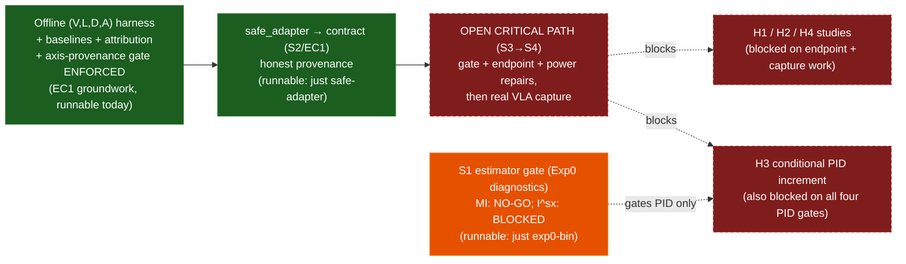

<p align="center">
  <picture>
    <source media="(prefers-color-scheme: dark)" srcset="assets/logo-dark.svg">
    
  </picture>
</p>

# prisoma

> **Rust PID estimators + Python bindings live in [`pid-rs`](https://github.com/sepahead/pid-rs) — the single source of truth.**
> `pid-core`, `pid-runlog`, and the `pid-python` (`pid_core_rs`) bindings are **not** vendored here;
> they are pinned as the `pid-rs/` git submodule. After cloning: `git submodule update --init`.
> The local crates (`pid-sim`, `pid-rerun`, `pid-bridge`) path-depend into `pid-rs/crates/*`, and the
> estimator binaries run from the submodule, e.g.
> `cargo run --manifest-path pid-rs/crates/pid-core/Cargo.toml --features experimental-all --bin exp0`.
> Build the Python module from the submodule: `maturin develop -m pid-rs/crates/pid-python/Cargo.toml`.

[](#license)

prisoma is a research toolkit providing **auditable experiment semantics** for **intervention‑grounded diagnosis** of **Vision‑Language‑Action (VLA)** policies: a provenance‑complete capture–intervention–replay substrate for testing whether genuinely pre‑treatment diagnostics predict intervention response and future failure beyond strong baselines. **Partial Information Decomposition (PID)** — the shared‑exclusions measure `I^sx_∩` — is one **conditional** candidate diagnostic, central only if it passes preregistered population, measure, estimator, and application gates (`grandplan.md` §7.1). The project is **gate‑driven**: PID atoms are never interpreted on real embeddings until those gates pass; confirmatory claims are bound by the `grandplan.md` §4 claim registry (EC1, H1–H4), the §3.8 PID kill rules, and the §6 statistical analysis plan; and negative results are first‑class publishable outcomes.

## Documentation map

Read these in order of what you need. `grandplan.md` is canonical; the others are kept consistent with it.

| Document | What it is |
|---|---|
| `grandplan.md` | Canonical spec — definitions, gates, hypotheses, engineering plan |
| `EXPERIMENTS.md` | What to run + what to log (protocols; runbook = executable-today vs blocked) |
| `ARCHITECTURE.md` | Target system design (PID‑Splat) |
| `DIAGRAMS.md` | Architecture + control-plane diagrams (status dashboards up top) |
| `pidsplatspecs.md` | Simulation/spec details (PID‑Splat) |
| `findings.md` | Current estimator-status evidence (Exp0 results + interpretation) |
| `REVIEW_AND_TODO.md` | Whole-repo review, prioritized to-do list, current critical path |
| `AGENTS.md` | Ground rules + a detailed "what actually exists" inventory for contributors |
| `NCP_DEV_PROMPT.md` | Optional: dev handoff for the Engram/NCP `(V,L,D,A)` bridge |
| `uidesigner/UI.md` | UI/UX spec (viewer-first; ordered by milestones) |
| `GAUSS_MI_INTEGRATION.md`, `WORLD_WARP_INTEGRATION.md` | Optional add-on specs (3DGS uncertainty; external world-model baseline) |
| `THIRD_PARTY_NOTICES.md` | Release-governance notices/checklist |

## Prerequisites

- **Rust** — a stable toolchain new enough for the current local dependency graph (Rerun
  0.28 declares Rust 1.88). The root workspace does not currently declare an enforced MSRV;
  the separate `pid-rs` workspace targets 1.80. Install via [rustup](https://rustup.rs/).
- **Git submodule** — `git submodule update --init` after cloning (fetches `pid-rs`, the estimator core). There are no nested submodules, so `--recursive` is not required. The submodule URL is SSH (`git@github.com:sepahead/pid-rs.git`); if you cloned over HTTPS without SSH keys, either configure SSH or add a `git config --global url."https://github.com/".insteadOf git@github.com:` rewrite first.
- **Python 3.11+** with [`uv`](https://docs.astral.sh/uv/) — only for the `experiments/` (SAFE adapter + attribution probe) and the doc-audit scripts. `numpy` is the sole hard runtime dep; `uv sync` installs the dev/analysis groups.
- **`just`** (optional) — a task runner; every `just` recipe below has a plain `cargo`/`python` equivalent. Install with `cargo install just`.
- **`maturin`** (optional) — only to build the Python bindings (`pid_core_rs`) from the submodule.

Verify the toolchain and see the estimator gate fire:

```bash
git submodule update --init
cargo test --workspace
cargo run --manifest-path pid-rs/crates/pid-core/Cargo.toml --features experimental-all --bin exp0   # prints the GO/PIVOT/NO-GO verdict
```

## Current Status & What To Do, In Order (docset v12.5, 2026-07-12)

**Status at a glance:**

- **Implemented, with passing baseline tests:** the Rust estimator, run-log/replay,
  bridge/sim/Rerun groundwork, offline `(V,L,D,A)` harness, Rapier manipulation, SAFE adapter,
  and reference attribution probe. Passing tests establish current behavior, not production or
  scientific validity; the dated code review lists unresolved integrity/security blockers.
- **Four separated PID gates** (`grandplan.md` §7.1: population, measure, estimator, application).
  The high-dimensional **MI/coherence (estimator) path is NO-GO**; continuous **`I^sx_∩` atoms on
  real embeddings are BLOCKED / NOT APPLICATION-VALIDATED**: default Experiment 0 includes a
  measure-mismatched zero-redundancy target, while `--strict-gate` enforces the curated
  low-dimensional MI band and only reports atoms. See `findings.md`; never quote the binary's
  aggregate label as an atom-validity verdict.
- **Docset v12.5 (2026-07-12)** adopts the second-round adversarial review: the thesis is reframed
  around auditable experiment semantics with PID as a conditional candidate, replacing the v10.7
  plan (archived at `docs/archive/grandplan-v10.7.md`; review bundle at
  `docs/reviews/2026-07-12-grandplan-v12.5/`). Key changes: the EC1 + H1–H4 confirmatory registry
  (Protocol A/B split for H1, censoring-aware H2, conditional H3, availability–use H4), the S0–S7
  gate sequence, M0–M7 milestones, four PID gates, an E0–E5 ecosystem evidence ladder, and a
  dependency firebreak. Earlier docset history (v10.4–v10.7) is in `CHANGELOG.md`.
- **Open critical path:** do **not** begin an evidentiary real-VLA capture yet. Required first (S0–S3):
  repair the upstream continuous application gate; implement leakage-safe episode-local H1 scores
  plus action-entropy and ensemble/temperature baselines; freeze transforms and task eligibility;
  and replace the implemented idealized power tool with the nested capture design in
  `grandplan.md` §6.8. The first power report is overall NOT PASSED and all of its first-run grid
  counts are withdrawn as capture requirements.



*Caption: Runnable plumbing is not a scientific pass. H1/H2/H4 remain blocked on their
protocol, endpoint, power, and capture prerequisites, but they do not wait for PID; H3 also waits
for all four PID gates.*

Each step gates the next; canonical depth is in `grandplan.md` at the cited sections.

1. **Verify the toolchain and inspect diagnostics:** `cargo test`, then `just exp0` /
   `just exp0-bin`. The printed aggregate is diagnostic output, not a valid `I^sx` verdict;
   the current split status is MI NO-GO / `I^sx` application gate BLOCKED (`grandplan.md`
   §7.2, §7.9; `findings.md`).
2. **Learn the measurement-regime rules before touching real data:** one (PID measure, preprocessing, estimator config) tuple = one preregistered regime; never pool or compare continuous `I^sx_∩` atoms with discrete `I_min` atoms as if they were one quantity — `--pid-mode discrete` is Williams–Beer `I_min`, not discrete `i^sx_∩` (`grandplan.md` §7.6); supervised projections (PLS) are fit on training samples only and re-gated (`grandplan.md` §6.2).
3. **Exercise plumbing on checked fixtures:** strict geometry and discrete fixtures intentionally
   warn/fail. Their thresholds are not validated scientific gates, and discrete saturation is
   currently advisory rather than a strict failure path.
4. **Prepare, but do not treat as evidentiary capture yet:** the SAFE adapter and Rapier path
   can exercise the EC1 contract. H1/H2/H4 wait for their protocol and capture blockers; H3 also
   waits for all four PID gates. The harness supports `--pid-mode none` so non-PID work continues.
5. **Analyze only after gates exist:** geometry diagnostics do not currently select a valid
   regime. The m-out-of-n raw percentile output is a stability envelope at size m, not an
   n-sample confidence interval; endpoint inference must resample the correct outer units.
6. **Run the non-PID baselines every time:** majority/1-NN/centroid baselines *and* a SAFE-class logistic-regression internal-feature failure detector (surfaced under the `heldout_logreg_vlda_success_*` metric names) are built into the harness; add one faithfulness-checked attribution baseline (`experiments/attribution/`, an AttnLRP protocol, `grandplan.md` §6.10, §10.2; `just attribution-probe`). The preregistered PID kill rules (`grandplan.md` §3.8) decide whether PID atoms earn a place in any claim — a negative answer is a publishable outcome.
7. **Only then** run the H1–H4 study protocols in `EXPERIMENTS.md` (see its runbook for what is executable today vs blocked on step 4).

## Confirmatory claim registry (Docset v12.5)

The canonical registry and its claim-to-evidence matrix live in `grandplan.md` §4 (with the §3.8 PID kill rules); the preregistered statistical analysis plan (estimands, endpoints, multiplicity, power gates) is `grandplan.md` §6. The thesis holds no more than three confirmatory scientific claims; engineering acceptance (EC1) is separate.

| Claim | One‑line testable claim | Type | Status |
|---|---|---|---|
| **EC1** | **Provenance-complete replay** — the capture/intervention/replay contract records the declared causal + temporal variables, detects contract violations, and reproduces exact events or tolerance-bounded outcomes, benchmarked against conventional scripts and standard containers. | Engineering acceptance | Run-log/replay groundwork implemented; external benchmark pending |
| **H1** | Genuinely **pre-treatment** diagnostics predict intervention response — **Protocol A** (paired frozen-snapshot algorithmic sensitivity) and/or **Protocol B** (randomized closed-loop effect modification), scored by effect-specific criteria, not factual-outcome fit. | Confirmatory | Blocked on pilot + capture |
| **H2** | Diagnostics improve **prospective, censoring-aware** failure prediction beyond strong baselines (Tri-Info / SAFE / Hide-and-Seek / ActProbe / Rewind-IL / VLAConf / Foresight …) under a frozen alarm policy (with process-level safety cost as a decision-utility adjunct, not the headline claim). | Confirmatory | Blocked on capture |
| **H3** | PID adds **incremental value only inside its validated support envelope** (all four gates), vs MI/CMI, uncertainty, temporal, geometry, attribution, and learned baselines. | Conditional | Blocked on the estimator application gate |
| **H4** | Representational **availability** (held-out decodability) can diverge from causal **policy use** — the availability–use gap. Replaces H3 as a thesis paper if PID fails; a first-order problem, not a consolation prize. | Confirmatory / fallback | Blocked on capture |

**Exploratory:** memorization under structured perturbation; temporal transitions before failure; low-dimensional object/contact flow as a portable target; process-level safety cost; cross-embodiment transport of relationships (not raw atom magnitudes); diagnostic-guided intervention/fallback selection.

**Retired/deferred:** real-time continuous PID as an online safety monitor; PID safety certification; full three-source PID as a required analysis; atom signs as direct evidence of memorization/grounding/world-modeling; universal cross-model atom comparisons; a custom simulator/Tauri shell/SparkJS renderer/Gaussian-splat editor as a thesis dependency (`grandplan.md` §4).

PID is **forced nowhere**: `grandplan.md` §3.8 records the PID kill rules and §4's claim-to-evidence matrix records, per claim, the minimal evidence, replication requirement, and main disqualifier. Attribution methods are comparison evidence, not a shortcut around PID validity, and any reasoning/trace claim must be grounded in action and counterfactual effects (`grandplan.md` §10.2). Disagreement under controlled interventions is itself a diagnostic result.

## Experiments (Run Order)

Details and logging requirements live in `EXPERIMENTS.md`; estimator gates and confounds live in `grandplan.md`.

1. **Exp0 — PID population/measure/estimator/application diagnostics (S1).** GO/PIVOT/NO‑GO. *Runnable today* (`just exp0-bin`); current verdict on synthetic high‑d controls remains **NO‑GO** under the pinned pid-rs 1.0 environment (`findings.md`). No PID atom or H3 result is interpretable without all four gates; EC1 and the non-PID H1/H2/H4 paths continue with PID disabled (`grandplan.md` §7, §8.9.3).
2. **EC1 capture/replay + adapter (S2).** The offline `(V,L,D,A)` harness, SAFE adapter, and sim/Rapier `Flow_gt` cross‑checks are *runnable today* (`just runlog-sim-verify`); the external infrastructure benchmark and a second adapter are pending (`grandplan.md` §8.8).
3. **Intervention pilot (S3).** Dose / target‑engagement / placebo / OOD checks on one interpretable intervention. *Blocked on capture* (`grandplan.md` §5.4, §5.6).
4. **H1 — pre‑treatment diagnostics predict intervention response** (Protocol A paired and/or Protocol B randomized). The common preflight and deterministic synthetic Protocol A scoring reference are fixture-runnable, but neither real/evidentiary response protocol is implemented; scientific H1 remains *blocked on pilot + capture* (`grandplan.md` §6.3).
5. **H2 — prospective, censoring‑aware failure prediction** vs the comparator frontier. *Blocked on capture* (`grandplan.md` §6.4).
6. **H3 or H4 — conditional PID incremental value, or the availability–use gap.** *Blocked on the estimator application gate / capture* (`grandplan.md` §7, §4).
7. **Transport replication (S7)** — second task family, policy, simulator, or embodiment; mind the embodiment‑in‑`L` confound. *Blocked on capture* (`grandplan.md` §5.11).

## Doc Audits

- `python scripts/audit_grandplan.py` (validates the R1–R112 reference ledger: contiguous IDs, all defined + cited, no undefined/unused/duplicate, URLs)
- `python scripts/audit_grandplan_claims.py` (heuristic scan for unqualified venue/perf claims)
- `python scripts/audit_docset_claims.py` (same heuristic scan across the canonical docset + `findings.md`)
- Full tracked-Markdown sweep: `python scripts/audit_docset_claims.py --paths $(git ls-files '*.md')`
- With `just`: `just docs-audit` (runs the four repository audits, including pinned-dependency truth)

## What Actually Exists

The authoritative, detailed inventory is in **`AGENTS.md`** ("Repo reality"). In brief:

- **Implemented (Rust, in the pinned `pid-rs` 1.0 submodule):** `pid-core` (stable report-first KSG/categorical/quantized surfaces plus default-off continuous shared exclusions, PLS/pipelines, hierarchy, and hyperbolic research features; discrete SxPID `i^sx_∩` supports 2–4 sources but is *not yet wired into the offline harness*), `pid-python` (a typed stable `pid_core_rs` surface for `compute_mi_report`, categorical SxPID/`I_min`, fitted quantization, and diagnostics; pre-1.0 scalar calls exist only in the default-off migration module), and `pid-runlog` (the canonical EC1 JSONL run-log schema + replay/validate/compare/summary/manifest/sidecar CLI).
- **Implemented (Rust, local crates):** `pid-bridge` (Agent Bridge dispatch/JSON-RPC-shaped
  conversion/contract export), `pid-sim` (deterministic sim, real optional Rapier backend,
  manipulation harness, transports, offline VLDA screens, and a fail-closed H1 common-preflight
  validator/CLI for content-addressed fixture plumbing and diagnostic-instrumentation
  noninterference, plus a deterministic finite-benchmark Protocol A software-reference runner),
  and `pid-rerun`. The reference runner exact-binds a passed schema-v2 representative-mechanism
  preflight, restores independent clone states, reverses order, records zero RNG draws, and performs
  fixed out-of-fold proper scoring. It is synthetic scoring plumbing—not a subprocess/stochastic
  audit, physical individual effect, Protocol B implementation, or H1 scientific evidence. Implemented
  baselines are majority, 1-NN, nearest-centroid, and held-out logistic regression; action
  predictive entropy and ensemble/temperature uncertainty are still missing. The code review
  also identifies network-authentication, transactional logging, reconstructability, and
  artifact-integrity work before production use.
- **Source-agnostic capture:** the analysis consumes one `(V,L,D,A)`+labels contract, so producers are pluggable. The **reference producer is `experiments/safe_adapter/`** (the S2/EC1 adapter); `pid-sim` fixtures + the Rapier/toy harnesses are standalone sim cross-checks. In `(V,L,D,A)`, **D is the hidden-state / dynamics axis, not depth**, and semantic labels require architecture evidence (`grandplan.md` §9.1, §3.5).
- **Optional NCP observer:** `crates/ncp-observer` is a read-only tap for a conforming NCP
  producer (an E2 dependency edge to NCP itself, `grandplan.md` §8.9), excluded from the default
  workspace and off the critical path. The public `sepahead/engram` repository remains a
  README-only placeholder; there is no public live Engram producer or Prisoma integration. The observer's
  integrity repair ships against wire 0.8, pinned to the immutable NCP `v0.8.0` release:
  exact-seq-only D, bounded callback handoff, immutable sample/events, and atomic durable,
  sealed same-path-retryable artifact/run-log finalization with failure-injection tests. It
  also requires an explicit secure/open transport choice and rejects observation-payload/
  session-key mismatches; artifact finalization requires a canonical run log. It remains exploratory
  because honest L/split/episode/label structure and a conforming live publisher are still
  required before it can be an S2/EC1 producer.
- **Specified (not yet built):** a fuller Rerun-based diagnostic viewer and the deferred
  Tauri/SparkJS UI. Start at `grandplan.md` §12 (milestones) and §8.10 (current vs target).

## Quick Start — Exp0 Gate

```bash
# optional: nix develop
cargo test
just exp0        # estimator smoke tests
just exp0-bin    # prints the GO/PIVOT/NO-GO verdict
just exp0-runlog # exports + validates canonical Exp0 evidence
```

Without `just`: `cargo test`, then `cargo run --manifest-path pid-rs/crates/pid-core/Cargo.toml --features experimental-all --bin exp0`. To export canonical Exp0 evidence:

```bash
cargo run --manifest-path pid-rs/crates/pid-core/Cargo.toml --features experimental-all --bin exp0 -- \
  --summary-json outputs/exp0_summary.json --runlog outputs/exp0_runlog.jsonl
cargo run --manifest-path pid-rs/crates/pid-runlog/Cargo.toml --bin pid-runlog-replay -- \
  --validate outputs/exp0_runlog.jsonl
```

See `findings.md` for the latest repo-local Exp0 interpretation notes.

## Quick Start — Tiny Labeled Harness

```bash
just toy-harness
```

Without `just`: `cargo run -p pid-sim --bin pid-toy-harness -- --summary-json outputs/toy_vla_summary.json --runlog outputs/toy_vla_runlog.jsonl`, then validate with `pid-runlog-replay --validate outputs/toy_vla_runlog.jsonl`. This is a deterministic toy task, **not VLA evidence** — it exercises label events, a replay-linked `(V,L,D,A)` contract, PID/CI features, non-PID baselines, summary artifacts, and canonical run-log export end to end.

## Quick Start — H1 Common Preflight

```bash
just h1-preflight
```

The recipe runs a passing fixture plus semantic/artifact- and parse-rejection fixtures, validates every
resulting run log, checks deterministic output, and asserts zero PID events. Without `just`:

```bash
cargo run -p pid-sim --bin pid-h1-preflight -- \
  --input INPUT --summary-json SUMMARY --runlog RUNLOG
```

Artifact paths resolve below the input directory unless `--artifact-root` is supplied.
The CLI verifies declared artifact bytes and shared structural/noninterference requirements only.
It neither executes nor clears Protocol A or B. Readable invalid contracts produce canonical failed
logs; missing or unreadable input files remain ordinary CLI I/O errors.

## Quick Start — H1 Protocol A Software Reference

```bash
just h1-protocol-a
```

This first runs the common preflight, exact-binds its content-addressed chain, executes the checked
deterministic synthetic finite benchmark, verifies byte-repeatable canonical logs, and exercises
preflight-binding and parse failures. The emitted response and proper-score numbers validate the
software primitive only; `synthetic_fixture_only=true` and `establishes_h1_evidence=false` are
binding. Real Protocol A capture/analysis and all Protocol B execution remain unimplemented.

## Quick Start — Offline (V,L,D,A) Embedding Harness

```bash
just offline-harness
just offline-harness-require-labels
just offline-harness-require-heldout
just offline-harness-require-heldout-class-coverage
just offline-harness-require-heldout-episode-disjoint
just offline-harness-strict            # asserts the expected geometry-gate failure
just offline-harness-highdim
just firebreak                       # --pid-mode none; asserts zero MI/PID events
just offline-harness-discrete
just offline-harness-discrete-pls
```

**PID estimator modes** (`--pid-mode`): `none` (skip every MI/PID estimate), `continuous`,
`discrete` (`I_min`, a different measure), and `discrete-pls`. PLS selection accepts
`--pls-components N|cv|cv:MAX`; all fitted
transforms still need a frozen train-fit/apply-held-out scientific path. Discrete saturation
warnings mark non-evidence but do not currently fail the CLI, so discrete mode is not an
active-regime gate. Permutation choices are `--permutation-scheme
full-shuffle|circular-shift`: full shuffle assumes IID/exchangeable rows; circular shift
requires an approximately stationary series and is not a grouped-episode null.

**Input schema.** A JSON object with optional `run_id`/`source`/`model`/`task` and a `samples` array. Each sample carries `sample_id`, optional `episode_id`, numeric `v`/`l`/`d`/`a` vectors, optional `labels`, and optional string `metadata`. `metadata.split` values recognized as **train**: `train`, `training`; as **held-out**: `test`, `validation`, `val`, `eval`, `evaluation`, `heldout`, `holdout`, `held_out`, `hold_out`.

**What it computes.** All two-source `V/L/D→A` screens — `(V,L;A)`, `(V,D;A)`, `(L,D;A)` — after deterministic per-variable standardization, with geometry diagnostics/gates over the standardized space. When a recognized metadata split is present, it also emits train-split-only PID screens (fit with train-only standardizers, so held-out embeddings are excluded from both preprocessing and PID evidence).

**Baselines (when every sample has a boolean `success` label).** Success rate + majority accuracy; sample-level leave-one-out 1-NN; leakage-resistant leave-one-episode-out majority/1-NN (when every sample has an `episode_id` and there are ≥2 distinct episodes); and true held-out majority/1-NN + train-standardized nearest-centroid + a SAFE-class held-out logistic-regression detector (when the split is present). Held-out baselines emit accuracy and balanced accuracy when both classes are present; centroid baselines also emit AUROC. The summary/run log preserve split counts, train/held-out IDs, class-coverage and episode-disjointness status, held-out per-sample prediction records, and failure-class confusion/rate diagnostics.

**Strict modes (fail closed).** `--require-success-labels`, `--require-heldout-split`, `--require-heldout-class-coverage`, `--require-heldout-episode-disjoint`, `--require-geometry-pass`, and `--require-axis-provenance-honest` each fail the run (while still writing a valid *failed* run log) when their invariant is violated.

Without `just`:

```bash
cargo run -p pid-sim --bin pid-offline-harness -- \
  --input crates/pid-sim/fixtures/offline_vlda_fixture.json \
  --summary-json outputs/offline_vlda_summary.json --runlog outputs/offline_vlda_runlog.jsonl
cargo run --manifest-path pid-rs/crates/pid-runlog/Cargo.toml --bin pid-runlog-replay -- \
  --validate outputs/offline_vlda_runlog.jsonl
```

The harness is an artifact-to-runlog converter for captured embeddings, **not** evidence from a real VLA by itself.

## Quick Start — M1 Run Log & Agent Bridge

```bash
just runlog-demo               # emit + a deterministic sim run log
just bridge-contract           # export the Agent Bridge JSON-RPC contract
just runlog-replay             # replay
just runlog-validate           # validate
just runlog-bridge-demo
just runlog-bridge-stdio       # drive the bridge over stdio JSON-RPC
just runlog-bridge-stdio-safe  # same, in read-only safe mode
just runlog-summary
just runlog-manifest
just runlog-sidecars
just runlog-sim-verify
just runlog-rerun              # convert a run log to a Rerun .rrd
just runlog-rerun-bridge
just runlog-bridge-export-rerun
```

> **Note:** `just runlog-bridge-tcp` and `just runlog-bridge-ws` start a server that **blocks waiting for one client to connect** — they do not self-terminate. Run them in a separate terminal and connect a client (the CI job in `.github/workflows/ci.yml` shows a minimal Python client for each). They are omitted from the list above for that reason.

> **Security note:** TCP/WebSocket transports are development smokes, not hardened remote
> control planes. They currently lack authentication/origin enforcement and should remain
> loopback-only and safe-mode until the dated code-review findings are fixed.

**Safe mode.** The Agent Bridge read-only safe mode allows only the two non-mutating methods, `sim.status` and `log.replay`. Every mutating method — `sim.step`, `sim.reset`, `scene.set_object`, `intervention.apply`, `log.start`, `log.stop`, and file-writing `export.rerun` — is logged as a blocked bridge error response. Outside safe mode, `intervention.apply` supports deterministic `set_velocity`, `translate_object`, and `set_pose`; `log.stop` finalizes the run log; `export.rerun` converts a validated run log to a `.rrd` recording (and refuses to overwrite the session's own run log). `pid-sim-bridge-tcp` exposes newline-delimited JSON-RPC on localhost; `pid-sim-bridge-ws` exposes JSON-RPC over a local RFC6455 WebSocket. Both write canonical run logs and finalize (with `run_ended`) even on a transport error.

Without `just`: `cargo run -p pid-sim --bin pid-sim-demo -- outputs/demo_runlog.jsonl`, then validate/replay it with `pid-runlog-replay`. For sidecar provenance, use `--write-sidecars` followed by `--verify-sidecars`.

## Engineering Plan (To "Finish" the Project)

The research milestones and stop rules are `grandplan.md` §12 (**M0–M7**: freeze contracts →
version estimator gates → core + ecosystem conformance benchmark → intervention pilot → locked H1 →
locked H2 → H3/H4 → transport replication). The infrastructure that supports them is specified in
§8 (**infrastructure as a scientific contribution**, whose acceptance claim is EC1).

The concrete build order for the capture/intervention/replay substrate:

Exp0 estimator gate → canonical `pid-runlog` event schema → deterministic replay → Agent Bridge
control plane → minimal sim + `Flow_gt` → Rerun-based viewer → embedding-capture harness on a real
VLA (the S2/EC1 adapter, `experiments/safe_adapter`) → optional live transport + robot sim →
optional predictor-driven `Flow_pred` → optional Tauri+SparkJS UI.

GauSS‑MI uncertainty + view selection is an **optional, pre-implementation (E1) confound-control
add-on** (`GAUSS_MI_INTEGRATION.md`; `grandplan.md` §8.9), **not** a milestone.

If you use an external simulator backend (Isaac/MuJoCo/etc.), treat it as an adapter that still emits the canonical run log, logs backend/solver config via `config_logged`, and is controlled via the Agent Bridge surface.

### Docset-wide final solution

The decision record lives in `grandplan.md` §16:

```text
run log      = source of truth
Agent Bridge = only control plane
Rerun        = read-only diagnostic/time-machine viewer
Tauri/SparkJS = optional control/editor/custom-rendering shell
```

Build path: (1) keep Exp0/geometry gates strict; (2) define the canonical `pid-runlog` event schema; (3) implement deterministic replay; (4) route all GUI/script/LLM actions through the Agent Bridge; (5) build the minimal object sim and simulator-derived `Flow_gt`; (6) convert run logs into Rerun recordings/blueprints; (7) connect the offline embedding harness to one small real VLA/task capture with labels, attribution probes, and non-PID baselines; (8) gate optional live transport and external `Flow_pred` services behind the same run-log schema; (9) add Tauri/SparkJS only after the Rerun workflow works; (10) add license/provenance automation for dependencies, models, datasets, generated assets, and sidecars.

## Citation

```bibtex
@software{prisoma,
  title  = {Prisoma: Intervention-Grounded Diagnostics for Sequential Embodied Policies},
  author = {Mahmoudian, Sepehr},
  year   = {2026},
  url    = {https://github.com/sepahead/prisoma}
}
```

## License

Licensed under either of

- Apache License, Version 2.0 ([LICENSE-APACHE](LICENSE-APACHE))
- MIT license ([LICENSE-MIT](LICENSE-MIT))

at your option.
