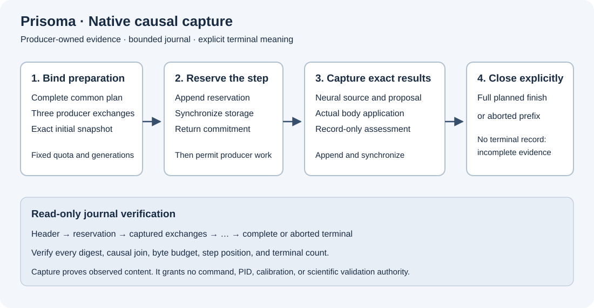

# Native local NCP capture

`prisoma-ncp-local-capture` records complete causal exchanges from one bounded local simulation run.
Its exact application profile is `prisoma.local-causal-capture.v1`.
It has no command, Agent Bridge, estimator, Host API, or network capability.



Text alternative: Preparation binds the complete plan, initial snapshot, and three producer generations.
A durable reservation precedes each neural and body advance.
Capture validates the complete neural, body, and monitor exchanges before appending one durable record.
The read-only verifier requires the complete chain and an explicit terminal record.

The standalone package pins the `ncp-local` SDK from `NCP/local/rust` to one immutable Git revision.
Cargo resolves that revision from the public NCP repository without a sibling checkout.
The lockfile fixes the transitive dependency versions.
Installed ecosystem qualification remains a separate gate.
The historical wire observer and Host API observer keep their existing contracts.

## Build and launch

```bash
cargo build --locked --release --manifest-path crates/ncp-local-capture/Cargo.toml
just ncp-local-capture-check
```

The supervisor launches the binary with three arguments:

```text
--run-id <UUID> --generation <UUID> --output-file <PATH>
```

The process derives its capture role and exact local profile digest from compiled code.
Only the trusted launch command supplies the output path.
No protocol payload accepts a path.
The file must be new and its parent directory must exist.
The process rejects an existing file or final-component symlink.
It creates the file with mode `0600` and synchronizes the file and parent directory.
Invalid preparation can leave an empty, incomplete journal.

NCP requests and responses use inherited standard input and standard output.
Errors use standard error and contain no submitted payload.
The process opens no listener and launches no peer.
This local path contract does not qualify an adversarial shared filesystem or remote security profile.

## Prepared evidence

`PrepareData` contains the shared `RunPlan`, application profile, and closed `CaptureConfiguration`.
The configuration contains three preparation exchanges and `max_capture_bytes`.
Each `Exchange` retains the original `LocalRequest` and complete `LocalResponse`.

Preparation verifies these joins:

- Every producer uses the same plan, run, and exact local profile digest.
- Body, neural, monitor, and capture generations are distinct.
- Each preparation is a committed sequence-one exchange from its expected role.
- The body configuration binds the supplied neural generation.
- The monitor configuration and result bind the supplied body generation.
- The body supplies the exact initial snapshot.
- The neural descriptor matches its content digest and declares time zero.
- The monitor declares exploratory scalar research and uncalibrated inference.

The journal records these supplied identities and bytes.
It does not authenticate a producer executable, scientific model, or remote source.

## Reservation and quota

Let `N` be the planned step count.
Let `H` be the serialized header size, including its newline.
The minimum accepted quota is `H + 65536 N + 16384` bytes.
The hard quota ceiling is 128 MiB.

Each logical step reserves 65536 journal bytes.
The reservation record can use at most 1024 bytes.
The complete capture record can use at most 64512 bytes.
Either terminal record can use at most 16384 bytes.
Every record also passes NCP's bounded JSON preflight.

`reserve` accepts only `{plan_digest, step}` for the next unreserved step.
Its journal record reaches `sync_all` before the process returns commitment.
The supervisor must receive this result before it advances the neural owner.
A byte quota proves logical capacity.
It does not guarantee future free disk space or a successful storage operation.

## Causal capture

`capture` contains the plan digest, step, source snapshot, and neural, body, and monitor exchanges.
The source must equal the previous captured output snapshot in full.
The neural request must contain exactly that source snapshot.
The body request must contain exactly the supplied retained neural response.
The body result must preserve the neural modes, proposal, and source identities.
The monitor request must contain exactly the supplied retained body response.
Its result must preserve the body result, snapshot, time, entity, and innovation source joins.

Capture preserves proposed and applied acceleration as different fields.
It preserves missing measurements and actual producer assessment content.
It never adds language, PID estimates, calibration, or command authority.

Validation operates on a proposed next journal state.
An invalid capture preserves both the file prefix and its reservation.
After successful validation, the owner appends the complete record and calls `sync_all`.
Only then does it advance the captured prefix and release the reservation.
NCP separately retains the exact response until acknowledgement.
An exact duplicate cannot append another record.

A storage failure after execution admission retires the capture generation.
Any written partial record remains incomplete evidence.
The process does not claim lossless completion after that failure.

## Terminal meaning

`finish` requires the complete planned prefix, no outstanding reservation, and all three producer finish exchanges.
Each finish request must bind the exact plan and completed count.
The body terminal result must bind the last snapshot and report cleanup.
The captured producer results remain descriptive local observations.

`abort` accepts an empty object.
It records the captured prefix, any outstanding reserved step, and `remaining_suffix="unresolved"`.
An aborted journal can be structurally complete while the execution plan remains incomplete.
End of file without either terminal record is incomplete.

This journal uses `prisoma.local-journal.v1`.
It is separate from the canonical schema-2 Agent Bridge run log.
No automatic schema-2 compatibility or scientific-study validity is claimed.

## Read-only verification

```bash
crates/ncp-local-capture/target/release/prisoma-ncp-local-capture \
  --verify /absolute/path/to/journal.jsonl
```

The verifier opens an existing regular file without following its final symlink.
It enforces file, record, JSON, quota, chain, causal, and terminal bounds.
It rejects duplicate keys, omitted fields, partial lines, reordered records, and omitted whole steps.
It checks that file metadata stays stable during the read.
It never executes a producer or writes the journal.

A successful report separates `store_completion`, `captured_steps`, and `execution_plan_complete`.
It always reports `scientific_validation=false`.
The journal digest describes content integrity, not a signature.

The package tests use explicitly synthetic producer exchanges.
They test one-, two-, and three-entity journals and hostile integrity controls.
A subprocess test uses real private standard I/O and real journal writes.
Real NEST and ecosystem qualification require a separate installed integration gate.
