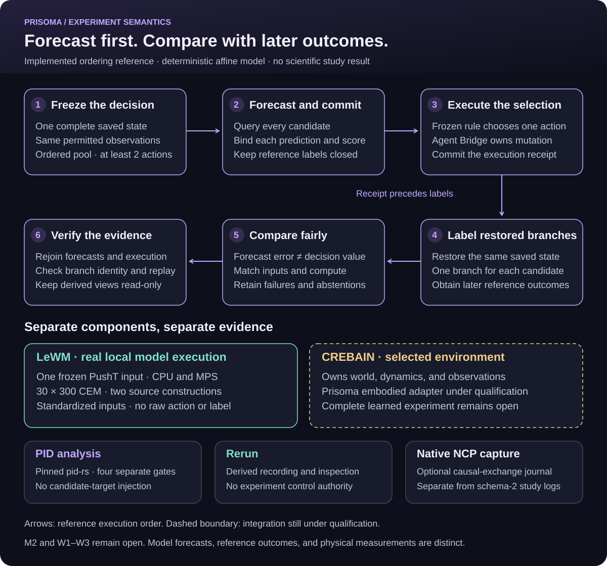

# From a forecast to an auditable comparison

Prisoma asks whether a model's action-conditioned forecast supports a better decision under a declared experiment.
It keeps the proposed action, predicted consequence, selected execution, and observed outcome as different records.

The [grand plan](../grandplan.md) owns the scientific design.
This guide explains its implemented reference and the separate learned-model engineering path.
It does not freeze or complete a scientific study.

<picture>
  <source media="(max-width: 640px)" srcset="../assets/experiment-workflow-mobile.svg">
  
</picture>

[Wide SVG](../assets/experiment-workflow.svg) ·
[Mobile SVG](../assets/experiment-workflow-mobile.svg) ·
[Direct vector](https://raw.githubusercontent.com/sepahead/prisoma/main/assets/experiment-workflow.svg)

Open the direct vector in a browser when the repository preview is too small.
The [standalone HTML view](experiment-workflow.html) supports local browser reading without scripts or remote assets.
The following prose supplies the complete reading alternative.

## One state, several possible decisions

Let $X_t$ denote the complete declared simulator state at decision time $t$.
Let $O_t$ denote the observations available to the model at that time.
The model does not automatically receive every component of $X_t$.
An experiment can keep privileged reference state separate from permitted model inputs.

Let $A_i$ denote candidate action sequence $i$ from an ordered pool of size $K$, where $K \geq 2$.
Each action must satisfy the environment's declared support and timing contract.
Let $\widehat Z_i$ denote the model forecast for candidate $A_i$.
Let $Z_i$ denote the later declared reference outcome obtained from an independent restored branch.

For a fixed-pool selector, a frozen score $J$ produces the recommendation:

$$
\widehat Z_i=f(O_t,A_i), \qquad
i^*=\operatorname*{arg\,min}_{1\leq i\leq K} J(\widehat Z_i).
$$

$f$ is the admitted model query. $J$ includes its declared goal, units, and tie rule.
The symbols describe an experiment contract, not a claim that every model predicts physical truth.

The software reference uses this order:

1. Freeze the complete state, model inputs, ordered pool, and identities.
2. Query every candidate and commit its forecast and score.
3. Apply the frozen selection rule.
4. Submit only $A_{i^*}$ to the Agent Bridge for canonical execution.
5. Commit the resulting execution receipt.
6. Restore an independent branch from $X_t$ for each candidate.
7. Obtain every $Z_i$ and verify the complete evidence chain.

The independent branches never continue from the selected action's mutated state.
Reference labels become available only after the forecast commitments and selected-execution receipt.
The branch outcomes support comparison. They cannot change the recorded earlier recommendation.

## A small numerical example

This illustration uses a dimensionless scalar state. It is not a recorded Prisoma or CREBAIN trajectory.
Suppose the current state is $x=0.4$ and the goal is $g=1$.
Two admitted commands propose increments of $0.2$ and $0.5$.

| Candidate | Proposed increment | Forecast $\widehat z_i$ | Goal score $(\widehat z_i-g)^2$ |
| --- | --- | --- | --- |
| A | 0.2 | 0.6 | 0.16 |
| B | 0.5 | 0.9 | 0.01 |

The selector recommends B because its committed score is lower.
That statement describes a model-based decision. It does not show that the model is accurate.

Suppose the later independent branch labels are $z_A=0.55$ and $z_B=0.82$.
Their observed goal costs are $0.2025$ and $0.0324$.
Their absolute forecast errors are $0.05$ and $0.08$.
All quantities are dimensionless in this illustration.

These are three distinct questions:

- Which candidate did the model recommend before labels existed?
- How close was each forecast to its later reference outcome?
- How did the selected complete policy perform across independent episodes?

This one example answers only finite-case arithmetic.
It does not establish calibration, a population effect, or complete-policy improvement.

## What owns each part

| Owner | Responsibility | Boundary |
| --- | --- | --- |
| Environment | State transitions, sensor observations, action application, accepted checkpoints | An image or pose is not a complete checkpoint |
| Model | Action-conditioned forecasts under its admitted input contract | Predicted latents are not observed outcomes |
| Prisoma experiment | Candidate identity, ordering, commitments, comparisons, and lineage | Study design must define permitted inputs and labels |
| Agent Bridge | Canonical experiment mutation and request/response recording | A viewer or observer cannot bypass it |
| `pid-rs` | Pinned estimator and run-log implementation | Shared code is not independent validation |
| Rerun | Existing recording and visualization capabilities | The current Prisoma projection does not map every model event |
| Native NCP capture | Optional local causal-exchange journal and verification | Separate from schema-2 study logs, without command authority |

CREBAIN is the selected environment integration for the embodied rollout path.
Its accepted environment state and modality outputs require a consumer-owned Prisoma adapter.
That complete embodied experiment remains under qualification.
The affine reference and offline workflows remain independent of CREBAIN.

The final environment join must bind frames, units, clocks, controls, action application, observation availability, and checkpoint completeness.
It must separate privileged reference state from model observations and later outcome labels.
No diagram edge grants that access or proves the integration.

## Two implemented paths with different evidence

### Exact-fork reference

Run `just world-model-reference` from the repository root.
The recipe executes a small affine model, the existing deterministic simulator, the Agent Bridge, independent restored labels, replay, and Rerun export.
Training and reference dynamics use the same deterministic law.
The result proves the tested software semantics only.

Schema 2 lacks a neutral inline decision event.
The reference uses strictly named `label_observed` compatibility envelopes for forecast commitments and execution receipts.
These records are not outcome labels.
The pinned upstream schema and its historical replay remain unchanged.

### LeWM engineering adapter

The maintained [LeWM adapter](lewm/README.md) queries verified pretrained weights on real PushT images.
It executed CPU and MPS controls on one frozen observation/goal input.
Two source constructions retain separate identities and concordance results.

Its search preserves 30 CEM rounds, 300 samples per round, 30 elites, horizon five, and five-action blocks.
Every round records the exact proposals, forecasts, costs, elites, mean, and sample standard deviation.
The final recommended mean receives a separate forecast and score.

These actions are standardized model inputs.
The adapter has no admitted raw-command conversion and executes no raw action.
It obtains no branch outcome labels and is not yet joined to the complete reference lifecycle above.

An independent reader reconstructs the recorded arithmetic and content joins without importing the model or simulator.
It does not independently validate image encoding or forecast quality.
The [mathematics guide](lewm/MATHEMATICS.md) defines the actual latent objective and normalization boundary.
The [PDF](../output/pdf/LeWM_Mathematics_and_Evidence.pdf) provides its vector publication view.

## PID asks a separate question

PID examines a named quantity under a declared source/target law.
It does not establish a forecast's accuracy or a controller's authority.
Prisoma supplies experimental variables, row identities, transformations, split rules, and applicability checks before invoking the pinned estimator.

For example, a model state computed from $A_i$ cannot be a PID source whose target is that same $A_i$.
The target was already supplied to the source computation.
Cross-fitting cannot remove that structural injection.

A later reference outcome can be a different target.
Its matched baseline must receive the same candidate action and permitted observations.
Every source needs a prediction landmark before target availability and a valid ancestor-time record.
No absent language or other modality may be replaced with a zero vector or invented label.

The LeWM structural helper does not produce an admissible PID dataset or H3 ancestry attestation.
The 9,000 adaptive proposals share one input and are not independent population samples.
Read the [PID handoff](lewm/PID_HANDOFF.md) and [method contract](../PID_METHOD_SELECTION_AND_PUBLICATION_CONTRACT.md) before interpreting a result.

## What must still pass

| Question | Required evidence | Current boundary |
| --- | --- | --- |
| Does the software preserve ordering? | Reference commitments, selected execution, branch labels, and negative controls | Implemented deterministic reference |
| Can these pretrained paths execute locally? | Exact assets, real inputs, CPU/MPS controls, and trace verification | Observed one-input engineering result |
| Can the learned model execute supported actions? | Dataset-bound normalization, action support, environment joins, and multiple replans | Open |
| Does the model forecast well? | Frozen W1 score, matched baselines, calibration, holdout, and uncertainty | Open |
| Does selection improve the complete policy? | Frozen W2 episode comparison with resources, failures, and intention-to-treat accounting | Open |
| Do rendering and dynamics explain different errors? | W3 matched state, action, camera, renderer, and policy panels | Open |
| Is a PID interpretation admissible? | Population, measure, estimator, and application gates | High-dimensional intended application remains blocked |

A failed model or null result remains useful evidence about the declared boundary.
It must not become a stronger claim through a different label, omitted case, or attractive visualization.
