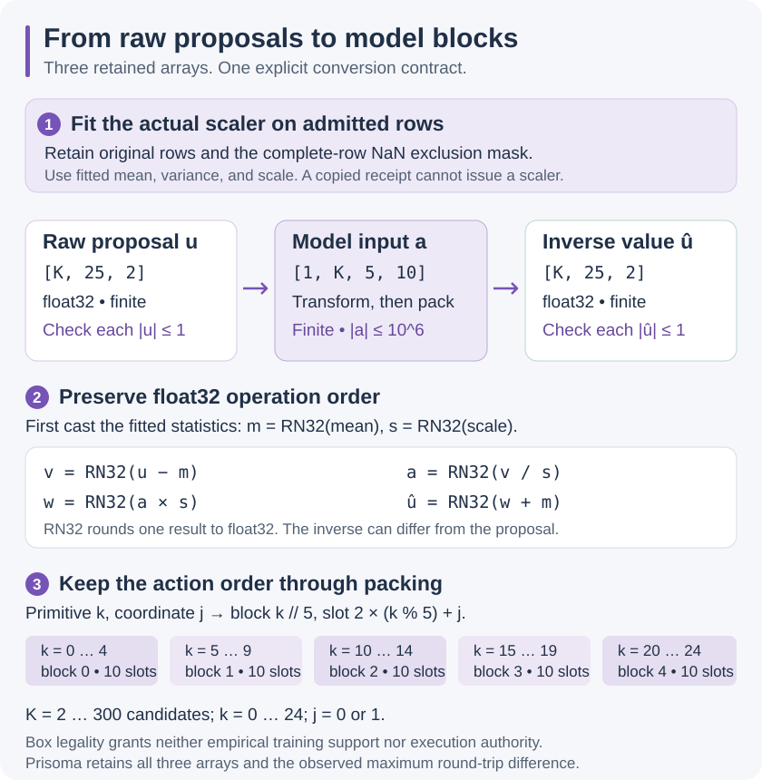

# LeWM: the quantities this probe actually computes

This note explains the frozen engineering probe and the separate raw-candidate converter. It does not report model quality or physical accuracy.

## State, observation, and action

The PushT owner has a physics state, denoted by `s_t`.
It includes more information than the seven values returned by `_get_obs`.
For example, the returned vector omits the block's velocity and contact-solver memory.

The observation `o_t` is an RGB image with 224 by 224 pixels.
Each stored channel value is an integer from 0 through 255.
The encoder receives the normalized image `x_t`.

For channel `c`, the preprocessing operation is:

```text
x_t[c] = (o_t[c] / 255 - mean[c]) / std[c]
mean = [0.485, 0.456, 0.406]
std  = [0.229, 0.224, 0.225]
```

The values are dimensionless. The released operation order applies normalization before resizing.
The first engineering arm already renders at 224 pixels, but retains the same operation order.

A raw action `u_t` has two components. PushT declares each component within `[-1, 1]`.
In relative mode, the controller target is the current agent position plus `100 u_t`.
The position coordinates are simulator arena units. They are not meters.

The controller runs ten physics steps for each action. Each physics step lasts 0.01 simulated seconds.
Thus, one raw action spans 0.1 simulated seconds.

The predictor consumes a standardized action `a_t`:

```text
a_t[j] = (u_t[j] - action_mean[j]) / action_scale[j]
u_t[j] = a_t[j] * action_scale[j] + action_mean[j]
```

Here, `j` selects one of the two action components.
The action mean and scale must come from a declared, content-bound dataset fit.
The frozen first probe has no such fit. Therefore, it cannot execute its standardized recommendations.

A model action block concatenates five consecutive two-dimensional actions.
Its width is ten. It represents 0.5 simulated seconds when an authorized scaler and execution path exist.
Five blocks represent 2.5 simulated seconds.

## Preparing raw candidates

The separate converter retains proposed raw values `u`, standardized model values `a`, and inverse-transformed values `u_hat`.
It executes no command. The first frozen LeWM probe retains its standardized-only boundary.



The converter accepts an owner-issued scaler. A copied receipt or caller-supplied mean cannot issue one.
The owned reader binds the complete frozen archive before fitting. Its actual training-archive qualification remains `NOT RUN`.
Synthetic controls retain `synthetic_control_only` scope.

## Real arithmetic and fitted statistics

Let `j` select the x or y coordinate. Let `mean[j]` and `scale[j] > 0` be its fitted mean and scale.
In exact real arithmetic, the raw interval has this model-coordinate image:

```text
-1 <= u[j] <= 1
    if and only if
(-1 - mean[j]) / scale[j] <= a[j]
    and a[j] <= (1 - mean[j]) / scale[j]
```

Subtracting the same mean preserves order. Dividing by a positive scale also preserves order.
The two-coordinate raw square therefore maps to a rectangle. The ideal real inverse recovers the original value.
These algebraic statements do not establish exact floating-point round trips.

Let `n` count the complete retained fit rows, and let `r[i,j]` be row `i`'s coordinate `j`.
The fit uses population variance:

```text
mean[j] = sum_i r[i,j] / n
variance[j] = sum_i (r[i,j] - mean[j])^2 / n
```

The denominator is `n`. Any row containing NaN is excluded as a whole. Any infinity rejects the input.
At least two complete finite rows must remain.
Use sklearn's retained `scale_` instead of recomputing the square root of its variance.
The pinned implementation gives constant and numerically near-constant axes unit scale.
A positive computed variance can therefore accompany scale one.

## Float32 conversion and a retained failure

The pinned sklearn implementation casts fitted float64 means and scales to the float32 input dtype before arithmetic.
Let `RN32` round one result to the binary32 value used by this runtime.
For each coordinate, the actual stored intermediate values follow this order:

```text
m = RN32(mean[j])        s = RN32(scale[j])
v = RN32(u[j] - m)       a[j] = RN32(v / s)
w = RN32(a[j] * s)       u_hat[j] = RN32(w + m)
```

The converter checks three numeric domains.
Proposals must be finite and inside `[-1,1]`. Standardized values must be finite with magnitude at most `1000000`.
The actual inverse values must also be finite and inside `[-1,1]`.
No clipping or added tolerance expands that last box. A legal proposal can therefore fail conversion.

Consider these synthetic control rows, stored as float64:

```text
[-1,  -0.5 ]
[ 0,   0.25]
[ 0.5, 1   ]
```

Their ideal mean is `(-1/6, 1/4)`. Their population variance is `(7/18, 3/8)`.
The observed float64 scales are approximately `(0.6236095644623235, 0.6123724356957945)`.
For a proposal entered as float32 `(0.1,0.2)`, the x coordinate changes as follows:

```text
proposed u:    0.10000000149011612   bits 0x3dcccccd
model a:       0.42761802673339844
inverse u_hat: 0.10000000894069672   bits 0x3dccccce
```

The inverse is the next float32 value above the proposal. Both coordinates remain inside the box, so conversion succeeds.
An existing selected boundary control fits these float32 rows:

```text
[-0.21676428616046906, -0.701422393321991  ]
[-0.7363889813423157,   0.926403284072876  ]
[-0.2295258790254593,  -0.45703527331352234]
```

For raw `(-1,-1)`, the inverse is `(-1,-1.0000001192092896)`. The converter rejects the whole pool.
With that same fit, raw `(-0.5,-0.5)` returns `(-0.5,-0.5000000596046448)` and passes.
These are selected regression controls, not held-out measurements.
Both examples use the pinned NumPy 2.4.6 and scikit-learn 1.9.0 runtime.

Signed zero can also change during conversion. Zero maximum numerical difference would not establish identical bytes.
The retained arrays and their separate hashes preserve that distinction.

## Packing, timing, and machine checks

Each of `K` candidates contains 25 two-coordinate primitives. The converter accepts 2 through 300 candidates.
The raw array shape is `[K,25,2]`. The model shape is `[1,K,5,10]`.
Let `k` select the primitive, `j` its coordinate, `b` the model block, and `q` the slot:

```text
b = k // 5              q = 2 * (k % 5) + j
k = 5 * b + q // 2      j = q % 2
```

These maps are inverses for `0 <= k < 25`, `0 <= j < 2`, `0 <= b < 5`, and `0 <= q < 10`.
Primitive 7's y coordinate occupies block 1, slot 5.
Packing preserves values and primitive order. This indexing bijection does not make float32 normalization a bijection.

One primitive nominally spans 0.1 simulated seconds. One block spans 0.5 seconds.
Preparing these arrays produces no elapsed simulation or execution receipt.

The registered `formal/lewm_action_conversion.smt2` model checks the indexing maps and positive-real affine identities.
Its nine obligations include valid premise witnesses, four counterexample searches, and deliberately defective alternatives.
Z3 4.16.0 checks the written formulas. These results do not verify NumPy, sklearn, floating-point refinement, or the complete reader.

A raw-box check establishes bounded numeric legality for this conversion profile.
It establishes neither empirical training support, calibrated model accuracy, nor successful control.

## Encoding and prediction

The encoder maps an image to a 192-component latent vector:

```text
z_t = encoder_and_projector(x_t)
```

Each latent component is a learned, dimensionless quantity.
It is not a position, velocity, probability, or confidence interval.

The action encoder maps an action block to its learned embedding.
The autoregressive predictor combines recent latent states with the corresponding action embeddings.
It uses at most three model time points as context.

With one observed frame and five action blocks, a rollout returns the observed latent and five predicted latents.
The captured array therefore has six latent time points.
The two frozen source arms preserve their own actual rollout implementation.

## Goal score

Let `g` be the encoded goal image. Let `z_hat_i` be the final latent predicted for candidate `i`.
The released objective is:

```text
J_i = sum over d=1..192 of (z_hat_i[d] - g[d])²
```

The implementation calls an elementwise mean-squared-error operation, then sums its components.
Thus, its final score is a sum of squared errors, rather than their mean.
Smaller scores receive preference. These scores are not physical goal distances.

For a two-component illustration, let the prediction be `[1, 2]` and the goal be `[0, 1]`.
The score is `(1 - 0)² + (2 - 1)² = 2`.
This illustration is not a measured model result.

## Cross-entropy method

The search uses 30 rounds. Each round proposes 300 sequences and retains 30 elite sequences.
Every sequence has five blocks of width ten.

At round `r`, the solver samples independent standard-normal values `epsilon_i`:

```text
candidate_i = mu_r + sigma_r * epsilon_i
candidate_0 = mu_r
```

Multiplication applies separately to each sequence coordinate.
The initial mean `mu_0` is zero. The initial scale `sigma_0` is one.
The code calls this scale `var`, although the update computes a standard deviation.

Let `E_r` contain the 30 candidates with the smallest scores. For each coordinate:

```text
mu_(r+1) = sum over i in E_r of candidate_i / 30
sigma_(r+1) = sqrt(sum over i in E_r of (candidate_i - mu_(r+1))² / 29)
```

The denominator is 29 because the released code uses the sample standard deviation.
For an illustrative two-member elite set `[1, 3]`, the mean is 2 and this standard deviation is `sqrt(2)`.
A population-standard-deviation update would produce 1. The verifier rejects that substitution.

The solver does not enforce raw action bounds. A supplied `Box` determines dimensions only.
The probe records this limitation. It does not silently clip proposals or rename them supported actions.

After round 30, the solver returns its updated mean.
The probe separately predicts and scores that exact mean before recording the recommendation.
Every sampled proposal, prediction, cost, elite index, mean, and scale remains available for reconstruction.

## Experiment order and present boundary

The current probe records source identity, preprocessing, actual input pixels, and candidate tensors before loading the model.
It then records forecasts and planner calculations. It executes no action and obtains no branch outcome label.

A complete Prisoma experiment requires a stronger order:

1. Freeze the environment checkpoint, observations, action support, and candidate roster.
2. Compute each declared model and matched-baseline forecast.
3. Commit forecasts, scores, abstentions, and the selected action.
4. Execute the selected action through the Agent Bridge.
5. Record its execution receipt.
6. Evaluate independent reference branches from the same accepted checkpoint.
7. Record labels and replay the complete comparison.

An environment state vector cannot substitute for a complete checkpoint.
An in-process ordering rule cannot prove that arbitrary code never accessed future labels.
The exact-fork and future-label authority gates remain separate from this local model execution probe.
