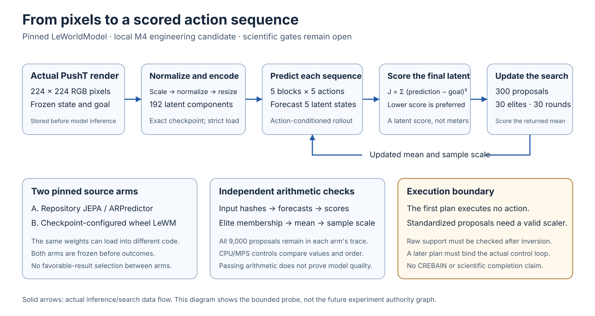

# Run a pretrained world model locally

Prisoma provides an optional LeWorldModel engineering adapter for the pinned M4 Max runtime.
It compares standardized candidate actions using real PushT images and verified pretrained weights.
It records each search proposal and checks the resulting arithmetic independently.

The adapter is an **MPS candidate**. It does not qualify raw execution, M2, W1, W2, W3, or physical forecast accuracy.
The current command executes model inference and search. It executes no raw action.



[Open the scalable diagram](inference.svg) to inspect its details.
Read the [mathematics guide](MATHEMATICS.md) for units, equations, and worked examples.
The [five-page PDF](../../output/pdf/LeWM_Mathematics_and_Evidence.pdf) is its vector publication view.

## What Prisoma adds

The model supplies forecasts. The existing PushT package supplies the environment.
Prisoma supplies immutable candidate identities, source and input commitments, complete search records, and an independent evidence reader.
The package also rejects raw-command use without an admitted scaler and action-support contract.

Rerun already supplies substantial logging, storage, query, visualization, and data capabilities.
This adapter builds experiment semantics above those capabilities. It does not implement another viewer or simulator.
See the [official Rerun overview](https://rerun.io/docs/overview/what-is-rerun).

The existing exact-fork Agent Bridge reference remains a separate software proof.
A future integration must join these forecasts to its pre-label commitment and selected-execution order.
The learned adapter currently obtains no branch outcome labels.

## Stage the exact assets

Keep external assets outside Git. Use this directory layout:

```text
assets-root/
  model/config.json
  model/weights.pt
  source-wheels/stable_worldmodel-0.1.1-py3-none-any.whl
  source-wheels/stable_pretraining-0.1.7-py3-none-any.whl
  upstream-lewm/LICENSE
  upstream-lewm/uv.lock
  upstream-lewm/src/lewm/jepa.py
  upstream-lewm/src/lewm/module.py
```

The [projection manifest](../../experiments/lewm/projection.json) declares every accepted size, digest, archive member, and generated initializer.
Wrong bytes fail before model import. A partial staging failure remains as a failed output directory.
The command never downloads missing inputs or repairs a changed asset.

| Asset | Exact source |
| --- | --- |
| LeWM code | [Mengarr/lewm at 8a2c595](https://github.com/Mengarr/lewm/tree/8a2c595813d0eee85b2dbffa6f58ff0842f9e673) |
| Checkpoint and configuration | [quentinll/lewm-pusht at 22b330c](https://huggingface.co/quentinll/lewm-pusht/tree/22b330c28c27ead4bfd1888615af1340e3fe9052) |
| Planning wheel | `stable-worldmodel==0.1.1`, selected by the pinned LeWM lock |
| Constructor provenance | `stable-pretraining==0.1.7`, selected by the same lock |

The checkpoint contains 72,290,721 bytes.
Its SHA-256 is `48938400ae3464c9680731287f583a9cb516f55a8ec64ea13a91be47fb15b607`.
Loading uses the restricted weights-only route and exact state-dictionary matching.
The loader decodes one immutable byte snapshot whose complete size and digest passed admission.
Changing the original inode after admission cannot change the bytes given to the decoder.

## Prepare the private runtime

Use a separate CPython 3.11.15 environment on Darwin arm64.
The ordinary Prisoma environment does not install Torch or download weights.
The exact optional [runtime lock](../../experiments/lewm/requirements-m4.lock) contains hashes for its dependency closure.

If all accepted wheels are staged locally, install them into the private runtime:

```bash
"$LEWM_PYTHON" -m pip install --no-index --no-deps --require-hashes \
  --find-links "$LEWM_WHEELHOUSE" \
  -r experiments/lewm/requirements-m4.lock
```

`LEWM_PYTHON` identifies the private interpreter. `LEWM_WHEELHOUSE` identifies the operator's verified wheel directory.
The CLI checks the exact Python, host, and dependency versions before importing the model.
Those observations are not loaded-bytecode attestation.

## Run the complete engineering check

From the repository root, use a fresh output directory:

```bash
PYTHONDONTWRITEBYTECODE=1 PYTORCH_ENABLE_MPS_FALLBACK=0 \
HF_HUB_OFFLINE=1 TRANSFORMERS_OFFLINE=1 \
/usr/bin/sandbox-exec -p '(version 1)(allow default)(deny network*)' \
  "$LEWM_PYTHON" -B -m experiments.lewm qualify \
  --assets-root "$LEWM_ASSETS" --output "$LEWM_OUTPUT"
```

This one command stages an ordinary local package, runs both source arms, and verifies their complete traces.
It preserves actual upstream module bytes. It uses no namespace injection or runtime AST extraction.
The [design decision](../../experiments/lewm/DESIGN.md) explains the package boundary.

If the retained construction run is available, add `--reference-run /absolute/path/to/run-001`.
This option compares both source arms under the unchanged frozen numerical tolerances.
It does not establish general equivalence between their different implementations.

The sandbox denies network access. It does not isolate arbitrary malicious code.
The trusted worker uses four threads and a 1,800-second alarm per source arm.
Each arm has a 256-MiB trace limit. These bounds are admission controls, not latency promises.

## Read the evidence

```bash
"$LEWM_PYTHON" -B -m experiments.lewm verify --run "$LEWM_OUTPUT/run"
```

The reader uses NumPy and imports no model or simulator.
It bounds compressed arrays and declared array allocation before loading them.
File hashing enforces its byte limit during every read, including file growth.
It checks candidate commitments, forecast costs, elite membership, distribution updates, fixed objectives, and final recommendations.

| Output | Meaning |
| --- | --- |
| `source-stage/source-manifest.json` | Exact copied assets, projected modules, generated initializers, and retained notice status |
| `run/input-commitment.json` | Actual pixels, normalized inputs, ordered candidates, and explicit unknown raw support |
| `run/<arm>/public-api/` | Reusable library forecast commitment and its independently checked arrays |
| `run/<arm>/candidates-*.json` | Candidate tensor commitments written before each model query |
| `run/<arm>/round-*.npz` | Every proposal, forecast, score, elite, mean, and sample standard deviation |
| `run/<arm>/final-recommendation.npz` | Separately scored final CEM mean |
| `verification.json` | Independent arithmetic and content-join verdict |
| `receipt.json` | Terminal engineering receipt with `raw_actions_executed=false` |

Failed and partial directories remain evidence. A receipt never grants resume, command, producer, or scientific authority.

## Use the library seam

After offline staging, construct `PreparedLeWM(staged_directory, source_arm, device)` from `experiments.lewm.model`.
Pass `ObservationPair` and `StandardizedCandidates` from `experiments.lewm.contracts` to its `forecast()` method.
Both contracts retain immutable copies. They reject unsupported shapes, dtypes, nonfinite candidates, and ambiguous candidate rosters.
They accept exact NumPy arrays, including strided arrays. Array subclasses are unsupported.
Numerical validation applies to the retained immutable candidate bytes.

The returned `ForecastCommit` binds the complete candidate commitment, including ordered IDs and exact tensors.
Use `verify_forecast()` to inspect its exported arrays and selection independently.
The library object is a trusted local seam. It is not a Python capability-security boundary.
Its `source` property returns an inspection copy. Changing that copy cannot change later forecast provenance.

The source arm is either `repository_jepa` or `model_config_wheel_lewm`.
The candidate tensor is float32 with shape `[1, N, 5, 10]`, where `2 <= N <= 300`.
Each width-ten block contains five standardized two-dimensional actions.
These values are not raw PushT commands.

## PID and remaining work

Read the [PID handoff](PID_HANDOFF.md) before constructing a diagnostic dataset.
The structural helper rejects a candidate-conditioned source whose target is that same proposal.
It requires an exact matched proposal and a valid declared prediction landmark for a downstream target.
It does not produce an H3 ancestry attestation, a language source, or a PID estimate.

Dataset-bound normalization, supported raw actions, multiple replans, complete checkpoints, and matched-baseline outcome comparisons remain separate milestones.
The current one-input result does not validate a population law or learned model quality.

The planning wheel declares MIT but omits a license file.
The adapter preserves that known discrepancy and every notice actually supplied by its exact inputs.
Code, model, data, and transitive-rights review remain separate. No broad adoption clearance is inferred.

## Build the publication view

Install `experiments/lewm/requirements-publication.txt` into a separate document environment.
The renderer uses the declared macOS fonts and records their hashes.

```bash
python -B -m experiments.lewm.build_pdf
```

Render and inspect every PDF page after a source change.
The build receipt binds Markdown, SVG, fonts, renderer, and output bytes.
Visual review remains a separate, explicit receipt.
