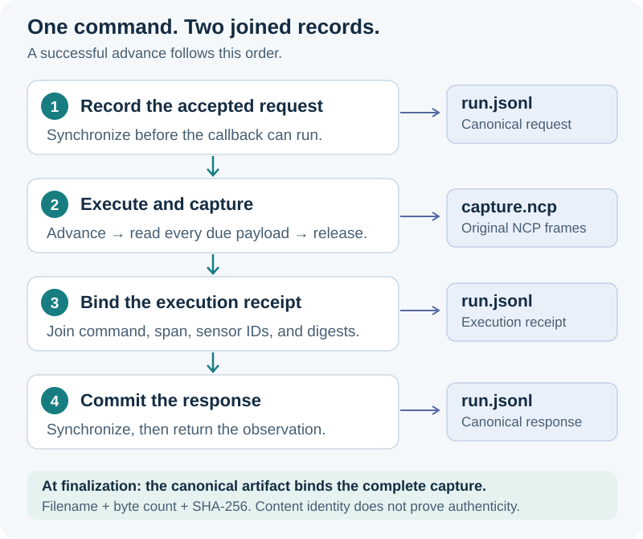
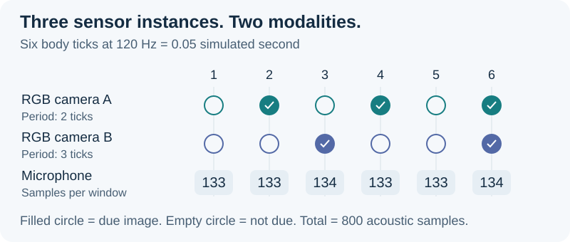

# Recorded sensor execution

Prisoma records accepted experiment commands. CREBAIN executes its world and produces sensors. NCP carries their typed requests, results, and bounded payloads.

The optional application bridge connects those responsibilities through two evidence files.
`run.jsonl` is the canonical schema-2 command log. `capture.ncp` preserves the original NCP exchange bytes.
The final canonical artifact record binds the completed capture by filename, byte count, and SHA-256.



[Open the original vector](https://raw.githubusercontent.com/sepahead/prisoma/main/integrations/agent-bridge/execution.svg).

<!-- pagebreak -->

## One command, several exchanges

An `advance` command contains one body tick and a target, or a hold of the previously accepted target.
The canonical request is synchronized before the callback can execute.
The callback advances CREBAIN, acknowledges its result, reads every due sensor payload, and releases the source buffers.
Each NCP request and response is captured before the next dependent operation.

The execution receipt joins the primary NCP exchange, the complete exchange span, and the observed payload digests.
It precedes the canonical response. The bridge synchronizes both records before returning the observation.
The receipt uses `label_observed` as a schema-2 compatibility envelope. Its metadata explicitly identifies an execution receipt, without an outcome-label claim.

Readback generates the NCP commands again through the installed sensor client.
Every generated request must equal the original captured request bytes.
Reconstructed observations, source identities, response hashes, capture positions, and terminal counts must agree.
Hashes establish content identity, without producer authenticity or proof that the host never bypassed the bridge.

## Three sources do not imply three modalities

The native example uses two 320-by-240 RGB cameras and one 16-kHz microphone.
The first camera samples every two body ticks. The second samples every three ticks.
The body advances at 120 ticks per simulated second.
Each microphone window contains the samples assigned to one body tick.

| Body tick | RGB camera A | RGB camera B | Microphone samples | Due payloads |
| --- | --- | --- | --- | --- |
| 1 | Not due | Not due | 133 | 1 |
| 2 | Due | Not due | 133 | 2 |
| 3 | Not due | Due | 134 | 2 |
| 4 | Due | Not due | 133 | 2 |
| 5 | Not due | Not due | 133 | 1 |
| 6 | Due | Due | 134 | 3 |

Both cameras retain their declared source identities even if their image bytes match.
A not-due image is neither zero activity nor an additional independent observation.
Thermal is optional. Camera-only and multiple-microphone sessions retain the same command contract.

For a three-source PID study, a researcher could declare separate features for camera A, camera B, and the acoustic window.
That declaration must also specify the target, prediction landmark, feature encoding, sampling law, missingness policy, and statistical bounds.
Sensor identity alone does not define a PID variable or make repeated frames independent.
This native run supplies no target labels, fitted features, PID estimate, or confidence bound.

<!-- pagebreak -->

## Count capacity before execution

Let `T` be the planned body-tick count. Let `k` identify one tick, from 1 through `T`.
For sensor `i`, let `d_i(k)` be its due payload length in bytes. Let `D(k)` be the due sensor set.
NCP fixes the chunk capacity at `B = 32,768` bytes.
Each due payload requires `c_i(k) = ceil(d_i(k) / B)` chunk reads.

An exchange contains one NCP request and its response. An acknowledgement is a separate exchange.
One advance therefore requires:

```text
E(k) = 2 + 2 × sum(c_i(k), i in D(k)) + 2 × |D(k)|.
```

The first term covers advance and acknowledgement. The second covers chunk reads and their acknowledgements.
The final term covers buffer releases and their acknowledgements.
Prepare and Finish add two exchanges each:

```text
N = 4 + sum(E(k), k = 1..T).
```

RGBA8 stores red, green, blue, and alpha channels in one byte each.
Acoustic pressure uses eight-byte little-endian binary64 values in pascals.

For the example, each RGB payload contains `320 × 240 × 4 = 307,200` bytes and needs ten chunks.
Each acoustic window fits one chunk. The six tick costs are `6, 28, 28, 28, 6, 50` exchanges.
Their sum is 146. Prepare and Finish raise the total to 150.

The two cameras produce five images. The microphone produces six windows containing 800 samples:

```text
sample_start(k) = floor((k - 1) × 16,000 / 120)
sample_end(k)   = floor(k × 16,000 / 120)
samples(k)     = sample_end(k) - sample_start(k)
raw bytes      = 5 × 307,200 + 800 × 8 = 1,542,400.
```

Adjacent sample windows share their boundary. The sum telescopes to exactly 800 samples over six ticks.
This integer relation avoids cumulative rounding error.
It does not establish an acoustic calibration or statistical sampling law.



<!-- pagebreak -->

## Storage and operating bounds

The transcript computes its own reservation from the peer roster, maximum exchange count, framing, and terminal allowance.
One stored exchange reserves two 65,536-byte frames plus 92 framing bytes.
Its independent admission limits remain 8,190 exchanges and 1 GiB.
These are bounded capture-session limits, without a protocol requirement to select every sensor or project.

The canonical bridge admits `C = T + 2` calls. Each successful call adds one request, one receipt, and one response.
Two prefix events, one capture artifact, and one terminal event give `3C + 4` events.
For `T = 6`, this is eight calls and 28 events.

The [SMT model](../../formal/crebain_sensor_capacity.smt2) checks chunk coverage, acoustic-window counts, partition boundaries, exchange counts, and canonical event bounds.
Each universal counterexample check has a feasible positive control.
Three intentionally false bounds produce counterexamples.
These checks establish conditional integer relations. They do not formally verify the implementation, renderer, operating system, or a statistical claim.

## Observed scope and limits

The native M4 Max run recorded 150 exchanges, 11 payloads, 56 chunks, and 1,542,400 raw bytes.
Its capture used 2,337,352 bytes. Its canonical log used 22,042 bytes.
All payloads reopened with their producer digests. Canonical readback reconstructed every command and observation.
The host also checked the renderer receipt and retired its observed process identities.

The measured workflow took 4.883639 seconds for 0.05 simulated seconds, including startup, recording, export, readback, and retirement.
This is one engineering case, without a real-time, latency-distribution, renderer-oracle, or scientific claim.
It used one force-ground drone, zero scene solids, fixed seed 4, and the initial target throughout.

Host log timestamps use elapsed monotonic nanoseconds. They are separate from simulation time and sensor sampling windows.
Callback, capture, and recording failures retire the adapter. An external effect can already exist when a failure becomes visible.
There is no automatic retry, rollback, arbitrary-code sandbox, or atomic transaction across the two files.
The host owns producer lifetime. A terminal protocol response alone does not establish operating-system process retirement.

Learned forecasts, independent restored-branch labels, target-specific PID, and full embodied-policy evaluation remain separate gates.
