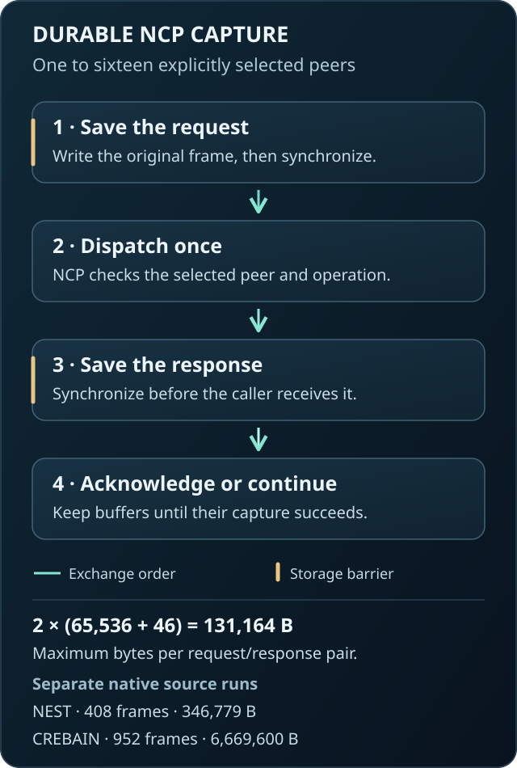

# Modular NCP transcript

Capture original NCP exchanges in one bounded file, with one to sixteen selected peers.
No body, neural, or monitor role is mandatory.
Large sensor payloads remain sequences of bounded NCP frames.

Peer count and sensor count are different.
One CREBAIN peer can expose several identified cameras or microphones.
The installed application validates the selected roster; the transcript does not require every modality or convert streams into PID variables.
Prisoma's [experiment contract](../../README.md#pid-remains-substantive-and-gated) owns source grouping, timing, features, targets, and statistical assumptions.



[Direct SVG for browser zoom](https://raw.githubusercontent.com/sepahead/prisoma/main/integrations/ncp-transcript/capture.svg)

## Contract

The host supplies the peer bindings, installed application contracts, requests, and streams.
`Journal.exchange` synchronizes each request before dispatch.
It synchronizes the received response before returning its bytes.
The caller can then acknowledge the result or request the next buffer chunk.
The journal selects no action and launches no producer.

NCP's existing client verifies request, response, predecessor, result-query, and acknowledgement joins.
The read-only verifier replays those same rules with the exact installed application contracts.
The file preserves original NCP JSON payload bytes instead of reserializing the exchanged messages.
Transport length prefixes are not journal records.

Every peer must acknowledge a committed `Finish` before the journal can finish.
An explicit abort records a closed prefix without declaring execution completion.
Plain close, missing responses, truncated records, and storage failures leave incomplete evidence.
A transport failure does not authorize retry.
The host remains responsible for retiring its producer processes.

## Use on trusted streams

Install this optional package in its own Python environment:

```bash
python -m pip install ./integrations/ncp-transcript
```

The manifest pins the public NCP SDK to immutable Git source `9ae64ac1a77c9cd0612284992a8711220428a6e3`.
Python 3.11 or newer on a POSIX host is required.
The root Prisoma environment and PID dependency remain independent of this package.

The following code uses a binding and application contract from an existing trusted host.
`reader` and `writer` are that host's private NCP streams.

```python
from ncp_local.modular_client import Client
from ncp_local.modular_wire import Outcome
from prisoma_ncp_transcript import Journal, Peer

client = Client(binding, Contract)
with Journal(
    "capture.ncp",
    (Peer(binding, Contract),),
    max_exchanges=204,
    quota_bytes=32 * 1024**2,
) as journal:
    def call(operation):
        raw = client.begin(operation)
        reply = journal.exchange(
            binding.endpoint_id, raw, reader, writer, deadline=deadline
        )
        result = client.observe(reply)
        if result.outcome is not Outcome.COMMITTED:
            raise RuntimeError("Operation did not commit")
        ack = client.acknowledgement()
        reply = journal.exchange(
            binding.endpoint_id, ack, reader, writer, deadline=deadline
        )
        acknowledged = client.observe_acknowledgement(reply)
        if acknowledged.outcome is not Outcome.ACKNOWLEDGED:
            raise RuntimeError("Acknowledgement did not complete")
        return result

    # Use call() for preparation, operations, and the final Finish.
    # Acknowledge only the outcomes permitted by the installed contract.
    # Retain source buffers until their captured reads succeed.
    # journal.finish() then requires every selected peer's terminal acknowledgement.
```

This example shows a host integration seam, not a complete simulator launcher.
A Prisoma experiment must dispatch mutations through Agent Bridge and bind its canonical events to the transcript.
This package does not create that experiment binding.

## Use with CREBAIN's sensor client

CREBAIN's `SensorSession` accepts this journal through its optional `exchange` hook.
One body binding is sufficient.
This example requires no neural or monitor peer.
CREBAIN remains usable without this capture package.

The host supplies an installed CREBAIN sensor client, its trusted streams, binding, configuration, policy, and absolute monotonic deadline.
The journal path must be new, with a trusted existing parent directory.
The following limits apply to the documented 24-tick M1 configuration.
Other configurations require their own exchange and byte budgets.

```python
from functools import partial

from crebain_ncp_sensors import SensorContract, SensorSession
from prisoma_ncp_transcript import Journal, Peer, verify

peers = (Peer(binding, SensorContract),)
with Journal(
    journal_path,
    peers,
    max_exchanges=512,
    quota_bytes=72 * 1024**2,
) as journal:
    with SensorSession(
        reader,
        writer,
        binding,
        prepare,
        deadline=deadline,
        exchange=partial(journal.exchange, binding.endpoint_id),
    ) as session:
        target = initial_target
        for tick in range(1, prepare.planned_ticks + 1):
            with session.advance(target) as batch:
                if tick < prepare.planned_ticks:
                    target = choose_target(batch.observation)
            del batch
        result = session.finish()
    capture = journal.finish()

assert verify(journal_path, peers) == capture
```

Journal admission precedes preparation and body mutation.
Each `advance` captures and validates every due payload before exposing the complete batch.
Normal batch-context exit then releases its source buffers.
A capture failure retires the client without retry or further release.
The host must close its streams and confirm producer retirement on every path.
Logical quota admission does not reserve physical disk space.

The [CREBAIN calling contract](https://github.com/sepahead/crebain/blob/47ea76fc0a9dda0e247ec099119c6df9a5dfde1b/integrations/ncp-force-ground-sensors/python/README.md) defines lifecycle, failure prefixes, sensor layouts, and host responsibilities.
This example supplies no installed launcher or canonical Agent Bridge experiment binding.

## Capacity and storage

Let `N` be the maximum exchange count.
One exchange contains one request and one response, including acknowledgement exchanges.
Each NCP JSON payload contains at most 65,536 bytes.
Its transcript record adds a one-byte peer index and 45 framing bytes.

The maximum exchange cost is:

```text
P = 2 × (65,536 + 1 + 45) = 131,164 bytes.
Q >= 8 + 45 + H + N × P + 45 + 1,024.
```

`H` is the serialized header length in bytes.
`Q` is the caller's byte quota.
The final 1,024 bytes reserve the terminal payload.
Admission enforces both the 8,190-exchange count ceiling and the 1-GiB byte ceiling.
The byte ceiling can reject a count that otherwise passes its independent limit.

For 204 exchanges, frame reservations require 26,757,456 bytes before header and terminal space.
A 32-MiB quota admits the recorded one-peer NEST case.
The resulting file used 346,779 bytes.
Quota admission reserves logical capacity; it neither allocates disk blocks nor guarantees future free space.

The file must be new, private, regular, and owned by the current user.
The writer rejects an existing final component and synchronizes the parent directory.
The verifier rejects final symlinks, hard links, shared permissions, oversized files, and changed file identities.
The parent directory remains trusted host input.
This contract does not qualify an adversarial shared filesystem.

Records contain a kind byte, ordinal, payload length, original payload, and SHA-256 chain digest.
Each digest includes its predecessor and exact framing bytes.
A hash chain detects unaccounted changes; it is not a signature or producer attestation.

The [SMT model](quota.smt2) checks conditional frame-cost and remaining-quota arithmetic.
It includes feasible examples and counterexamples to intentionally false bounds.
It does not prove the Python implementation, operating system, or storage device.

## Read-only verification

```python
from prisoma_ncp_transcript import verify

report = verify("capture.ncp", (Peer(binding, Contract),))
print(report.store_completion, report.exchange_pairs)
```

The report separates unanswered requests, pending peer operations, and finished peers.
It always returns `application_completion_validated=false` and `scientific_validation=false`.
Typed protocol validity does not establish complete application semantics or experimental validity.
The journal cannot prove that a caller never bypassed its capture boundary.

This format is `prisoma.ncp.transcript.v1`.
The earlier [local causal journal](../../crates/ncp-local-capture/README.md) retains its separate compatibility contract.
Neither format replaces the canonical schema-2 Agent Bridge run log.

## Observed evidence

The source suite passes 29 tests on Python 3.11 and 3.14.
The same 29 tests pass after a fresh Python 3.14 installation from the pinned public Git dependency.
That cold installation took 353 seconds; it does not establish a fast installation path.
It covers private-stream I/O, sixteen peers, an 800-KiB frame sequence, and storage and transport failures.
Negative controls cover malformed responses, changed files, missing acknowledgements, reordering, truncation, quotas, and terminal semantics.

### NEST capture

One source experiment captured an actual NEST 3.9.0 service with eight recurrently connected neurons.
It recorded 100 one-millisecond steps, 204 exchanges, and 408 original frames.
All 100 observations matched the retained direct-reference study.
The first observation is pending and has no numeric count or rate.
The 99 complete observations cover time through 99 ms, leaving an explicit one-millisecond unread tail.
All four observed processes exited.
The native runtime and selected source files remained unchanged.

The slowest captured step took 16.809041 ms.
The complete experiment was not a one-millisecond real-time loop.
Filesystem synchronization has no hard execution-time bound in this implementation.

The [evidence summary](evidence.json) binds the source, observations, and retained root review.
The [step table](observations.csv) contains statuses, measured counts, and durations.
Empty numeric cells preserve the pending observation; they do not represent zero activity.
This NEST experiment does not qualify an installed host, CREBAIN buffer release, or a complete embodied experiment.

### CREBAIN sensor capture

A separate source run used `SensorSession` with `Journal.exchange` on an M4 Max.
Its native renderer and sensor engine produced actual RGB, thermal, and pressure outputs.
The next pitch target used the previous pressure window's mean sign.
The [immutable CREBAIN evidence](https://github.com/sepahead/crebain/blob/47ea76fc0a9dda0e247ec099119c6df9a5dfde1b/integrations/ncp-force-ground-sensors/evidence/captured-native-2026-09-09.json) binds the source commits, counts, payload digests, and retained reviews.

| Quantity | Observed value |
| --- | --- |
| Body execution | 24 ticks at 120 Hz; 0.2 simulated seconds |
| Sensor data | 44 payloads; 4,326,400 raw bytes |
| Buffer transfer | 168 reads and 44 explicit releases |
| NCP operations | Preparation + 24 advances + 168 reads + 44 releases + finish = 238 |
| Captured exchanges | 238 operations + 238 acknowledgements = 476 |
| Journal | 952 JSON frames + header + terminal = 954 records; 6,669,600 bytes |
| Native session elapsed time | 11.2073 seconds, including preparation, file synchronization, verification, and normal producer retirement |

The independent reconstruction procedure recovered every payload from captured chunks and compared its original bytes with the separate export.
It verified complete batch capture before each first buffer release.
All 44 payloads also matched the previous uncaptured run of this fixed workload.
This comparison establishes repeatability for one workload, not independent physical validation or a statistical performance result.
All thirteen observed process identities retired.

The run used CREBAIN source `04edafc6aa5eaf81bd2411a21552325f74e6fabc`, Prisoma source `3282a1734d353f3f915f3c9c679dfce4fc930a58`, and the unchanged NCP SDK pin above.
These NEST and CREBAIN runs were separate experiments.
They do not establish a coupled neural-body experiment, installed host qualification, native lifetime-fault coverage, world-model quality, or real-time operation.
Canonical Agent Bridge event binding remains open.
Independent review remains pending.

## Focused checks

After installation, run the focused source suite:

```bash
python -m unittest discover -s integrations/ncp-transcript/tests -v
z3 integrations/ncp-transcript/quota.smt2
```

Use exact Z3 4.16.0 for the retained arithmetic check.
The expected results are `unsat, sat, sat, unsat, sat, sat`.
The [design record](DESIGN.md) compares ten approaches and separates the unresolved integration requirements.
